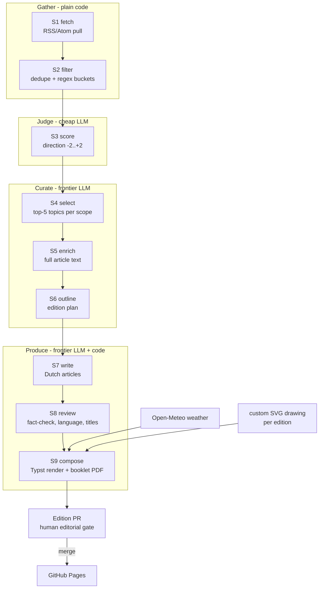

# De Zonzijde — System Design

Status: **draft v1** — companion to [`SPEC.md`](SPEC.md) (the *what*). This is the *how*:
a coherent automation pipeline that turns the working prototypes into a weekly,
reviewable, mostly-automated production system.

---

## 1. Where we are, where we're going

Today the edition is produced by hand-driving three prototypes:

| Asset | Role today | Fate |
|-------|-----------|------|
| `proto_fetchfilter.html` | Browser app: fetch RSS via CORS proxy, regex buckets, Gemini scoring, copy MD table | Source list, regex buckets, and scoring logic migrate into pipeline stages S1–S4. App remains as a manual inspection/debug UI. |
| `tools/fetch-articles.py` | Fetch full article text behind selected links (requests+trafilatura, Playwright fallback) | Becomes stage S5, minus its RSS-summary fallback: blocked stories are re-sourced or dropped instead. |
| `proto_index.html` | Early in-browser generator (client-side Anthropic key) | Superseded; kept for reference. |
| `proto_krant.html` | Hand-built edition — the target look & feel | Design reference only. The layout it established (grid, fonts, masthead, kickers) is re-created once in the Typst print template; the HTML edition itself is retired — prototypes are prototypes, not products. |
| `.github/workflows/pages.yml` | Deploys repo root to GitHub Pages | Kept only to serve the PDF archive (direct links); no HTML edition is published. |

Target: one command — `python -m zonzijde run --edition 2026-07-26` — executes the whole
funnel and opens an edition PR; a human reviews and merges; Pages publishes.

## 2. Design principles

1. **Staged artifacts, not a monolith.** Every stage reads one JSON artifact and writes
   the next. Any stage can be re-run in isolation; a failed run resumes from the last
   good artifact. This is also what makes the editorial gate (OPS-3) cheap: everything
   is inspectable and diffable in the PR.
2. **Cheap-first LLM funnel.** Volume work (scoring ~1–2k items/week) uses a lightweight
   model; frontier-model calls only happen after the stream has narrowed to dozens
   (select) and then ~10–15 stories (outline/write/review).
3. **Deterministic frame, creative core.** Fetching, filtering, dedupe, layout, and
   validation are plain code. LLMs do only what code can't: judge direction, select,
   outline, write, review. Every LLM step has a versioned prompt and a schema-validated
   output.
4. **The data is the source of truth; the PDF is the product.** `edition.json` holds
   the finished edition; the booklet PDF is a deterministic rendering of it. There is
   no HTML edition. Weather and all content are baked at compose time; the published
   artifact has no runtime dependencies and no keys (OPS-5).
5. **Human gate before the world sees it.** The pipeline proposes; the editor disposes
   (merge = publish). Nothing in the design assumes unattended publication.

## 3. Pipeline stages



| Stage | Spec | Kind | Input → output artifact | Notes |
|-------|------|------|--------------------------|-------|
| S1 `fetch` | PIPE-1 | code | `config/sources.yaml` → `10-items.json` | Concurrent pull with timeout; per-feed failures logged in the run report, never fatal. Window per SRC-4. |
| S2 `filter` | PIPE-2 | code | `10` → `20-filtered.json` + `20-rejected.json` | Batch dedupe + bucket filtering per PIPE-2; buckets B1–B5 live in `config/filters.yaml` (ported from the prototype). Rejections keep their reason for auditability. |
| S3 `score` | PIPE-3 | LLM (light) | `20` → `30-scored.json` | Batched (~80 items/call, concurrent), schema-enforced output, prompt `prompts/score.md`. Unparseable batch → items left unscored and excluded (fail-closed: unscored never advances). |
| S4 `select` | PIPE-4 | LLM (frontier) | `30` (+1/+2 only) → `40-candidates.json` | Inputs `prompts/brief.md` + `prompts/select.md` + scored titles/summaries; output shape per PIPE-4. |
| S5 `enrich` | PIPE-5 | code | `40` → `50-articles.json` | `tools/fetch-articles.py` refactored into the package; two-stage fetch (requests, then headless browser). Re-source-or-drop per PIPE-5: the topic's sibling rows in `40-candidates.json` are the only re-source; a topic with no full text is dropped and logged. No model call. |
| S6 `outline` | PIPE-6 | LLM (frontier) | `40` + `50` (ok flags) + SPEC §5 → `60-outline.json` | A quick pitch: produces the edition plan per PIPE-6 (story picks, length classes) from the **shortlist** — titles + RSS summaries, not the full texts. One plain call, no tools, no browsing; the writers (S7) get the texts. The model's editorial choices (ED-1 counts, ED-2 mix, which topics) are taken as-is and judged at the human gate — not validated in code. Code still assembles what it owns: `pos` and the lokaal front by ring-order sort (ED-6), and `source_date` (ED-3, the *newest* source's date). SRC-3 reference reading is not automated here (OQ-1). |
| S7 `write` | PIPE-7 | LLM (frontier) | `60` → `70-drafts.json` | One call per article (grounded on its S5 texts only); the rules from PIPE-7 (length guidance, no self-reference) are in the system prompt and not re-checked in code. `words` computed. |
| S8 `review` | PIPE-8 | LLM (frontier) | `70` → `80-reviewed.json` | Per article, fact-checked against its S5 source text (WR-2) by the model; emits a correction log for the PR. Output taken as-is, not validated in code. |
| S9 `compose` | PIPE-9 | code (+LLM assist) | `80` → `editions/<date>/krant-A3boekje.pdf` + `edition.json` | Custom-illustration drawing, Typst render, weather baking, typeset checks, booklet imposition — all per §5. Text-LLM assist only to shorten/lengthen a specific paragraph when a check demands it. |

Stage contract: every stage is `python -m zonzijde <stage> --edition YYYY-MM-DD`;
`run` chains them; `--from/--until` re-run a slice against existing artifacts.

## 4. Data contracts

Artifacts live in `editions/<date>/work/`, are pretty-printed JSON (stable key order —
diffable in the PR), and validate against pydantic models in `zonzijde/contracts.py`.
Item identity: `id = sha1(canonical_link)[:12]`, assigned at S1 and carried through, so
every printed article traces back to its feed items.

```jsonc
// 10-items.json  (S1) — one per feed item
{ "id": "f3a91c02be77", "source": "gld_rvn", "bron": "Gld RvN",
  "scopes": ["L","R"], "title": "…", "link": "https://…",
  "summary": "…", "published": "2026-07-14T09:30:00+02:00",
  "fetched": "2026-07-18T04:31:22+02:00" }

// 20-filtered.json (S2): same shape.  20-rejected.json adds:
{ "id": "…", "reason": "duplicate | bucket:B2 | …" }

// 30-scored.json (S3): item + { "score": -2..2 }        // absent = excluded, fail-closed

// 40-candidates.json (S4)
{ "scope": "L", "topic": "…",
  "items": [ { "id": "…", "bron": "…", "titel": "…", "samenvatting": "…", "link": "…" } ] }

// 50-articles.json (S5): candidate item + full text
{ "id": "…", "ok": true, "method": "requests | playwright",
  "text": "…", "words": 812, "links": ["…"], "note": "" }
// ok:false = dropped (both fetch routes exhausted); kept in the file for the run report

// 60-outline.json (S6) — the edition plan
{ "edition": "2026-07-26", "slots": [
    { "pos": 1, "scope": "L",
      "topic": "…", "length": "long | standard | short",
      "devices": ["irony"], "source_ids": ["…"],
      "location": "Wijchen", "source_date": "2026-07-14" } ] }

// 70-drafts.json (S7) / 80-reviewed.json (S8): slot + article text
{ "pos": 1, "title": "…", "location": "Wijchen", "source_date": "2026-07-14",
  "text": "…", "words": 430,
  "review": { "fact_issues": [], "corrections": ["…"] } }   // S8 only

// editions/<date>/edition.json (S9) — manifest of the published edition
{ "edition": "2026-07-26", "nr": 3, "articles": [ …final texts + provenance ids… ],
  "weather": { …baked Open-Meteo snapshot… },
  "illustration": "work/85-illustration.svg",   // custom-drawn for this edition
  "pdf": "krant-A3boekje.pdf",
  "counts": { "words_body": 3120, "pages": 4 },
  "pipeline": { "run": "…", "prompt_versions": { "score": "v3", … } } }
```

## 5. Compose: Typst typesetting, checks & booklet imposition

**Engine choice: Typst, not a browser.** The prototypes printed HTML from Chromium;
that stays a prototype. Browsers break lines greedily, one line at a time — which is
exactly what produces single-word lines, short columns, and whitespace holes (LAY-3..5)
in narrow justified columns — and their layout shifts across browser versions. Typst
typesets like LaTeX (whole-paragraph line-break optimisation, real widow/orphan
control, Dutch hyphenation), outputs PDF directly, is deterministic when pinned to a
version, and its templates are plain text that both humans and LLMs edit well. The
LAY rules go from "detect and repair" to mostly "cannot occur".

`templates/krant.typ` re-creates the design established by `proto_krant.html` — the
A4 three-column grid, 12 mm margins, 6 mm gutters, 9.5/11 pt body (LAY-1/2), Fraunces /
Newsreader / Archivo, masthead, kickers, weather strip — and renders `edition.json`
straight to a 4-page A4 PDF. (Typst consumes ttf/otf; `tools/build-fonts.py` gains a
step to emit those alongside the woff2 subsets that only the prototypes needed.)

**Typeset checks.** Compile, then verify LAY-1..5 and LAY-7 against the compiled
layout (Typst's introspection/query where possible, PDF text extraction otherwise).
Violations should be rare; when one occurs, remedies in order of cheapness —
reflow knobs (illustration slot), a review-model trim or
extension of a specific paragraph (addressed by article `pos` + paragraph index) by a
word budget — max 3 recompiles, then fail
the run with the violation report; a human decides (the gate exists precisely for
this). The target is **exactly 4 A4 pages**, closing landscape absorbing the slack
(LAY-7).

**Booklet imposition.** pypdf imposes the 4 A4 pages onto the two A3 sheets in LAY-7's
order, producing the fold-ready `krant-A3boekje.pdf` — the deliverable (OPS-2).

Weather (EL-2) is fetched from Open-Meteo at compose time and baked into
`edition.json`, so the rendered edition is a closed artifact (principle 4).

**Illustration (EL-3): drawn anew every edition — no stock library.** Not currently
wired into the outline stage (S6) — S9 has the frontier model pick a subject and draw a
fresh one-column SVG in the house style — black-and-white, minimalist fine lines,
patterns, strokes. The style
lives in `prompts/illustrate.md` together with two or three reference drawings from
past editions (references teach the *style*, they are never reused as the drawing).
Saved as `work/85-illustration.svg`, referenced from `edition.json`, and judged by the
editor at the gate like any article: redraw or replace before merge. Only the masthead
sunflower and the closing landscape (EL-1/EL-4) are fixed assets.

## 6. LLM usage & budget

| Stage | Model class | Calls/edition | Tokens (rough) | Failure policy |
|-------|-------------|---------------|----------------|----------------|
| S3 score | light (e.g. Claude Haiku) | ~15–25 batches | ~150k in / 5k out | no retry; unscored = excluded (fail-closed) |
| S4 select | frontier | 1 | ~30k in / 2k out | no retry; fatal on failure or invalid output |
| S6 outline | frontier (no tools) | 1 | ~8k in / 3k out | idem |
| S7 write | frontier | ~10–12 (per article) | ~6k in / 1k out each | no retry; a failed article fails the run |
| S8 review | frontier | ~10–12 | ~5k in / 1k out each | idem |
| S9 illustration | frontier | 1 | ~5k in / 5k out | invalid SVG surfaces at the gate; editor judges |
| S9 trim assist | frontier | 0–4 | small | one call per typeset violation (§5) |

Order of magnitude: a few dollars per edition, dominated by S6–S8. Every response that
feeds a later stage is JSON-schema-validated at the call layer; an invalid response is
not retried — the stage excludes the item (S3) or fails the run (S4+).
Prompts are files in `config/prompts/` with a version header; `edition.json` records the
versions used, so output changes are attributable to prompt changes.

Provider access goes through a thin adapter (`zonzijde/llm.py`) with two named tiers
(`light`, `frontier`) configured in `config/edition.yaml` — models are swappable without
touching stages. **Both tiers are driven through the Claude Agent SDK, not raw API
calls**: each stage invocation is a short agent session, which gives S9's trim assist
file context and provides schema-enforced structured output out of the box. The
curation and writing stages (S4, S6, S7, S8) are single prompt-in/JSON-out calls with
no tools; S5 enrichment is plain code with no model at all. The light tier (S3
scoring) runs the same sessions on a Haiku-class model — single prompt, no tools —
so one auth path covers the whole
pipeline.

## 7. Orchestration

**GitHub Actions, two workflows:**

1. `edition.yml` — cron early Sunday morning (Europe/Amsterdam) + `workflow_dispatch`
   (inputs: `edition_date`, `from_stage` for resume). Steps: checkout → install
   (Python deps, **Playwright Chromium with its system libraries** — `playwright
   install --with-deps chromium`, needed by S5's browser-render fetch — and the
   **pinned Typst binary** for S9) → `python -m zonzijde run` → commit
   `editions/<date>/` to branch `edition/<date>` → open the **edition PR**.
2. `pages.yml` (existing) — on merge to `main`, deploy. Extended to (re)generate the
   archive listing (latest edition + previous ones, direct PDF links).

**The edition PR is the editorial gate (OPS-3).** Its body is the run report: the funnel
(fetched → filtered → scored → selected → written), scores distribution, sources used,
stories re-sourced or dropped (blocked fetches, widened lokaal window), correction
log from S8, typeset-check outcome, and LLM cost. The editor opens the booklet PDF from
the PR, optionally edits `edition.json`/artifacts in place (S9 re-renders), merges to
publish.
Nothing auto-merges (OQ-5).

Secrets: `ANTHROPIC_API_KEY` as an Actions secret, read from env by the Agent SDK.
Local runs use the same env var (or ambient Claude Code credentials).

## 8. Target repository layout

```
zonzijde/                  # Python package (the pipeline)
  __main__.py cli.py       # run / per-stage entry points, --from/--until
  stages/                  # fetch.py filter.py score.py select.py enrich.py
                           # outline.py write.py review.py compose.py
  contracts.py             # pydantic models for all artifacts (§4)
  llm.py                   # provider adapters, tiers, schema-validated calls
  typeset.py               # Typst compile, LAY checks, booklet imposition (§5)
  report.py                # run report for the edition PR
config/
  sources.yaml             # feed list + scope tags (from proto_fetchfilter.html)
  filters.yaml             # regex buckets B1–B5
  edition.yaml             # ED/LAY constants, cadence, model tiers
  prompts/                 # brief.md score.md select.md outline.md write.md
                           # review.md illustrate.md (versioned; brief…write exist,
                           # seeded verbatim from the archived concept)
templates/krant.typ        # Typst print template (design per proto_krant.html)
assets/art/                # fixed art: masthead sunflower, closing landscape;
                           # style-reference drawings for prompts/illustrate.md
fonts/  fonts.css          # unchanged
editions/<YYYY-MM-DD>/     # work/ (stage artifacts), krant-A3boekje.pdf,
                           # edition.json, report.md
tools/                     # prototypes & one-off utilities (proto_* stay for debugging)
docs/                      # SPEC.md  ARCHITECTURE.md
tests/                     # unit + golden-run + evals (§9)
```

## 9. Testing & evaluation

- **Unit**: dedupe, bucket regexes (fixture titles per bucket), contracts, MD/JSON
  parsing, date windows.
- **Golden run**: recorded feed fixtures + stubbed LLM responses drive S1→S9 to a byte-
  stable edition; catches template and plumbing regressions in CI on every PR.
- **Scorer eval**: a hand-labelled set (~100–200 real items) with two tracked numbers:
  *negativity leakage* (items ≤0 labelled that score ≥+1 — the trust-killer, keep ~0)
  and *positive recall*.
- **Typeset check** doubles as a test: the golden edition must pass LAY-1..5.

## 10. Security & operational notes

- **Immediate action**: `proto_fetchfilter.html` embeds a Google API key (`GKEY`) in a
  public repo — rotate the key, then have the prototype prompt for a key stored in
  `localStorage` (as `proto_index.html` already does for Anthropic). OPS-5 forbids
  recurrence.
- The published site is static output only; keys exist solely in Actions secrets/local
  env.
- Feeds and article pages are untrusted input: parsed defensively (no HTML pass-through
  to the template — text is extracted and re-escaped), and LLM prompts treat fetched
  content as data, not instructions.
- Editions are committed to the repo: full history, trivial rollback (revert the merge),
  and the archive is just files (OQ-6 needs nothing new).

## 11. Build order (migration plan)

Each phase lands as a normal PR and leaves the current manual workflow usable.

1. **Skeleton + S1/S2** — package, contracts, CLI; port sources + buckets to config;
   funnel report. *Exit: `run --until filter` reproduces the prototype's filtered table.*
2. **S3/S4** — scoring + selection with schema-validated calls; scorer eval harness with
   the first labelled set. *Exit: `40-candidates.json` matches the quality of the manual
   MD-table flow.*
3. **S5** — absorb `tools/fetch-articles.py` as a stage. *Exit: `50-articles.json` for a
   real candidate set.*
4. **S6–S8** — outline/write/review prompts (seeded from `config/prompts/`, hardened);
   correction log. *Exit: a full `80-reviewed.json` a human judges publishable-with-edits.*
5. **S9 + template** — re-create the `proto_krant.html` design as `templates/krant.typ`
   (side-by-side against a printed prototype edition until visually equivalent);
   ttf/otf font subsets; weather baking; custom-illustration drawing step; typeset
   checks; A3 booklet imposition. *Exit: golden run produces a fold-ready booklet PDF
   end-to-end.*
6. **Orchestration** — `edition.yml`, edition PR with report, archive index in Pages
   deploy. *Exit: one Sunday edition produced by cron, reviewed, merged, published.*
7. **Hardening** — eval gates in CI, cost tracking, prompt versioning discipline; then
   revisit OQ-5 (auto-publish) with evidence.
