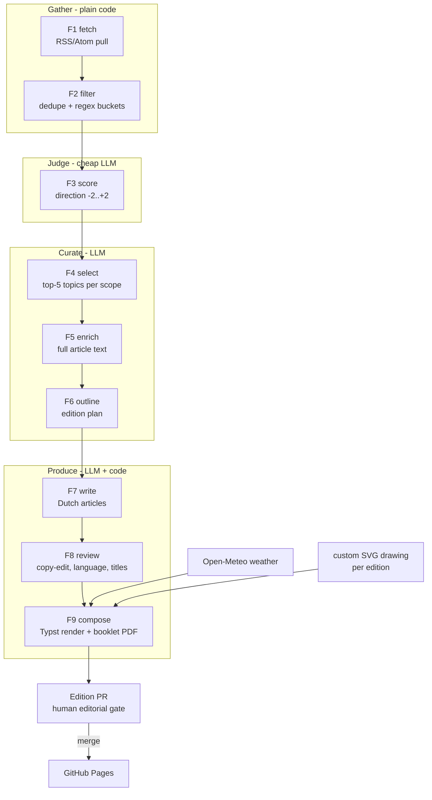

# De Zonzijde — System Design

Status: **draft v1** — companion to [`SPEC.md`](SPEC.md) (the *what*). This is the *how*:
a coherent automation pipeline, a weekly,
reviewable, mostly-automated production system.

---

## 1. Where we're going

Target: one command — `python -m zonzijde run --edition 2026-07-26` — executes the whole
funnel and opens an edition PR; a human reviews and merges; Pages publishes.

## 2. Design principles

1. **Fased artifacts, not a monolith.** Every fase reads one JSON artifact and writes
   the next. Any fase can be re-run in isolation; a failed run resumes from the last
   good artifact. This is also what makes the editorial gate (OPS-3) cheap: everything
   is inspectable and diffable in the PR.
2. **Cheap-first LLM funnel.** Volume work (scoring ~1–2k items/week) runs on Haiku;
   the Sonnet/Opus calls only happen after the stream has narrowed to dozens
   (select) and then ~10–15 stories (outline/write/review).
3. **Deterministic frame, creative core.** Fetching, filtering, dedupe, layout, and
   validation are plain code. LLMs do only what code can't: judge direction, select,
   outline, write, review. Every LLM step has a versioned prompt and a schema-validated
   output.
4. **The data is the source of truth; the PDF is the product.** `edition.json` holds
   the finished edition; the booklet PDF is a deterministic rendering of it. There is
   no HTML edition. Weather and all content are baked at compose time; the published
   artifact has no runtime dependencies and no keys (OPS-5).
5. **Human gate before the world sees it.** The pipeline proposes; the editor disposes
   (merge = publish). Nothing in the design assumes unattended publication.

## 3. Pipeline fases

| Fase | Spec | Kind | Input → output artifact | Notes |
|------|------|------|--------------------------|-------|
| F1 `fetch` | PIPE-1 | code | `config/sources.yaml` → `f1-items.json` | Concurrent pull with timeout; per-feed failures logged in the run report, never fatal. Window per SRC-4. |
| F2 `filter` | PIPE-2 | code | `f1` → `f2-filtered.json` + `f2-rejected.json` | Batch dedupe + bucket filtering per PIPE-2; buckets B1–B5 live in `config/filters.yaml`. Rejections keep their reason for auditability. |
| F3 `score` | PIPE-3 | LLM | `f2` → `f3-scored.json` | Batched (~80 items/call, concurrent), schema-enforced output, prompt `prompts/score.md`. Unparseable batch → items left unscored and excluded (fail-closed: unscored never advances). |
| F4 `select` | PIPE-4 | LLM | `f3` (+1/+2 only) → `f4-candidates.json` | Inputs `prompts/brief.md` + `prompts/select.md` + scored titles/summaries; output shape per PIPE-4. |
| F5 `enrich` | PIPE-5 | code (+LLM) | `f4` → `f5-articles.json` | `tools/fetch-articles.py` refactored into the package; two-step fetch (requests, then headless browser). Re-source-or-drop per PIPE-5: the topic's sibling rows in `f4-candidates.json` are the only re-source; a topic with no full text is dropped and logged. Each full-text article's in-body links are classified by the model (EXT/INT/NAV/PROMO); EXT+INT links (denylist-filtered, capped) are followed as best-effort background `references` — never gating a topic's drop status. |
| F6 `outline` | PIPE-6 | LLM | `f4` + `f5` (ok flags) + SPEC §5 → `f6-outline.json` | A quick pitch: produces the edition plan per PIPE-6 (story picks, length classes) from the **shortlist** — titles + RSS summaries, not the full texts. One plain call, no tools, no browsing; the writers (F7) get the texts. The model's editorial choices (ED-1 counts, ED-2 mix, which topics) are taken as-is and judged at the human gate — not validated in code. Code still assembles what it owns: `pos` and the lokaal front by ring-order sort (ED-6), and `source_date` (ED-3, the *newest* source's date). SRC-3 reference reading is not automated here (OQ-1). |
| F7 `write` | PIPE-7 | LLM | `f6` → `f7-drafts.json` | One call per article (grounded on its F5 texts only); the rules from PIPE-7 (length guidance, no self-reference) are in the system prompt and not re-checked in code. `words` computed. |
| F8 `review` | PIPE-8 | LLM | `f7` → `f8-reviewed.json` | Per article, copy-edited in isolation (draft text only — no source or reference text): Dutch grammar/spelling/phrasing and title, emitting a correction log for the PR. Output taken as-is, not validated in code. |
| F9 `compose` | PIPE-9 | code (+LLM illustration) | `f8` → `editions/<date>/krant-A3boekje.pdf` + `edition.json` | Custom-illustration drawing, Typst render, weather baking, typeset checks, booklet imposition — all per §5. The only LLM step is the illustration; layout violations the reflow knob can't fix fail to the editorial gate. |

Fase contract: every fase is `python -m zonzijde <fase> --edition YYYY-MM-DD`;
`run` chains them; `--from/--until` re-run a slice against existing artifacts.

## 4. Data contracts

Artifacts live in `editions/<date>/work/`, are pretty-printed JSON (stable key order —
diffable in the PR), and validate against pydantic models in `zonzijde/contracts.py`.
Item identity: `id = sha1(canonical_link)[:12]`, assigned at F1 and carried through, so
every printed article traces back to its feed items.

## 5. Compose: Typst typesetting, checks & booklet imposition

**Engine choice: Typst, not a browser.** 
typesets like LaTeX (whole-paragraph line-break optimisation, real widow/orphan
control, Dutch hyphenation), outputs PDF directly, is deterministic when pinned to a
version, and its templates are plain text that both humans and LLMs edit well. The
LAY rules go from "detect and repair" to mostly "cannot occur".

`templates/krant.typ` — the
A4 three-column grid, 12 mm margins, 6 mm gutters, 9.5/11 pt body (LAY-1/2), Fraunces /
Newsreader / Archivo, masthead, kickers, weather strip — and renders `edition.json`
straight to a 4-page A4 PDF.

**Typeset checks.** Compile, then verify LAY-1..5 and LAY-7 against the compiled
layout (Typst's introspection/query where possible, PDF text extraction otherwise).
Violations should be rare — LAY-3 is prevented in the template rather than repaired.
The only automatic remedy is the reflow knob (moving the illustration slot to the
next eligible article) — max 3 recompiles; anything still violating fails the run
with the violation report, and the editorial gate resolves it (edit the copy or
reflow, then re-run). The target is **exactly 4 A4 pages**, closing landscape
absorbing the slack (LAY-7).

**Booklet imposition.** pypdf imposes the 4 A4 pages onto the two A3 sheets in LAY-7's
order, producing the fold-ready `krant-A3boekje.pdf` — the deliverable (OPS-2).

Weather (EL-2) is fetched from Open-Meteo at compose time and baked into
`edition.json`, so the rendered edition is a closed artifact (principle 4).

**Illustration (EL-3): drawn anew every edition.** F9 has the model pick two subjects and draw two fresh one-column SVGs in the house style — black-and-white, minimalist fine lines,
patterns, strokes. The style
lives in `prompts/illustrate.md` together with two or three reference drawings from
past editions (references teach the *style*, they are never reused as the drawing).
Saved as `work/f9-illustration-1.svg`/`f9-illustration-2.svg`, referenced from `edition.json`, and judged by the
editor at the gate like any article: redraw or replace before merge. Only the masthead
sunflower and the closing landscape (EL-1/EL-4) are fixed assets.

## 6. LLM usage & budget

| Fase | Model | Calls/edition | Tokens (rough) | Failure policy |
|------|-------|---------------|----------------|----------------|
| F3 score | Claude Haiku | ~15–25 batches | ~150k in / 5k out | no retry; unscored = excluded (fail-closed) |
| F5 classify | Claude Haiku | ~10–15 (per article) | small | best-effort |
| F4 select | Claude Sonnet | 1 | ~30k in / 2k out | no retry; fatal on failure or invalid output |
| F6 outline | Claude Opus | 1 | ~8k in / 3k out | idem |
| F7 write | Claude Sonnet (one random slot on Claude Opus, effort high) | ~10–12 (per article) | ~6k in / 1k out each | no retry; a failed article fails the run |
| F8 review | Claude Sonnet | ~10–12 | ~5k in / 1k out each | idem |
| F9 illustration | Claude Sonnet | 1 | ~5k in / 9k out | reads brief + views/reads the two house drawings (Read tool), then draws two; either invalid SVG surfaces at the gate |

Order of magnitude: a few dollars per edition, dominated by F6–F8. Every response that
feeds a later fase is JSON-schema-validated at the call layer; an invalid response is
not retried — the fase excludes the item (F3) or fails the run (F4+).
Prompts are files in `config/prompts/` with a version header; `edition.json` records the
versions used, so output changes are attributable to prompt changes. Two prompts are
shared across the LLM fases and assembled into the system prompt (`prompts.system_base`):
`brief.md` (the product brief) and `pipeline.md` (a fase-orientation so each call knows
where it sits); each fase then supplies its own task prompt.

Provider access goes through a thin adapter (`zonzijde/llm.py`); each fase's model is
configured per fase under `llm.fases` in `config/edition.yaml` — swappable without
touching fases. **Every fase is driven through the Claude Agent SDK, not raw API
calls**: each fase invocation is a short agent session, which gives F9's illustration
step file context (the Read tool, to view and read the house-style drawings) and
provides schema-enforced structured output out of the box. The
curation and writing fases (F4, F6, F7, F8) are single prompt-in/JSON-out calls with
no tools; F5 enrichment is plain code apart from one Haiku call per article that
classifies its in-body links. F3 scoring and F5 link classification run the same
sessions on Haiku — single prompt, no tools — so one auth path covers the whole
pipeline.

## 7. Orchestration

**GitHub Actions, two workflows:**

1. `edition.yml` — cron early Sunday morning (Europe/Amsterdam) + `workflow_dispatch`
   (inputs: `edition_date`, `from_fase` for resume). Steps: checkout → install
   (Python deps, **Playwright Chromium with its system libraries** — `playwright
   install --with-deps chromium`, needed by F5's browser-render fetch; the Typst
   compiler for F9 comes in as the `typst` Python package, version-pinned in
   `pyproject.toml`) → `python -m zonzijde run` → commit
   `editions/<date>/` to branch `edition/<date>` → open the **edition PR**.
2. `pages.yml` (existing) — on merge to `main`, deploy. Extended to (re)generate the
   archive listing (latest edition + previous ones, direct PDF links).

**The edition PR is the editorial gate (OPS-3).** Its body is the run report: the funnel
(fetched → filtered → scored → selected → written), scores distribution, sources used,
stories re-sourced or dropped (blocked fetches, widened lokaal window), correction
log from F8, typeset-check outcome, and LLM cost. The editor opens the booklet PDF from
the PR, optionally edits `edition.json`/artifacts in place (F9 re-renders), merges to
publish.

## 8. Testing & evaluation

- **Golden run**: recorded feed fixtures + stubbed LLM responses drive F1→F9 to a byte-
  stable edition; catches template and plumbing regressions in CI on every PR.
- **Typeset check** doubles as a test: the golden edition must pass LAY-1..5.

