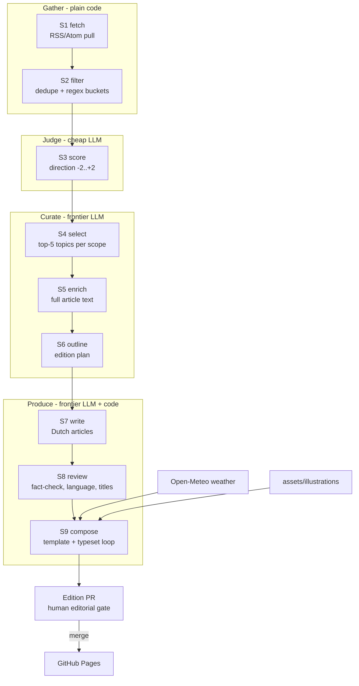

# De Zonzijde — System Design

Status: **draft v1** — companion to [`SPEC.md`](SPEC.md) (the *what*). This is the *how*:
a coherent automation pipeline that turns the working prototypes into a weekly,
reviewable, mostly-automated production system.

---

## 1. Where we are, where we're going

Today the edition is produced by hand-driving three prototypes:

| Asset | Role today | Fate |
|-------|-----------|------|
| `proto_fetchfilter.html` | Browser app: fetch RSS via CORS proxy, regex buckets, Gemini scoring, copy MD table | Source list, regex buckets, and scoring logic migrate into pipeline stages S1–S4. App remains as a manual inspection/debug UI. |
| `tools/fetch-articles.py` | Fetch full article text behind selected links (requests+trafilatura, Playwright fallback) | Becomes stage S5 nearly as-is. |
| `proto_index.html` | Early in-browser generator (client-side Anthropic key) | Superseded; kept for reference. |
| `proto_krant.html` | Hand-built edition — the target look & feel | Becomes the Jinja template `templates/krant.html.j2` + per-edition data. |
| `.github/workflows/pages.yml` | Deploys repo root to GitHub Pages | Extended: deploys `editions/` + archive index. |

Target: one command — `python -m zonzijde run --edition 2026-07-26` — executes the whole
funnel and opens an edition PR; a human reviews and merges; Pages publishes.

## 2. Design principles

1. **Staged artifacts, not a monolith.** Every stage reads one JSON artifact and writes
   the next. Any stage can be re-run in isolation; a failed run resumes from the last
   good artifact. This is also what makes the editorial gate (OPS-3) cheap: everything
   is inspectable and diffable in the PR.
2. **Cheap-first LLM funnel.** Volume work (scoring ~1–2k items/week) uses a lightweight
   model; frontier-model calls only happen after the stream has narrowed to dozens
   (select) and then ~10–15 stories (outline/write/review).
3. **Deterministic frame, creative core.** Fetching, filtering, dedupe, layout, and
   validation are plain code. LLMs do only what code can't: judge direction, select,
   outline, write, review. Every LLM step has a versioned prompt and a schema-validated
   output.
4. **The edition is a static artifact.** Weather and all content are baked at compose
   time; the published HTML has no runtime API dependencies and no keys (OPS-5).
5. **Human gate before the world sees it.** The pipeline proposes; the editor disposes
   (merge = publish). Nothing in the design assumes unattended publication.

## 3. Pipeline stages



| Stage | Spec | Kind | Input → output artifact | Notes |
|-------|------|------|--------------------------|-------|
| S1 `fetch` | PIPE-1 | code | `config/sources.yaml` → `10-items.json` | Concurrent feed pull with timeout; per-feed failures recorded in the run report, never fatal (SRC-1/PIPE-1). Window per SRC-4. |
| S2 `filter` | PIPE-2 | code | `10` → `20-filtered.json` + `20-rejected.json` | Link-dedupe, both within the batch and against links already published in past `editions/*/edition.json` manifests (a story never repeats across editions); regex buckets B1–B5 from `config/filters.yaml` (ported from the prototype). Rejections keep their reason for auditability. |
| S3 `score` | PIPE-3 | LLM (light) | `20` → `30-scored.json` | Batched (~80 items/call, concurrent), JSON-mode, temperature 0, prompt `prompts/score.md`. Unparseable batch → one retry → items left unscored and excluded (fail-closed: unscored never advances). |
| S4 `select` | PIPE-4 | LLM (frontier) | `30` (+1/+2 only) → `40-candidates.json` | Brief + titles/summaries in, ranked top-5 topics per scope out; one row per source article. |
| S5 `enrich` | PIPE-5 | code | `40` → `50-articles.json` | `tools/fetch-articles.py` refactored into the package; two-stage fetch with flagged RSS-summary fallback. |
| S6 `outline` | PIPE-6 | LLM (frontier) | `50` + SPEC §5 → `60-outline.json` | Picks final stories per ED-1/ED-2, assigns length class, type, tone/angle (WR-1), sources per story, illustration-subject proposal (EL-3), optional element (EL-5). Stories grounded only in an RSS-summary fallback are capped at the short length class or swapped out (PIPE-5). Uses tool-assisted browsing for SRC-3 reference sources. |
| S7 `write` | PIPE-7 | LLM (frontier) | `60` → `70-drafts.json` | One call per article (grounded on its S5 texts only); hard rules from PIPE-7 in the system prompt. |
| S8 `review` | PIPE-8 | LLM (frontier) | `70` → `80-reviewed.json` | Per-article fact-check against S5 source text (WR-2), NL grammar/spelling, final title; emits a correction log for the PR. |
| S9 `compose` | PIPE-9 | code (+LLM assist) | `80` → `editions/<date>/krant.html` + `krant-A3boekje.pdf` + `edition.json` | Jinja render of the krant template; bakes weather; places illustration + closing landscape; then the typeset loop and PDF export with A3 booklet imposition (§5). LLM is only called to shorten/lengthen a specific paragraph when the loop demands it. |

Stage contract: every stage is `python -m zonzijde <stage> --edition YYYY-MM-DD`;
`run` chains them; `--from/--until` re-run a slice against existing artifacts.

## 4. Data contracts

Artifacts live in `editions/<date>/work/`, are pretty-printed JSON (stable key order —
diffable in the PR), and validate against pydantic models in `zonzijde/contracts.py`.
Item identity: `id = sha1(canonical_link)[:12]`, assigned at S1 and carried through, so
every printed article traces back to its feed items.

```jsonc
// 10-items.json  (S1) — one per feed item
{ "id": "f3a91c02be77", "source": "gld_rvn", "bron": "Gld RvN",
  "scopes": ["L","R"], "title": "…", "link": "https://…",
  "summary": "…", "published": "2026-07-14T09:30:00+02:00",
  "fetched": "2026-07-18T04:31:22+02:00" }

// 20-filtered.json (S2): same shape.  20-rejected.json adds:
{ "id": "…", "reason": "duplicate | bucket:B2 | …" }

// 30-scored.json (S3): item + { "score": -2..2 }        // absent = excluded, fail-closed

// 40-candidates.json (S4)
{ "scope": "L", "rank": 1, "topic": "…",
  "items": [ { "id": "…", "bron": "…", "titel": "…", "samenvatting": "…", "link": "…" } ] }

// 50-articles.json (S5): candidate item + full text
{ "id": "…", "ok": true, "method": "requests | playwright | rss-fallback",
  "text": "…", "words": 812, "links": ["…"], "note": "" }

// 60-outline.json (S6) — the edition plan
{ "edition": "2026-07-26", "slots": [
    { "pos": 1, "scope": "L", "role": "front-hero",
      "topic": "…", "length": "long | standard | short",
      "type": "news | feature | profile | zoom-out | zoom-in",
      "angle": "…", "devices": ["irony"], "source_ids": ["…"],
      "location": "Wijchen", "source_date": "2026-07-14" } ],
  "illustration": { "slot_pos": 7, "subject": "…" },
  "optional_element": { "kind": "quote | number | side-story | none", "content": "…" } }

// 70-drafts.json (S7) / 80-reviewed.json (S8): slot + article text
{ "pos": 1, "title": "…", "location": "Wijchen", "source_date": "2026-07-14",
  "paragraphs": ["…"], "words": 430,
  "review": { "fact_issues": [], "corrections": ["…"] } }   // S8 only

// editions/<date>/edition.json (S9) — manifest of the published edition
{ "edition": "2026-07-26", "nr": 3, "articles": [ …final texts + provenance ids… ],
  "weather": { …baked Open-Meteo snapshot… },
  "illustration": "assets/illustrations/….svg",
  "pdf": "krant-A3boekje.pdf",
  "counts": { "words_body": 3120, "pages": 4 },
  "pipeline": { "run": "…", "prompt_versions": { "score": "v3", … } } }
```

## 5. Compose & the typeset loop

LAY-1..5 can only be judged on a *rendered* page, so S9 validates with headless
Chromium (Playwright is already a dependency):

1. Render `krant.html` with print CSS at A4 and measure per column: line boxes,
   single-word lines (LAY-3), short columns (LAY-4), whitespace runs (LAY-5), and
   total page count (LAY-1).
2. If violations: apply the cheapest sufficient remedy, in order —
   a. reflow knobs (swap optional element position, nudge illustration slot,
      hyphenation hints);
   b. ask the review model to trim or extend a specific paragraph — addressed by
      article `pos` + paragraph index in the `paragraphs` array — by a word budget;
   c. drop the lowest-ranked optional element.
3. Re-render; max 3 iterations, then fail the run with the violation report — a human
   decides (the gate exists precisely for this).

The loop targets **exactly 4 A4 pages** (LAY-7): content fills 3.5–4 pages and the
closing landscape (EL-4) absorbs the remaining slack on page 4.

**PDF export & booklet imposition (OPS-2).** Once the loop passes, the same Chromium
instance prints the HTML to a 4-page A4 PDF, and pypdf imposes those pages onto two A3
landscape sheets — outer sheet `4 | 1`, inner sheet `2 | 3` — producing the fold-ready
`krant-A3boekje.pdf`, the primary print deliverable (matching the editions produced to
date). The HTML remains the source artifact and the web-readable edition.

Weather (EL-2) is fetched from Open-Meteo at compose time and baked into the HTML —
the published page stays static and dependency-free (principle 4; the prototype's
client-side fetch remains only as a progressive enhancement that overwrites the baked
strip when online).

Illustrations (EL-3/EL-4, OQ-2): `assets/illustrations/` is a small library of
hand-drawn-style SVGs tagged by theme. S6 proposes a subject; S9 picks the best tag
match and records the choice in `edition.json`; the editor can swap it in the PR. The
masthead sunflower and the closing landscape are fixed assets from the prototype.

## 6. LLM usage & budget

| Stage | Model class | Calls/edition | Tokens (rough) | Failure policy |
|-------|-------------|---------------|----------------|----------------|
| S3 score | light (e.g. Gemini Flash-Lite) | ~15–25 batches | ~150k in / 5k out | retry once/batch; unscored = excluded |
| S4 select | frontier | 1 | ~30k in / 2k out | retry w/ backoff; fatal after 3 |
| S6 outline | frontier (+ web tool) | 1 | ~50k in / 3k out | idem |
| S7 write | frontier | ~10–12 (per article) | ~6k in / 1k out each | retry per article |
| S8 review | frontier | ~10–12 | ~5k in / 1k out each | idem |
| S9 trim assist | frontier | 0–4 | small | idem |

Order of magnitude: a few dollars per edition, dominated by S6–S8. Every response that
feeds a later stage is JSON-schema-validated at the call layer (retry on mismatch).
Prompts are files in `config/prompts/` with a version header; `edition.json` records the
versions used, so output changes are attributable to prompt changes.

Provider access goes through a thin adapter (`zonzijde/llm.py`) with two named tiers
(`light`, `frontier`) configured in `config/edition.yaml` — models are swappable without
touching stages. The **frontier tier is driven through the Claude Agent SDK, not raw
Claude API calls**: each stage invocation is a short agent session, which is what gives
S6 its browsing/tool use for the SRC-3 reference sources, gives S9's trim assist file
context, and provides schema-enforced structured output and retries out of the box. The
light tier (S3 scoring) calls the Gemini API directly — plain batched JSON-mode calls
need no agent loop.

## 7. Orchestration

**GitHub Actions, two workflows:**

1. `edition.yml` — cron early Sunday morning (Europe/Amsterdam) + `workflow_dispatch`
   (inputs: `edition_date`, `from_stage` for resume). Steps: checkout → install
   (Python deps **plus Playwright Chromium and its system libraries** — `playwright
   install --with-deps chromium` — needed by S5's fallback fetch and S9's typeset
   loop) → `python -m zonzijde run` → commit `editions/<date>/` to branch
   `edition/<date>` → open the **edition PR**.
2. `pages.yml` (existing) — on merge to `main`, deploy. Extended to (re)generate the
   archive index (`index.html`: latest edition + list of previous ones).

**The edition PR is the editorial gate (OPS-3).** Its body is the run report: the funnel
(fetched → filtered → scored → selected → written), scores distribution, sources used,
fallbacks hit (blocked fetches, RSS-summary articles, widened lokaal window), correction
log from S8, typeset-loop outcome, and LLM cost. The editor reads the rendered edition
(PR preview or local open), optionally edits artifacts/HTML in place, merges to publish.
Nothing auto-merges (OQ-5).

Secrets: `GEMINI_API_KEY`, `ANTHROPIC_API_KEY` as Actions secrets, read from env by
`llm.py`. Local runs use the same env vars.

## 8. Target repository layout

```
zonzijde/                  # Python package (the pipeline)
  __main__.py cli.py       # run / per-stage entry points, --from/--until
  stages/                  # fetch.py filter.py score.py select.py enrich.py
                           # outline.py write.py review.py compose.py
  contracts.py             # pydantic models for all artifacts (§4)
  llm.py                   # provider adapters, tiers, schema-validated calls
  typeset.py               # headless-chromium measurement (§5)
  report.py                # run report for the edition PR
config/
  sources.yaml             # feed list + scope tags (from proto_fetchfilter.html)
  filters.yaml             # regex buckets B1–B5
  edition.yaml             # ED/LAY constants, cadence, model tiers
  prompts/                 # score.md select.md outline.md write.md review.md (versioned)
templates/krant.html.j2    # from proto_krant.html
assets/illustrations/      # tagged SVG library + masthead + closing landscape
fonts/  fonts.css          # unchanged
editions/<YYYY-MM-DD>/     # work/ (stage artifacts), krant.html,
                           # krant-A3boekje.pdf, edition.json, report.md
tools/                     # prototypes & one-off utilities (proto_* stay for debugging)
docs/                      # SPEC.md  ARCHITECTURE.md
tests/                     # unit + golden-run + evals (§9)
```

## 9. Testing & evaluation

- **Unit**: dedupe, bucket regexes (fixture titles per bucket), contracts, MD/JSON
  parsing, date windows.
- **Golden run**: recorded feed fixtures + stubbed LLM responses drive S1→S9 to a byte-
  stable edition; catches template and plumbing regressions in CI on every PR.
- **Scorer eval**: a hand-labelled set (~100–200 real items) with two tracked numbers:
  *negativity leakage* (items ≤0 labelled that score ≥+1 — the trust-killer, keep ~0)
  and *positive recall*. Any change to `prompts/score.md`, the light model, or the
  buckets must re-run the eval and post the numbers in its PR.
- **Typeset check** doubles as a test: the golden edition must pass LAY-1..5.

## 10. Security & operational notes

- **Immediate action**: `proto_fetchfilter.html` embeds a Google API key (`GKEY`) in a
  public repo — rotate the key, then have the prototype prompt for a key stored in
  `localStorage` (as `proto_index.html` already does for Anthropic). OPS-5 forbids
  recurrence.
- The published site is static output only; keys exist solely in Actions secrets/local
  env.
- Feeds and article pages are untrusted input: parsed defensively (no HTML pass-through
  to the template — text is extracted and re-escaped), and LLM prompts treat fetched
  content as data, not instructions.
- Editions are committed to the repo: full history, trivial rollback (revert the merge),
  and the archive is just files (OQ-6 needs nothing new).

## 11. Build order (migration plan)

Each phase lands as a normal PR and leaves the current manual workflow usable.

1. **Skeleton + S1/S2** — package, contracts, CLI; port sources + buckets to config;
   funnel report. *Exit: `run --until filter` reproduces the prototype's filtered table.*
2. **S3/S4** — scoring + selection with schema-validated calls; scorer eval harness with
   the first labelled set. *Exit: `40-candidates.json` matches the quality of the manual
   MD-table flow.*
3. **S5** — absorb `tools/fetch-articles.py` as a stage. *Exit: `50-articles.json` for a
   real candidate set.*
4. **S6–S8** — outline/write/review prompts (ported from concept §3.5–3.6 and hardened);
   correction log. *Exit: a full `80-reviewed.json` a human judges publishable-with-edits.*
5. **S9 + template** — extract `krant.html.j2` from `proto_krant.html`; weather baking;
   illustration slot; typeset loop; print-to-PDF and A3 booklet imposition. *Exit:
   golden run produces a valid edition (HTML + booklet PDF) end-to-end.*
6. **Orchestration** — `edition.yml`, edition PR with report, archive index in Pages
   deploy. *Exit: one Sunday edition produced by cron, reviewed, merged, published.*
7. **Hardening** — eval gates in CI, cost tracking, prompt versioning discipline; then
   revisit OQ-5 (auto-publish) with evidence.
