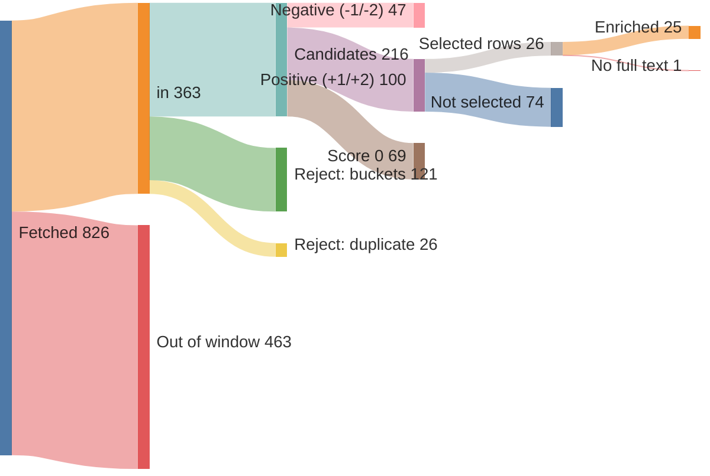
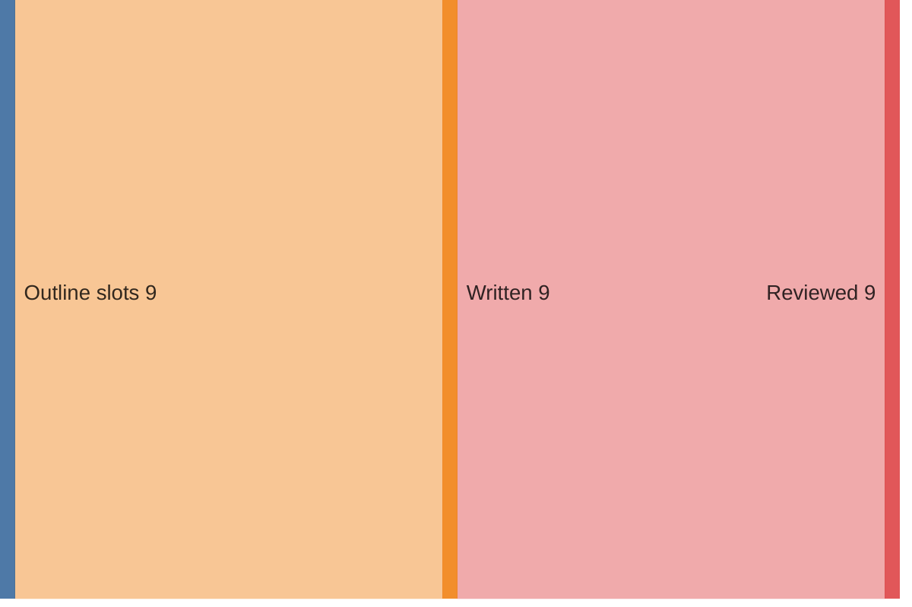

# Run report — edition 2026-07-26

## Funnel overview

Items — fetched → in → filtered → scored → selected → enriched (drop branches show why and what type):

Edition — outline slots → written → reviewed:

## Funnel

- window: 6 days (from 2026-07-20T00:00:00+02:00, SRC-4)
- F1 fetch: 826 feed items → 363 in (32/33 feeds ok)
- F2 filter: 363 → 216 candidates (147 rejected)
- F3 score: 216 scored → 100 at +1/+2
- F4 select: 24 topics (26 source rows)
- F5 enrich: 26 source rows → 25 full texts (requests 25, playwright 0); 1 topics dropped (F5)
- F6 outline: 9 slots, planned 2350–4500 words
- F7 write: 9 articles, 2323 words
- F8 review: 2297 words body text (ED-5 target 2800–3400)

## Feeds

| bron | items | in | error |
|---|---|---|---|
| Gem Wijchen | 20 | 1 | — |
| nieuws.nl | 0 | 0 | HTTPError: 503 Server Error: Service Unavailable for url: http://wijchen.nieuws.nl/sitemap/news.xml |
| Gld | 50 | 50 | — |
| Gld RvN | 50 | 50 | — |
| Overheid | 10 | 10 | — |
| NOS J | 20 | 20 | — |
| NOS Binnen | 20 | 20 | — |
| NOS Buiten | 20 | 20 | — |
| NOS Econ | 20 | 20 | — |
| NOS Sport | 20 | 20 | — |
| NOS Opm | 20 | 1 | — |
| NOS Cultuur | 20 | 3 | — |
| FTM | 7 | 6 | — |
| EW | 10 | 10 | — |
| DW | 21 | 21 | — |
| DW Env | 20 | 4 | — |
| DW Science | 3 | 3 | — |
| Positive | 10 | 5 | — |
| WijWijchen | 20 | 2 | — |
| Druten | 20 | 4 | — |
| KNMI | 5 | 0 | — |
| CBS n&m | 50 | 1 | — |
| CBS v&c | 50 | 0 | — |
| Natuurmon | 30 | 12 | — |
| IVN | 10 | 0 | — |
| MaatschapWij | 8 | 3 | — |
| BBC Future | 10 | 7 | — |
| RtbC | 10 | 5 | — |
| FixNews | 20 | 3 | — |
| Mongabay | 32 | 32 | — |
| HumanProg | 10 | 10 | — |
| NatureToday | 200 | 20 | — |
| ARK | 10 | 0 | — |

## LLM usage

| fase | model | effort | calls | turns | in tok | out tok | tools | think chars | wall | cost |
|---|---|---|---|---|---|---|---|---|---|---|
| F3 score | claude-haiku-4-5-20251001 | — | 3 | 6 | 86,702 | 13,143 | 3 | 26,917 | 144.3s | $0.1739 |
| F4 select | claude-sonnet-5 | low | 1 | 3 | 129,525 | 5,437 | 2 | 0 | 67.6s | $0.3727 |
| F5 enrich | claude-haiku-4-5-20251001 | — | 17 | 46 | 606,125 | 21,726 | 17 | 38,954 | 306.9s | $0.3722 |
| F6 outline | claude-opus-4-8 | medium | 1 | 2 | 46,977 | 9,421 | 1 | 0 | 147.9s | $0.7207 |
| F7 write | claude-sonnet-5 | high | 9 | 18 | 333,862 | 46,958 | 9 | 0 | 629.0s | $1.7963 |
| F8 review | claude-sonnet-5 | medium | 9 | 18 | 315,671 | 20,859 | 9 | 0 | 278.5s | $0.9433 |
| **total** |  |  | 40 | 93 | 1,518,862 | 117,544 | 41 | 65,871 | 1574.4s | $4.3791 |

## Rejected (F2)

| reason | count |
|---|---|
| B1 | 46 |
| B2 | 64 |
| B3 | 13 |
| B4 | 8 |
| B5 | 18 |
| duplicate | 26 |

## Scores (F3)

model claude-haiku-4-5-20251001, prompt score.md v3

| score | count |
|---|---|
| -2 | 12 |
| -1 | 35 |
| 0 | 69 |
| +1 | 82 |
| +2 | 18 |

## Selected topics (F4)

| s | topic | bronnen |
|---|---|---|
| L | Vierdaagse als beweegritueel voor Wijchen | Gem Wijchen |
| L | Liek loopt Vierdaagse voor zieke dochter Bo | Gld RvN |
| L | Nijmeegs gezin en Roze Woensdag | Gld RvN |
| L | Blaren en wandelkwalen: Rode Kruis-tips | Gld RvN |
| L | Marcel loopt Vierdaagse alleen | Gld RvN |
| L | Wijchense Wereldwinkel uitFAIRkoop-kast | WijWijchen |
| L | Gratis Happy Mind Moment voor vrouwen | WijWijchen |
| R | Papierfabriek Folding Boxboard lijkt gered | Gld |
| R | 100-jarige bevrijder Arnhem krijgt medaille | Gld |
| R | Vierdaagse voltooid: 42.137 wandelaars over finish | Gld, Gld |
| R | Aanzoek op de Vierdaagse | Gld |
| R | Lochem bouwt twee nieuwe buitenzwembaden | Gld |
| R | Vriendinnen uit Groesbeek: blaren en borrels | Gld |
| R | Drutense energiecoaches helpen buren besparen | Druten |
| N | Campagne helpt Nederlanders energie besparen | Overheid |
| N | Eerste moeder als Queen Zomercarnaval | NOS Binnen |
| N | Amsterdam viert eerste WorldPride | NOS Binnen |
| N | Delftse halfgeleider kan zenuwstelsel draadloos aansturen | EW |
| N | Ecologisch bermbeheer wordt de standaard | NatureToday |
| I | Kinderen in Gaza krijgen weer zwemles | NOS J |
| I | Ecowins: steden, dieren en technologie | DW, DW Env |
| I | Eerste vaccinproef tegen Bundibugyo-ebola | NOS Buiten |
| I | Hawaiiaanse steltloper herstelt van bijna-uitsterven | HumanProg |
| I | Gemeenschapsclubs floreren dankzij backlash tegen Premier League | Positive |

## Enrichment (F5)

| s | topic | bron | sum | text | refs | ref words | ref links | status |
|---|---|---|---|---|---|---|---|---|
| L | Vierdaagse als beweegritueel voor Wijchen | Gem Wijchen | 26 | 274 | 0 | 0 | — | ok |
| L | Liek loopt Vierdaagse voor zieke dochter Bo | Gld RvN | 42 | 358 | 1 | 86 | gld.nl/tv/programma/vierdaagsefeesten/172 | ok |
| L | Nijmeegs gezin en Roze Woensdag | Gld RvN | 37 | 387 | 1 | 86 | gld.nl/tv/programma/vierdaagsefeesten/172 | ok |
| L | Blaren en wandelkwalen: Rode Kruis-tips | Gld RvN | 68 | 636 | 0 | 0 | — | ok |
| L | Marcel loopt Vierdaagse alleen | Gld RvN | 49 | 445 | 1 | 86 | gld.nl/tv/programma/vierdaagsefeesten/172 | ok |
| L | Wijchense Wereldwinkel uitFAIRkoop-kast | WijWijchen | 62 | 147 | 0 | 0 | — | ok |
| L | Gratis Happy Mind Moment voor vrouwen | WijWijchen | 64 | 155 | 2 | 763 | cemsupport.nl/training-gratis-happy-mind-momenten.php cemsupport.nl/trainingen-vrouwen.php | ok |
| R | Papierfabriek Folding Boxboard lijkt gered | Gld | 44 | 293 | 0 | 0 | — | ok |
| R | 100-jarige bevrijder Arnhem krijgt medaille | Gld | 57 | 335 | 0 | 0 | — | ok |
| R | Vierdaagse voltooid: 42.137 wandelaars over finish | Gld | 43 | 90 | 1 | 86 | gld.nl/tv/programma/vierdaagsefeesten/172 | ok |
| R | Vierdaagse voltooid: 42.137 wandelaars over finish | Gld | 42 | 3050 | 3 | 1097 | anwb.nl/verkeer?expoints=verkeersportalnl&latitude=51.78925… gardenersworldmagazine.nl/groene-school/kweken/gladiolen-op… gld.nl/podcast/07968ea7-e519-4860-a822-ef0475e3d9c9/de-dood… | ok |
| R | Aanzoek op de Vierdaagse | Gld | 40 | 224 | 2 | 1061 | gld.nl/nieuws/8336797/bert-liep-71-keer-de-vierdaagse-nu-lo… gld.nl/tv/programma/vierdaagsefeesten/172 | ok |
| R | Lochem bouwt twee nieuwe buitenzwembaden | Gld | 44 | 678 | 0 | 0 | — | ok |
| R | Vriendinnen uit Groesbeek: blaren en borrels | Gld | 41 | 428 | 1 | 86 | gld.nl/tv/programma/vierdaagsefeesten/172 | ok |
| R | Drutense energiecoaches helpen buren besparen | Druten | 24 | 1074 | 0 | 0 | — | ok |
| N | Campagne helpt Nederlanders energie besparen | Overheid | 35 | 512 | 1 | 56 | rijksoverheid.nl/documenten/2026/04/20/actiesweerbaarheiden… | ok |
| N | Eerste moeder als Queen Zomercarnaval | NOS Binnen | 549 | 507 | 0 | 0 | — | ok |
| N | Amsterdam viert eerste WorldPride | NOS Binnen | 780 | 762 | 2 | 662 | amsterdam.nl/nieuws/nieuwsoverzicht/roze-driehoek-regenboog… uva.nl/content/nieuws/persberichten/2026/03/nederlandse-jon… | ok |
| N | Delftse halfgeleider kan zenuwstelsel draadloos aansturen | EW | 56 | 0 | 0 | 0 | — | **dropped** — no sufficient row |
| N | Ecologisch bermbeheer wordt de standaard | NatureToday | 53 | 480 | 3 | 1442 | vlinderstichting.nl/kleurkeur-werkt-meer-biodiversiteit/ vlinderstichting.nl/kleurkeur/ naturetoday.com/intl/nl/nature-reports/message/?msg=33606 | ok |
| I | Kinderen in Gaza krijgen weer zwemles | NOS J | 135 | 90 | 0 | 0 | — | ok |
| I | Ecowins: steden, dieren en technologie | DW | 34 | 312 | 3 | 2670 | dw.com/en/megafires-climate-change-intensified-fires-mitiga… dw.com/en/europe-wildfires-fires-france-spain-italy/a-78080… dw.com/en/heat-resistant-housing-how-we-need-to-adapt-our-h… | ok |
| I | Ecowins: steden, dieren en technologie | DW Env | 34 | 312 | 3 | 2670 | dw.com/en/megafires-climate-change-intensified-fires-mitiga… dw.com/en/europe-wildfires-fires-france-spain-italy/a-78080… dw.com/en/heat-resistant-housing-how-we-need-to-adapt-our-h… | ok |
| I | Eerste vaccinproef tegen Bundibugyo-ebola | NOS Buiten | 181 | 191 | 0 | 0 | — | ok |
| I | Hawaiiaanse steltloper herstelt van bijna-uitsterven | HumanProg | 74 | 96 | 1 | 514 | mauinow.com/2026/07/23/hawaiian-stilt-population-improves-f… | ok |
| I | Gemeenschapsclubs floreren dankzij backlash tegen Premier League | Positive | 38 | 904 | 0 | 0 | — | ok |

## Edition plan (F6)

| pos | s | length | topic | locatie | datum |
|---|---|---|---|---|---|
| 1 | L | mid | Vierdaagse als beweegritueel voor Wijchen | Wijchen | 2026-07-22 |
| 2 | L | kort | Wijchense Wereldwinkel uitFAIRkoop-kast | Wijchen | 2026-07-23 |
| 3 | R | mid | Papierfabriek Folding Boxboard lijkt gered | Eerbeek | 2026-07-25 |
| 4 | R | lang | 100-jarige bevrijder Arnhem krijgt medaille | Arnhem | 2026-07-25 |
| 5 | R | kort | Vierdaagse voltooid: 42.137 wandelaars over finish | Nijmegen | 2026-07-25 |
| 6 | N | lang | Eerste moeder als Queen Zomercarnaval | Rotterdam | 2026-07-25 |
| 7 | N | mid | Ecologisch bermbeheer wordt de standaard | Nederland | 2026-07-22 |
| 8 | I | mid | Eerste vaccinproef tegen Bundibugyo-ebola | Oxford | 2026-07-25 |
| 9 | I | kort | Hawaiiaanse steltloper herstelt van bijna-uitsterven | Hawaï | 2026-07-23 |

## Articles (F7/8)

| pos | title | words draft → reviewed |
|---|---|---|
| 1 | Vierdaagse en Roze Woensdag delen dezelfde straat | 247 → 244 |
| 2 | Eerlijke handel met 30% korting | 117 → 108 |
| 3 | Principeakkoord moet eeuwenoude papierfabriek redden | 286 → 282 |
| 4 | Arnhems comité verrast honderdjarige bevrijder met medaille | 410 → 403 |
| 5 | Vierdaagse voorbij, blaren blijven zeldzamer | 170 → 165 |
| 6 | Zonder wet: moeder danst voorop als Queen | 392 → 394 |
| 7 | Minder maaien redt insecten in de berm | 266 → 266 |
| 8 | Eerste vaccin tegen dodelijke ebolavariant in test | 239 → 240 |
| 9 | Hawaiiaanse steltloper krabbelt terug uit gevarenzone | 196 → 195 |
