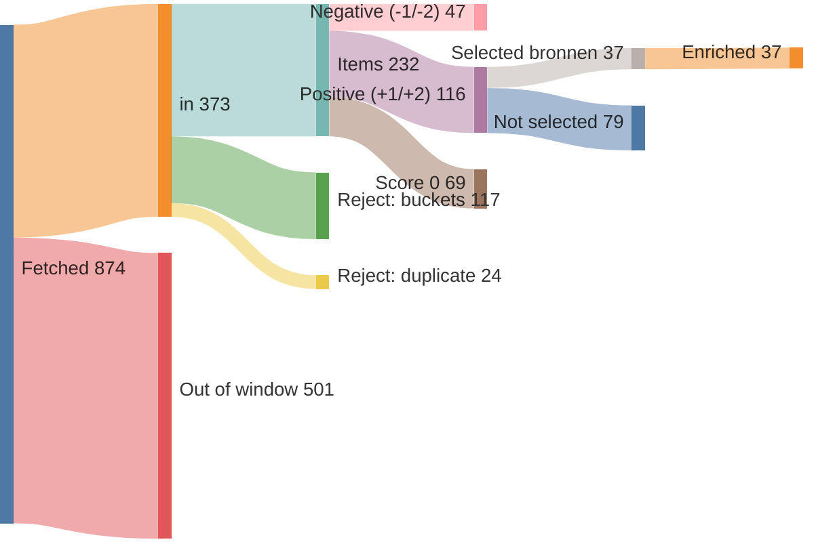
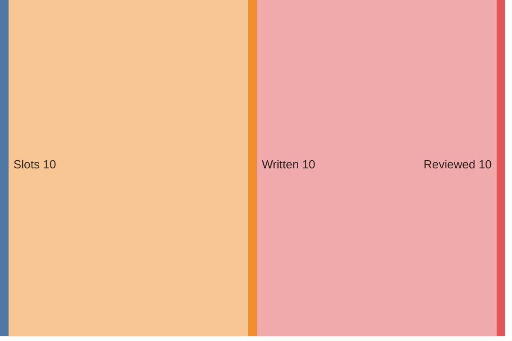
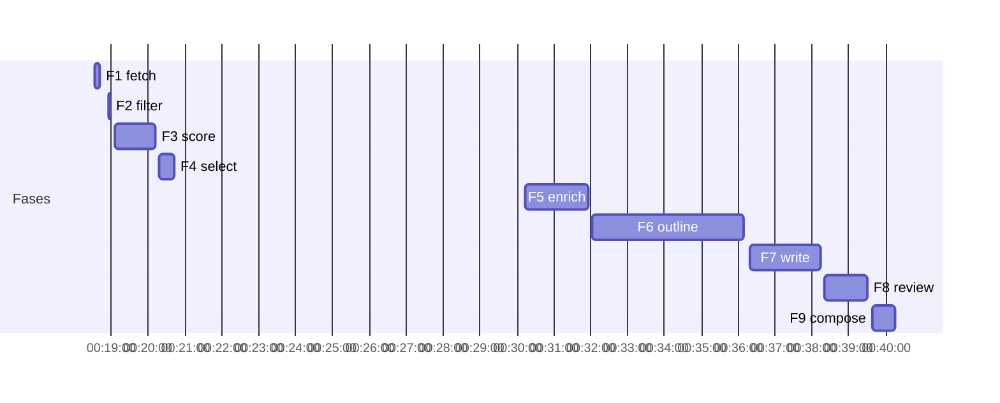

# Run report — edition 2026-07-26

## Funnel overview

Items — fetched → in → filtered → scored → selected → enriched (drop branches show why and what type):

Edition — slots → written → reviewed:

## Funnel

- window: 6 days (from 2026-07-20T00:00:00+02:00, SRC-4)
- F1 fetch: 874 feed items → 373 in (33/33 feeds ok)
- F2 filter: 373 → 232 items (141 rejected)
- F3 score: 232 scored → 116 at +1/+2
- F4 select: 24 onderwerpen (37 bronnen)
- F5 enrich: 37 bronnen → 37 full texts (requests 37, playwright 0)
- F6 outline: 10 slots, planned 2300–4500 words
- F7 write: 10 articles, 3007 words
- F8 review: 2987 words body text (ED-5 target 2800–3400)
- F9 compose: nr 4, 0 recompile(s) — typeset checks clean

## Feeds

| medium | items | in | error |
|---|---|---|---|
| Gem Wijchen | 20 | 1 | — |
| nieuws.nl | 48 | 10 | — |
| Gld | 50 | 50 | — |
| Gld RvN | 50 | 50 | — |
| Overheid | 10 | 10 | — |
| NOS J | 20 | 20 | — |
| NOS Binnen | 20 | 20 | — |
| NOS Buiten | 20 | 20 | — |
| NOS Econ | 20 | 20 | — |
| NOS Sport | 20 | 20 | — |
| NOS Opm | 20 | 1 | — |
| NOS Cultuur | 20 | 3 | — |
| FTM | 7 | 6 | — |
| EW | 10 | 10 | — |
| DW | 21 | 21 | — |
| DW Env | 20 | 4 | — |
| DW Science | 3 | 3 | — |
| Positive | 10 | 5 | — |
| WijWijchen | 20 | 2 | — |
| Druten | 20 | 4 | — |
| KNMI | 5 | 0 | — |
| CBS n&m | 50 | 1 | — |
| CBS v&c | 50 | 0 | — |
| Natuurmon | 30 | 12 | — |
| IVN | 10 | 0 | — |
| MaatschapWij | 8 | 3 | — |
| BBC Future | 10 | 7 | — |
| RtbC | 10 | 5 | — |
| FixNews | 20 | 3 | — |
| Mongabay | 32 | 32 | — |
| HumanProg | 10 | 10 | — |
| NatureToday | 200 | 20 | — |
| ARK | 10 | 0 | — |

## Timeline

`elapsed` is measured wall-clock per fase; `Σ wall` sums the per-call durations of calls that ran concurrently, so it is not elapsed time. `span` is the LLM fan-out measured end to end and `slowest` is the tail call that sets it.

| fase | start | elapsed | LLM span | slowest call | Σ wall | calls |
|---|---|---|---|---|---|---|
| F1 fetch | 00:18:33 | 7.8s | — | — | — | — |
| F2 filter | 00:18:56 | 0.1s | — | — | — | — |
| F3 score | 00:19:06 | 65.7s | 65.3s | 65.3s | 157.8s | 3 |
| F4 select | 00:20:17 | 26.5s | 26.1s | 26.1s | 24.3s | 1 |
| F5 enrich | 00:30:13 | 102.8s | 74.3s | 74.3s | 482.4s | 26 |
| F6 outline | 00:32:03 | 245.3s | 244.8s | 244.8s | 242.5s | 1 |
| F7 write | 00:36:18 | 115.8s | 115.4s | 115.4s | 693.5s | 10 |
| F8 review | 00:38:21 | 67.8s | 67.4s | 67.4s | 371.4s | 10 |
| F9 compose | 00:39:39 | 35.7s | 32.7s | 32.7s | 30.1s | 1 |
| **total** |  | 667.4s |  |  |  |  |

## LLM usage

| fase | model | effort | calls | turns | in tok | out tok | tools | think chars | Σ wall | cost |
|---|---|---|---|---|---|---|---|---|---|---|
| F3 score | claude-haiku-4-5-20251001 | — | 3 | 6 | 81,795 | 16,598 | 3 | 34,551 | 157.8s | $0.2385 |
| F4 select | claude-sonnet-5 | low | 1 | 2 | 73,413 | 1,603 | 1 | 0 | 24.3s | $0.4939 |
| F5 enrich | claude-haiku-4-5-20251001 | — | 26 | 64 | 847,465 | 40,862 | 25 | 68,791 | 482.4s | $0.6559 |
| F6 outline | claude-opus-4-8 | medium | 1 | 2 | 56,255 | 15,923 | 1 | 0 | 242.5s | $0.9822 |
| F7 write | claude-sonnet-5 | high | 10 | 20 | 383,746 | 56,899 | 10 | 0 | 693.5s | $2.0597 |
| F8 review | claude-sonnet-5 | medium | 10 | 20 | 362,112 | 30,763 | 10 | 0 | 371.4s | $1.6889 |
| F9 compose | — | — | 1 | 6 | 72,854 | 2,151 | 5 | 0 | 30.1s | $0.5095 |
| **total** |  |  | 52 | 120 | 1,877,640 | 164,799 | 55 | 103,342 | 2002.0s | $6.6286 |

## Rejected (F2)

| reason | count |
|---|---|
| B1 | 46 |
| B2 | 61 |
| B3 | 14 |
| B4 | 6 |
| B5 | 16 |
| duplicate | 24 |

## Scores (F3)

model claude-haiku-4-5-20251001, prompt score.md v5

| score | count |
|---|---|
| -2 | 10 |
| -1 | 37 |
| 0 | 69 |
| +1 | 98 |
| +2 | 18 |

## Selected onderwerpen (F4)

| schaal | onderwerp | media |
|---|---|---|
| L | Willie Heij loopt zijn 66e Vierdaagse | nieuws.nl |
| L | Wout Loeffen loopt Vierdaagse voor Huntington | nieuws.nl |
| L | Brons voor Laura Smulders op WK BMX | nieuws.nl |
| L | Theatervoorstelling De Honingbij in Hernen | nieuws.nl |
| L | Zomerspeurtocht verdwenen ijscoupes in Wijchen | nieuws.nl |
| L | Toezichthouders werken over gemeentegrenzen | nieuws.nl |
| L | Column: Samen in beweging | Gem Wijchen |
| R | Vierdaagse 2026: 42.137 wandelaars over de finish | Gld, NOS Binnen, Gld, NOS J, Gld RvN, Gld RvN, Gld RvN, Gld |
| R | Papierfabriek Folding Boxboard gered van faillissement | Gld |
| R | 100-jarige bevrijder Arnhem krijgt medaille | Gld |
| R | Herman van Veen koos jonge illustrator uit Hierden | Gld |
| R | Goud en brons voor Gelderse atleten op NK | Gld RvN |
| R | Roze Woensdag in Nijmegen | Gld RvN |
| R | Column: Elke stap telt (Druten) | Druten |
| N | Amsterdam viert WorldPride, grootste lhbti-evenement ooit | NOS Binnen, NOS J |
| N | OM haalt recordbedrag op bij criminelen | Overheid, NOS Binnen |
| N | Voor het eerst moeder als Queen Zomercarnaval Rotterdam | NOS Binnen, NOS J |
| N | Treinen stilgezet om poezengezin te redden | NOS J |
| N | Ecologisch bermbeheer wordt de standaard, goed voor insecten | NatureToday, NatureToday, NatureToday |
| I | Eerste ebolavaccin voor Bundibugyo-variant getest | NOS Buiten |
| I | Kinderen in Gaza krijgen weer zwemles in zee | NOS J |
| I | Gebouw in Nederland toont oplossingen voor wereldproblemen | Positive |
| I | Community voetbalclubs brengen verbinding terug | Positive |
| I | Eco wins: steden, dieren en technologie helpen klimaat | DW, DW Env |

## Enrichment (F5)

| schaal | onderwerp | medium | samenvatting | bron_woorden | refs | referentie_woorden | referentie_links | status |
|---|---|---|---|---|---|---|---|---|
| L | Willie Heij loopt zijn 66e Vierdaagse | nieuws.nl | 50 | 135 | 0 | 0 | — | ok |
| L | Wout Loeffen loopt Vierdaagse voor Huntington | nieuws.nl | 52 | 431 | 1 | 0 | ikkiesvooreenanderdoel.devierdaagsesponsorloop.nl/fundraise… | ok |
| L | Brons voor Laura Smulders op WK BMX | nieuws.nl | 47 | 272 | 0 | 0 | — | ok |
| L | Theatervoorstelling De Honingbij in Hernen | nieuws.nl | 46 | 245 | 0 | 0 | — | ok |
| L | Zomerspeurtocht verdwenen ijscoupes in Wijchen | nieuws.nl | 42 | 144 | 0 | 0 | — | ok |
| L | Toezichthouders werken over gemeentegrenzen | nieuws.nl | 44 | 154 | 0 | 0 | — | ok |
| L | Column: Samen in beweging | Gem Wijchen | 26 | 274 | 0 | 0 | — | ok |
| R | Vierdaagse 2026: 42.137 wandelaars over de finish | Gld | 42 | 3050 | 3 | 1097 | anwb.nl/verkeer?expoints=verkeersportalnl&latitude=51.78925… gardenersworldmagazine.nl/groene-school/kweken/gladiolen-op… gld.nl/podcast/07968ea7-e519-4860-a822-ef0475e3d9c9/de-dood… | ok |
| R | Vierdaagse 2026: 42.137 wandelaars over de finish | NOS Binnen | 410 | 417 | 1 | 1200 | gld.nl/nieuws/8501325/live-vierdaagse-op-naar-de-via-gladio… | ok |
| R | Vierdaagse 2026: 42.137 wandelaars over de finish | Gld | 45 | 136 | 2 | 215 | gld.nl/tv/programma/vierdaagsefeesten/172 gld.nl/vierdaagse2006 | ok |
| R | Vierdaagse 2026: 42.137 wandelaars over de finish | NOS J | 122 | 150 | 0 | 0 | — | ok |
| R | Vierdaagse 2026: 42.137 wandelaars over de finish | Gld RvN | 41 | 3688 | 0 | 0 | — | ok |
| R | Vierdaagse 2026: 42.137 wandelaars over de finish | Gld RvN | 41 | 428 | 0 | 0 | — | ok |
| R | Vierdaagse 2026: 42.137 wandelaars over de finish | Gld RvN | 42 | 358 | 1 | 86 | gld.nl/tv/programma/vierdaagsefeesten/172 | ok |
| R | Vierdaagse 2026: 42.137 wandelaars over de finish | Gld | 40 | 224 | 2 | 1061 | gld.nl/nieuws/8336797/bert-liep-71-keer-de-vierdaagse-nu-lo… gld.nl/tv/programma/vierdaagsefeesten/172 | ok |
| R | Papierfabriek Folding Boxboard gered van faillissement | Gld | 44 | 293 | 0 | 0 | — | ok |
| R | 100-jarige bevrijder Arnhem krijgt medaille | Gld | 57 | 335 | 1 | 0 | rtvconnect.nl/nieuws/artikel/100-jarige-bevrijder-van-arnhe… | ok |
| R | Herman van Veen koos jonge illustrator uit Hierden | Gld | 55 | 549 | 1 | 674 | vrmg.nl/rozemarijn-19-uit-hierden-maakte-illustraties-voor-… | ok |
| R | Goud en brons voor Gelderse atleten op NK | Gld RvN | 34 | 69 | 0 | 0 | — | ok |
| R | Roze Woensdag in Nijmegen | Gld RvN | 37 | 387 | 0 | 0 | — | ok |
| R | Column: Elke stap telt (Druten) | Druten | 35 | 270 | 0 | 0 | — | ok |
| N | Amsterdam viert WorldPride, grootste lhbti-evenement ooit | NOS Binnen | 780 | 762 | 2 | 662 | amsterdam.nl/nieuws/nieuwsoverzicht/roze-driehoek-regenboog… uva.nl/content/nieuws/persberichten/2026/03/nederlandse-jon… | ok |
| N | Amsterdam viert WorldPride, grootste lhbti-evenement ooit | NOS J | 281 | 169 | 0 | 0 | — | ok |
| N | OM haalt recordbedrag op bij criminelen | Overheid | 32 | 242 | 2 | 300 | rijksoverheid.nl/actueel/nieuws/2026/05/22/kabinet-stuurt-s… officielebekendmakingen.nl/stb-2026-222.html | ok |
| N | OM haalt recordbedrag op bij criminelen | NOS Binnen | 340 | 350 | 1 | 65 | om.nl/documenten/criminele-geldstromen/map/om-jaarbericht-c… | ok |
| N | Voor het eerst moeder als Queen Zomercarnaval Rotterdam | NOS Binnen | 549 | 507 | 0 | 0 | — | ok |
| N | Voor het eerst moeder als Queen Zomercarnaval Rotterdam | NOS J | 142 | 117 | 0 | 0 | — | ok |
| N | Treinen stilgezet om poezengezin te redden | NOS J | 73 | 85 | 0 | 0 | — | ok |
| N | Ecologisch bermbeheer wordt de standaard, goed voor insecten | NatureToday | 53 | 480 | 3 | 1442 | vlinderstichting.nl/kleurkeur-werkt-meer-biodiversiteit/ vlinderstichting.nl/kleurkeur/ naturetoday.com/intl/nl/nature-reports/message/?msg=33606 | ok |
| N | Ecologisch bermbeheer wordt de standaard, goed voor insecten | NatureToday | 59 | 685 | 0 | 0 | — | ok |
| N | Ecologisch bermbeheer wordt de standaard, goed voor insecten | NatureToday | 61 | 516 | 3 | 2220 | verspreidingsatlas.nl/1188 vlinderstichting.nl/vlinder/jakobsvlinder/ naturetoday.com/intl/nl/nature-reports/message/?msg=30954 | ok |
| I | Eerste ebolavaccin voor Bundibugyo-variant getest | NOS Buiten | 181 | 191 | 0 | 0 | — | ok |
| I | Kinderen in Gaza krijgen weer zwemles in zee | NOS J | 135 | 90 | 0 | 0 | — | ok |
| I | Gebouw in Nederland toont oplossingen voor wereldproblemen | Positive | 39 | 643 | 0 | 0 | — | ok |
| I | Community voetbalclubs brengen verbinding terug | Positive | 38 | 904 | 0 | 0 | — | ok |
| I | Eco wins: steden, dieren en technologie helpen klimaat | DW | 34 | 312 | 3 | 2670 | dw.com/en/megafires-climate-change-intensified-fires-mitiga… dw.com/en/europe-wildfires-fires-france-spain-italy/a-78080… dw.com/en/heat-resistant-housing-how-we-need-to-adapt-our-h… | ok |
| I | Eco wins: steden, dieren en technologie helpen klimaat | DW Env | 34 | 312 | 3 | 2670 | dw.com/en/megafires-climate-change-intensified-fires-mitiga… dw.com/en/europe-wildfires-fires-france-spain-italy/a-78080… dw.com/en/heat-resistant-housing-how-we-need-to-adapt-our-h… | ok |

## Edition plan (F6)

| pos | schaal | lengte | onderwerp | locatie | bron_datum |
|---|---|---|---|---|---|
| 1 | L | kort | Willie Heij loopt zijn 66e Vierdaagse | Wijchen | 2026-07-21 |
| 2 | L | kort | Zomerspeurtocht verdwenen ijscoupes in Wijchen | Wijchen | 2026-07-20 |
| 3 | R | kort | Papierfabriek Folding Boxboard gered van faillissement | Eerbeek | 2026-07-25 |
| 4 | R | mid | Herman van Veen koos jonge illustrator uit Hierden | Hierden | 2026-07-25 |
| 5 | R | kort | 100-jarige bevrijder Arnhem krijgt medaille | Arnhem | 2026-07-25 |
| 6 | N | lang | Ecologisch bermbeheer wordt de standaard, goed voor insecten | Nederland | 2026-07-22 |
| 7 | N | mid | OM haalt recordbedrag op bij criminelen | Den Haag | 2026-07-25 |
| 8 | N | mid | Voor het eerst moeder als Queen Zomercarnaval Rotterdam | Rotterdam | 2026-07-25 |
| 9 | I | mid | Eerste ebolavaccin voor Bundibugyo-variant getest | Oxford | 2026-07-25 |
| 10 | I | mid | Community voetbalclubs brengen verbinding terug | Bedford | 2026-07-22 |

## Slot inputs (F5→F6)

| pos | schaal | lengte | artikelkop | medium | samenvatting | bron_woorden | refs | referentie_woorden | model (F7) | invalshoek |
|---|---|---|---|---|---|---|---|---|---|---|
| 1 | L | kort | Willie Heij (83) loopt zijn 66e Vierdaagse | nieuws.nl | 50 | 135 | 0 | 0 | claude-sonnet-5 | Stille bekwaamheid als menselijke synecdoche: 83 jaar, 66e keer, sinds 1958 — recordhouder onder de nog lopende wandelaars. Niet de prestatie centraal maar de vanzelfsprekende volharding, terwijl de stoet door Wijchen trekt. Warm-in-terughoudendheid. |
| 2 | L | kort | Op zoek naar de verdwenen ijscoupes | nieuws.nl | 42 | 144 | 0 | 0 | claude-opus-4-8 | Ga-en-kijk, puur: de ijscoman is zijn ingrediënten kwijt en kinderen speuren de etalages van het centrum af. Een tastbare reden om de deur uit te gaan en mee te doen. Licht, nieuwsgierig, zonder de aardigheid dood te leggen. |
| 3 | R | kort | Eeuwenoude papierfabriek krijgt toch een doorstart | Gld | 44 | 293 | 0 | 0 | claude-sonnet-5 | Herstel met erkennen-en-keren: een sector onder druk, een faillissement — en tóch een doorstart voor een bedrijf dat teruggaat tot 1661. Benoem de somberheid, keer dan naar de veiliggestelde toekomst. Recht, ingehouden, geen valse triomf. |
| 4 | R | mid | Studente illustreert Herman van Veens Repelsteeltje | Gld | 55 | 549 | 1 | 674 | claude-sonnet-5 | Verandermaker en gegrepen kans: een negentienjarige student, een paar proefschetsen tussen de lessen door, en Herman van Veen kiest haar voor honderd uur illustraties bij 'Repelsteeltje'. Het talent en het lef dat de uitkomst aandreef. Warm. |
| 5 | R | kort | Honderdjarige bevrijder krijgt tweede Nederlandse medaille | Gld | 57 | 335 | 1 (0 ok) | 0 | claude-sonnet-5 | Laat herstel en erkenning: een 100-jarige bevrijder, vier maanden na zijn eerste terugkeer sinds 1945, krijgt een onderscheiding — het comité reist er stiekem voor naar Engeland. De verrassing draagt het stuk. Warm-in-terughoudendheid. |
| 6 | N | lang | Slordige berm blijkt bewust beleid | NatureToday, NatureToday, NatureToday | 173 | 1681 | 6 | 3662 | claude-sonnet-5 | Vooruitgangsverhaal met contra-intuïtieve kop: 'maaien is doden'. Uitgangscijfer — twee keer zoveel wilde bijen waar Kleurkeur de standaard wordt. De stille verbetering die niemand opmerkt; ruimte voor konijn en jakobskruiskruid als weefsel. Nieuwsgierig, gezaghebbend. |
| 7 | N | mid | OM pakt recordbedrag af bij criminelen | Overheid, NOS Binnen | 372 | 592 | 3 (2 ok) | 365 | claude-sonnet-5 | Strikt op de OM-cijfers: 433 miljoen afgepakt, vierde jaar op rij stijging — misdaad mag niet lonen. Contra-intuïtief uitgangscijfer tegen het gevoel dat criminelen wegkomen. Gezaghebbend. Blijf weg van de nederzettingen-bron in dit cluster. |
| 8 | N | mid | Zomercarnaval kroont eerste moeder als Queen | NOS Binnen, NOS J | 691 | 624 | 0 | 0 | claude-sonnet-5 | Verandermaker met erkennen-en-keren: een verouderde regel hield moeders uit de verkiezing, tot die geschrapt werd — en Mireyna's levenslange droom alsnog uitkwam en zij won. Opgewekt binnen de vangrails, in glitters en veren. Rotterdam kleurt. |
| 9 | I | mid | Eerste prik tegen ebolavariant, voorraad al gereed | NOS Buiten | 181 | 191 | 0 | 0 | claude-sonnet-5 | Oplossingsverhaal: eerste proefpersoon ingeënt tegen de Bundibugyo-variant waartegen nog geen vaccin bestaat, terwijl een uitbraak in Congo woedt. Probleem, interventie, en 600.000 doses al klaar voor inzet. Hoopvol maar nuchter, gezaghebbend. |
| 10 | I | mid | Real Bedford verliest de wedstrijd, wint de stad | Positive | 38 | 904 | 0 | 0 | claude-sonnet-5 | Herstel en verbinding op menselijke schaal: nu de Premier League onbetaalbaar wordt, keren fans terug naar het veld om de hoek. Een uit het niets opgebouwde club bracht 'het gevoel van gemeenschap terug in de stad'. Warm. |
|  |  |  | **totaal** |  | 1703 | 5448 | 11 (9 ok) | 4701 |  |  |

## Articles (F7/8)

| pos | artikelkop | woorden concept → artikel | model (F7) | effort |
|---|---|---|---|---|
| 1 | Willie Heij (83) loopt zijn 66e Vierdaagse | 180 → 179 | claude-sonnet-5 | high |
| 2 | Op zoek naar de verdwenen ijscoupes | 192 → 190 | claude-opus-4-8 | high |
| 3 | Eeuwenoude papierfabriek krijgt toch een doorstart | 175 → 165 | claude-sonnet-5 | high |
| 4 | Studente illustreert Herman van Veens Repelsteeltje | 329 → 330 | claude-sonnet-5 | high |
| 5 | Honderdjarige bevrijder krijgt tweede Nederlandse medaille | 204 → 203 | claude-sonnet-5 | high |
| 6 | Slordige berm blijkt bewust beleid | 580 → 580 | claude-sonnet-5 | high |
| 7 | OM pakt recordbedrag af bij criminelen | 282 → 281 | claude-sonnet-5 | high |
| 8 | Zomercarnaval kroont eerste moeder als Queen | 353 → 355 | claude-sonnet-5 | high |
| 9 | Eerste prik tegen ebolavariant, voorraad al gereed | 267 → 268 | claude-sonnet-5 | high |
| 10 | Real Bedford verliest de wedstrijd, wint de stad | 445 → 436 | claude-sonnet-5 | high |

## Typeset & compose (F9)

- illustration (EL-3): 'Een onderscheiding: medaille met lint en stralende ster' with the article at pos 5 — `work/f9-illustration-1.svg`
- illustration (EL-3): 'Vlinder boven ongemaaide bermgrassen' with the article at pos 6 — `work/f9-illustration-2.svg`
- 0 recompile(s)
- all typeset checks passed
