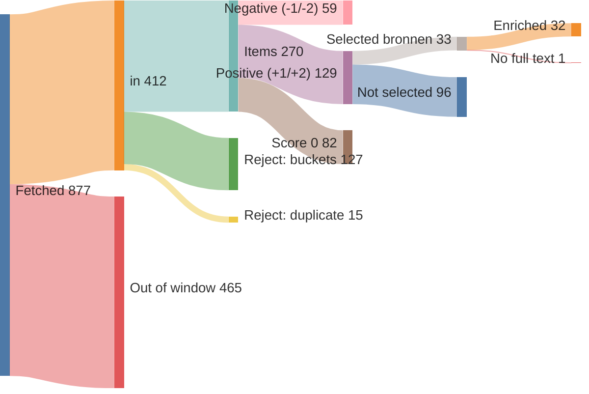
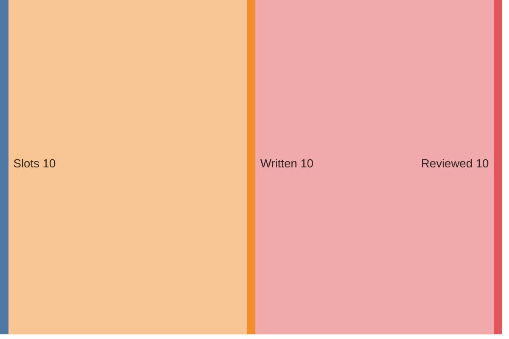
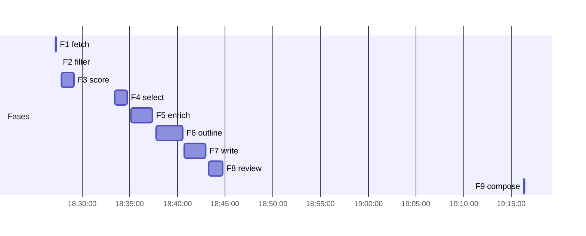

# Run report — edition 2026-07-29

## Funnel overview

Items — fetched → in → filtered → scored → selected → enriched (drop branches show why and what type):

Edition — slots → written → reviewed:

## Funnel

- window: 10 days (from 2026-07-19T00:00:00+02:00, SRC-4)
- F1 fetch: 877 feed items → 412 in (33/33 feeds ok)
- F2 filter: 412 → 270 items (142 rejected)
- F3 score: 270 scored → 129 at +1/+2
- F4 select: 24 onderwerpen (33 bronnen)
- F5 enrich: 33 bronnen → 32 full texts (requests 32, playwright 0); 1 onderwerpen dropped (F5)
- F6 outline: 10 slots, planned 2600–5000 words
- F7 write: 10 articles, 3016 words
- F8 review: 2985 words body text (ED-5 target 2800–3400)
- F9 compose: nr 5, 0 recompile(s) — typeset checks clean

## Feeds

| medium | items | in | error |
|---|---|---|---|
| Gem Wijchen | 20 | 2 | — |
| nieuws.nl | 44 | 13 | — |
| Gld | 50 | 50 | — |
| Gld RvN | 50 | 50 | — |
| Overheid | 13 | 13 | — |
| NOS J | 20 | 20 | — |
| NOS Binnen | 20 | 20 | — |
| NOS Buiten | 20 | 20 | — |
| NOS Econ | 20 | 20 | — |
| NOS Sport | 20 | 20 | — |
| NOS Opm | 20 | 2 | — |
| NOS Cultuur | 20 | 4 | — |
| FTM | 9 | 9 | — |
| EW | 10 | 10 | — |
| DW | 21 | 21 | — |
| DW Env | 20 | 5 | — |
| DW Science | 5 | 5 | — |
| Positive | 10 | 6 | — |
| WijWijchen | 20 | 4 | — |
| Druten | 20 | 3 | — |
| KNMI | 5 | 0 | — |
| CBS n&m | 50 | 1 | — |
| CBS v&c | 50 | 0 | — |
| Natuurmon | 30 | 14 | — |
| IVN | 10 | 0 | — |
| MaatschapWij | 8 | 4 | — |
| BBC Future | 10 | 10 | — |
| RtbC | 10 | 6 | — |
| FixNews | 20 | 3 | — |
| Mongabay | 32 | 32 | — |
| HumanProg | 10 | 10 | — |
| NatureToday | 200 | 33 | — |
| ARK | 10 | 2 | — |

## Timeline

`elapsed` is measured wall-clock per fase; `Σ wall` sums the per-call durations of calls that ran concurrently, so it is not elapsed time. `span` is the LLM fan-out measured end to end and `slowest` is the tail call that sets it.

| fase | start | elapsed | LLM span | slowest call | Σ wall | calls |
|---|---|---|---|---|---|---|
| F1 fetch | 18:27:14 | 5.4s | — | — | — | — |
| F2 filter | 18:27:37 | 0.1s | — | — | — | — |
| F3 score | 18:27:49 | 79.1s | 78.6s | 78.6s | 220.6s | 4 |
| F4 select | 18:33:27 | 78.9s | 78.4s | 78.4s | 75.7s | 1 |
| F5 enrich | 18:35:08 | 134.1s | 86.4s | 86.4s | 349.6s | 22 |
| F6 outline | 18:37:48 | 164.2s | 163.7s | 163.7s | 160.9s | 1 |
| F7 write | 18:40:45 | 132.3s | 131.8s | 131.8s | 581.6s | 10 |
| F8 review | 18:43:15 | 87.5s | 86.9s | 86.9s | 353.6s | 10 |
| F9 compose | 19:16:17 | 5.2s | — | — | — | — |
| **total** |  | 686.7s |  |  |  |  |

## LLM usage

| fase | model | effort | calls | turns | in tok | out tok | tools | think chars | Σ wall | cost |
|---|---|---|---|---|---|---|---|---|---|---|
| F3 score | claude-haiku-4-5-20251001 | — | 4 | 8 | 108,062 | 20,929 | 4 | 37,962 | 220.6s | $0.2233 |
| F4 select | claude-sonnet-5 | low | 1 | 4 | 229,316 | 6,773 | 3 | 0 | 75.7s | $0.2284 |
| F5 enrich | claude-haiku-4-5-20251001 | — | 22 | 56 | 739,629 | 26,527 | 22 | 46,205 | 349.6s | $0.5266 |
| F6 outline | claude-opus-4-8 | medium | 1 | 2 | 52,525 | 11,169 | 1 | 0 | 160.9s | $0.8233 |
| F7 write | claude-sonnet-5 | high | 10 | 20 | 404,518 | 43,872 | 10 | 0 | 581.6s | $2.0267 |
| F8 review | claude-sonnet-5 | medium | 10 | 20 | 363,730 | 26,457 | 10 | 0 | 353.6s | $1.1530 |
| **total** |  |  | 48 | 110 | 1,897,780 | 135,727 | 50 | 84,167 | 1742.1s | $4.9813 |

## Rejected (F2)

| reason | count |
|---|---|
| B1 | 58 |
| B2 | 57 |
| B3 | 11 |
| B4 | 8 |
| B5 | 22 |
| duplicate | 15 |

## Scores (F3)

model claude-haiku-4-5-20251001, prompt score.md v5

| score | count |
|---|---|
| -2 | 22 |
| -1 | 37 |
| 0 | 82 |
| +1 | 83 |
| +2 | 46 |

## Selected onderwerpen (F4)

| schaal | onderwerp | media |
|---|---|---|
| L | Vierdaagse trekt door Wijchen | nieuws.nl, nieuws.nl, nieuws.nl, Gld RvN, Gld RvN, Gld RvN, Gld RvN, Gld RvN, Gld RvN, Gld RvN |
| L | Column: samen in beweging | Gem Wijchen |
| L | Theatervoorstelling De Honingbij in kasteel Hernen | nieuws.nl |
| L | Brons voor Laura Smulders op WK BMX | nieuws.nl |
| L | Toezichthouders werken over gemeentegrenzen | nieuws.nl |
| L | Zomerspeurtocht verdwenen ijscoupes | nieuws.nl |
| L | Koop en help jongeren in Benin | WijWijchen |
| R | Gert Jan en zijn duizend fuchsia's | Gld |
| R | Rene le Blanc op album Engelbert Humperdinck | Gld |
| R | Vrijwilligers pakken Japanse duizendknoop aan | Gld |
| R | Papierfabriek Eerbeek maakt doorstart | Gld |
| R | Egel bevrijd uit muur in Vierhouten | Gld |
| R | Ome Joop's Tour: fietsvakantie voor kinderen | Gld |
| R | Sterrenwachten openen deuren voor zonsverduistering | Gld |
| N | Stikstofdoelen 2035 in zicht | NatureToday |
| N | Klimaatplannen goed nieuws voor vogels Zuidwestelijke Delta | NatureToday |
| N | Spontaan ooibos langs de Waal bij Gelderse Poort | NatureToday |
| N | Natuurontwikkeling droogdal bij Vijlen afgerond | ARK |
| N | Campagne helpt Nederlanders energie besparen | Overheid |
| I | Gebouw in Nederland als plek van hoop en oplossingen | Positive |
| I | Gemeenschapsclubs brengen verbinding terug in voetbal | Positive |
| I | Luipaarden herstellen in Zambia dankzij synthetische huiden | Positive |
| I | Cheetas teruggebracht in Zambiaans ecosysteem | Mongabay |
| I | Hawaiiaanse steltloper groeit van 200 naar 1500 | HumanProg |

## Enrichment (F5)

| schaal | onderwerp | medium | samenvatting | bron_woorden | refs | referentie_woorden | referentie_links | status |
|---|---|---|---|---|---|---|---|---|
| L | Vierdaagse trekt door Wijchen | nieuws.nl | 48 | 149 | 0 | 0 | — | ok |
| L | Vierdaagse trekt door Wijchen | nieuws.nl | 50 | 135 | 0 | 0 | — | ok |
| L | Vierdaagse trekt door Wijchen | nieuws.nl | 52 | 431 | 1 | 0 | ikkiesvooreenanderdoel.devierdaagsesponsorloop.nl/fundraise… | ok |
| L | Vierdaagse trekt door Wijchen | Gld RvN | 45 | 136 | 2 | 215 | gld.nl/tv/programma/vierdaagsefeesten/172 gld.nl/vierdaagse2006 | ok |
| L | Vierdaagse trekt door Wijchen | Gld RvN | 43 | 90 | 1 | 86 | gld.nl/tv/programma/vierdaagsefeesten/172 | ok |
| L | Vierdaagse trekt door Wijchen | Gld RvN | 40 | 224 | 2 | 1061 | gld.nl/nieuws/8336797/bert-liep-71-keer-de-vierdaagse-nu-lo… gld.nl/tv/programma/vierdaagsefeesten/172 | ok |
| L | Vierdaagse trekt door Wijchen | Gld RvN | 42 | 3049 | 3 | 645 | anwb.nl/verkeer?expoints=verkeersportalnl&latitude=51.78925… gld.nl/nieuws/8323566/alle-praktische-info-over-de-intocht-… gld.nl/nieuws/8501452/livestream-laatste-dag-van-de-vierdaa… | ok |
| L | Vierdaagse trekt door Wijchen | Gld RvN | 41 | 428 | 1 | 86 | gld.nl/tv/programma/vierdaagsefeesten/172 | ok |
| L | Vierdaagse trekt door Wijchen | Gld RvN | 41 | 3688 | 3 | 632 | gld.nl/tv/aflevering/4daagse-journaal/376387 gld.nl/tv/aflevering/vierdaagsefeesten/376388 gld.nl/nieuws/8323566/alle-praktische-info-over-de-intocht-… | ok |
| L | Vierdaagse trekt door Wijchen | Gld RvN | 34 | 69 | 0 | 0 | — | ok |
| L | Column: samen in beweging | Gem Wijchen | 26 | 274 | 0 | 0 | — | ok |
| L | Theatervoorstelling De Honingbij in kasteel Hernen | nieuws.nl | 46 | 245 | 1 | 512 | glk.nl/activiteiten/kasteelactiviteit/theatervoorstelling-d… | ok |
| L | Brons voor Laura Smulders op WK BMX | nieuws.nl | 47 | 272 | 0 | 0 | — | ok |
| L | Toezichthouders werken over gemeentegrenzen | nieuws.nl | 44 | 154 | 0 | 0 | — | ok |
| L | Zomerspeurtocht verdwenen ijscoupes | nieuws.nl | 42 | 144 | 0 | 0 | — | ok |
| L | Koop en help jongeren in Benin | WijWijchen | 63 | 135 | 0 | 0 | — | ok |
| R | Gert Jan en zijn duizend fuchsia's | Gld | 49 | 508 | 1 | 637 | rtvnunspeet.nl/wie-bij-gert-jan-80-de-tuin-in-loopt-belandt… | ok |
| R | Rene le Blanc op album Engelbert Humperdinck | Gld | 35 | 446 | 0 | 0 | — | ok |
| R | Vrijwilligers pakken Japanse duizendknoop aan | Gld | 48 | 616 | 0 | 0 | — | ok |
| R | Papierfabriek Eerbeek maakt doorstart | Gld | 31 | 298 | 0 | 0 | — | ok |
| R | Egel bevrijd uit muur in Vierhouten | Gld | 38 | 226 | 1 | 239 | rtvnunspeet.nl/bijzondere-reddingsactie-egel-zit-muurvast-a… | ok |
| R | Ome Joop's Tour: fietsvakantie voor kinderen | Gld | 33 | 0 | 0 | 0 | — | **dropped** — geen toereikende bron |
| R | Sterrenwachten openen deuren voor zonsverduistering | Gld | 31 | 302 | 0 | 0 | — | ok |
| N | Stikstofdoelen 2035 in zicht | NatureToday | 55 | 322 | 1 | 427 | bnnvara.nl/vroegevogels | ok |
| N | Klimaatplannen goed nieuws voor vogels Zuidwestelijke Delta | NatureToday | 35 | 317 | 1 | 1070 | omroepzeeland.nl/nieuws/18556294/klimaatplannen-voor-zeeuws… | ok |
| N | Spontaan ooibos langs de Waal bij Gelderse Poort | NatureToday | 69 | 919 | 0 | 0 | — | ok |
| N | Natuurontwikkeling droogdal bij Vijlen afgerond | ARK | 772 | 620 | 0 | 0 | — | ok |
| N | Campagne helpt Nederlanders energie besparen | Overheid | 35 | 512 | 1 | 56 | rijksoverheid.nl/documenten/2026/04/20/actiesweerbaarheiden… | ok |
| I | Gebouw in Nederland als plek van hoop en oplossingen | Positive | 39 | 643 | 0 | 0 | — | ok |
| I | Gemeenschapsclubs brengen verbinding terug in voetbal | Positive | 38 | 904 | 0 | 0 | — | ok |
| I | Luipaarden herstellen in Zambia dankzij synthetische huiden | Positive | 34 | 319 | 0 | 0 | — | ok |
| I | Cheetas teruggebracht in Zambiaans ecosysteem | Mongabay | 56 | 477 | 2 | 2400 | cambridge.org/core/journals/oryx/article/assessing-the-succ… cambridge.org/core/journals/oryx/article/reassessment-of-an… | ok |
| I | Hawaiiaanse steltloper groeit van 200 naar 1500 | HumanProg | 74 | 96 | 1 | 514 | mauinow.com/2026/07/23/hawaiian-stilt-population-improves-f… | ok |

## Edition plan (F6)

| pos | schaal | lengte | onderwerp | locatie | bron_datum |
|---|---|---|---|---|---|
| 1 | L | lang | Vierdaagse trekt door Wijchen | Wijchen | 2026-07-25 |
| 2 | L | mid | Brons voor Laura Smulders op WK BMX | Wijchen | 2026-07-22 |
| 3 | L | kort | Theatervoorstelling De Honingbij in kasteel Hernen | Hernen | 2026-07-25 |
| 4 | R | lang | Gert Jan en zijn duizend fuchsia's | Hulshorst | 2026-07-28 |
| 5 | R | mid | Papierfabriek Eerbeek maakt doorstart | Eerbeek | 2026-07-27 |
| 6 | R | kort | Sterrenwachten openen deuren voor zonsverduistering | Lochem | 2026-07-26 |
| 7 | N | mid | Stikstofdoelen 2035 in zicht | Veluwe | 2026-07-19 |
| 8 | N | mid | Spontaan ooibos langs de Waal bij Gelderse Poort | Gelderse Poort | 2026-07-27 |
| 9 | I | mid | Gebouw in Nederland als plek van hoop en oplossingen | Rotterdam | 2026-07-21 |
| 10 | I | kort | Luipaarden herstellen in Zambia dankzij synthetische huiden | West-Zambia | 2026-07-27 |

## Slot inputs (F5→F6)

| pos | schaal | lengte | artikelkop | medium | samenvatting | bron_woorden | refs | referentie_woorden | model (F7) | invalshoek |
|---|---|---|---|---|---|---|---|---|---|---|
| 1 | L | lang | Willie Heij loopt zijn 66e Vierdaagse | nieuws.nl, nieuws.nl, nieuws.nl, Gld RvN, Gld RvN, Gld RvN, Gld RvN, Gld RvN, Gld RvN, Gld RvN | 436 | 8399 | 13 (12 ok) | 2725 | claude-sonnet-5 | Maak de doorkomst door Wijchen tot gemeenschapsfeest, met Willie Heij (83, zijn 66e tocht, recordhouder onder de lopers) als menselijke synecdoche. Warm en terughoudend; de 42.137 uitlopers lopen op de achtergrond mee, niet in de kop. |
| 2 | L | mid | Smulders wint brons zonder finale te rijden | nieuws.nl | 47 | 272 | 0 | 0 | claude-sonnet-5 | Erkennen-en-keren: benoem het dubbele gevoel na de geschrapte WK-finale, keer dan naar wat telt — brons voor de Wijchense Laura Smulders en een verstandig veiligheidsbesluit bij storm. Nuchter, warm. |
| 3 | L | kort | Broer en zus redden bedreigd Bijengebied | nieuws.nl | 46 | 245 | 1 | 512 | claude-sonnet-5 | Ga-en-kijk voor gezinnen: nodig uit naar kasteel Hernen, waar Hanna'floor met accordeon 'De Honingbij' speelt tijdens de Kids-Zomerweken. Opgewekt en nieuwsgierig; concreet genoeg om er zelf heen te lopen. |
| 4 | R | lang | Duizend fuchsia's, elk met een eigen naam | Gld | 49 | 508 | 1 | 637 | claude-sonnet-5 | Warm portret van Gert Jan (80) uit Hulshorst en zijn duizend fuchsia's, elke plant een naam en een herinnering. Verandermaker uit pure toewijding; warmte-in-terughoudendheid, laat de stiltes en de naam 'Lena Lankman' hun werk doen. |
| 5 | R | mid | Eerbeek heeft zijn papierfabriek terug | Gld | 31 | 298 | 0 | 0 | claude-sonnet-5 | Herstelverhaal: papierfabriek Eerbeek maakt doorstart, 180 van de 220 banen behouden. Gezaghebbend en nuchter; benadruk de veerkracht en het 'samen sterk', zonder de eerdere onzekerheid te verzwijgen. |
| 6 | R | kort | Grootste zonsverduistering sinds 1999 boven Nederland | Gld | 31 | 302 | 0 | 0 | claude-sonnet-5 | Ga-en-kijk met tijdsklem: op 12 augustus verdwijnt bijna 90% van de zon; sterrenwachten in Lochem en Nijkerk openen hun deuren. Uitgangscijfer (vorige keer 1999, volgende pas 2081). Nieuwsgierig en uitnodigend. |
| 7 | N | mid | Nieuw rekenmodel ziet stikstofdoel Veluwe weer dichterbij | NatureToday | 55 | 322 | 1 | 427 | claude-sonnet-5 | Vooruitgangsverhaal met uitgangscijfer: waar het RIVM twee jaar terug op 40% zat, komt het doel van 74% natuurgebieden onder de kritische grens in 2035 nu in zicht. Erkennen-en-keren, tegen het stikstof-doembeeld in. |
| 8 | N | mid | Uiterwaard langs de Waal kiest zelf haar bos | NatureToday | 69 | 919 | 0 | 0 | claude-opus-4-8 | Stille bekwaamheid en geduld: langs de Waal in de Gelderse Poort mag 200 hectare ooibos vanzelf ontstaan. Laat de trage, onzichtbare groei — en de droogte die haar remt — spreken; niet forceren, laten gebeuren. |
| 9 | I | mid | Rotterdam bouwt ambassade voor duurzame oplossingen | Positive | 39 | 643 | 0 | 0 | claude-sonnet-5 | Oplossingsverhaal: in Rotterdam verrijst 'Shift Embassy', een gebouw dat werkende antwoorden op mondiale problemen toont — van machteloosheid naar hoop en handelen. Nieuwsgierig; houd het concreet en mijd holle beloftes. |
| 10 | I | kort | Koning ruilt luipaardenvel in voor kunstbont | Positive | 34 | 319 | 0 | 0 | claude-sonnet-5 | Verandermaker/oplossing: in West-Zambia daalt luipaardstroperij doordat ceremoniële gewaden nu synthetisch bont ('Heritage Furs') dragen, met koninklijke zegen. Subtiele juxtapositie van traditie en behoud; het uitgangscijfer (204–1.310 gespaarde luipaarden). |
|  |  |  | **totaal** |  | 837 | 12227 | 16 (15 ok) | 4301 |  |  |

## Articles (F7/8)

| pos | artikelkop | woorden concept → artikel | model (F7) | effort |
|---|---|---|---|---|
| 1 | Willie Heij loopt zijn 66e Vierdaagse | 453 → 450 | claude-sonnet-5 | high |
| 2 | Smulders wint brons zonder finale te rijden | 283 → 282 | claude-sonnet-5 | high |
| 3 | Broer en zus redden bedreigd Bijengebied | 192 → 192 | claude-sonnet-5 | high |
| 4 | Duizend fuchsia's, elk met een eigen naam | 450 → 443 | claude-sonnet-5 | high |
| 5 | Eerbeek heeft zijn papierfabriek terug | 280 → 268 | claude-sonnet-5 | high |
| 6 | Grootste zonsverduistering sinds 1999 boven Nederland | 218 → 219 | claude-sonnet-5 | high |
| 7 | Nieuw rekenmodel ziet stikstofdoel Veluwe weer dichterbij | 266 → 264 | claude-sonnet-5 | high |
| 8 | Uiterwaard langs de Waal kiest zelf haar bos | 372 → 365 | claude-opus-4-8 | high |
| 9 | Rotterdam bouwt ambassade voor duurzame oplossingen | 314 → 313 | claude-sonnet-5 | high |
| 10 | Koning ruilt luipaardenvel in voor kunstbont | 188 → 189 | claude-sonnet-5 | high |

## Typeset & compose (F9)

- illustration (EL-3): 'Een overhangende tak met vogels erop, boven een bloeiende plant in de berm' with the article at pos 8 — `work/f9-illustration-1.svg`
- illustration (EL-3): 'Een wandelschoen die als bloempot dienstdoet, met planten die eruit opschieten' with the article at pos 4 — `work/f9-illustration-2.svg`
- 0 recompile(s)
- all typeset checks passed
