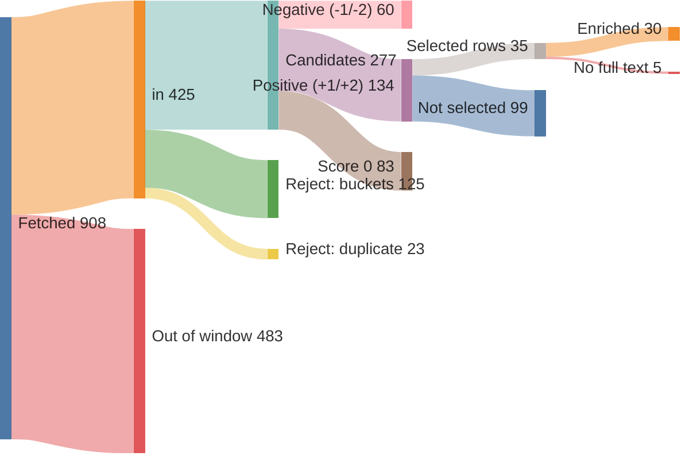
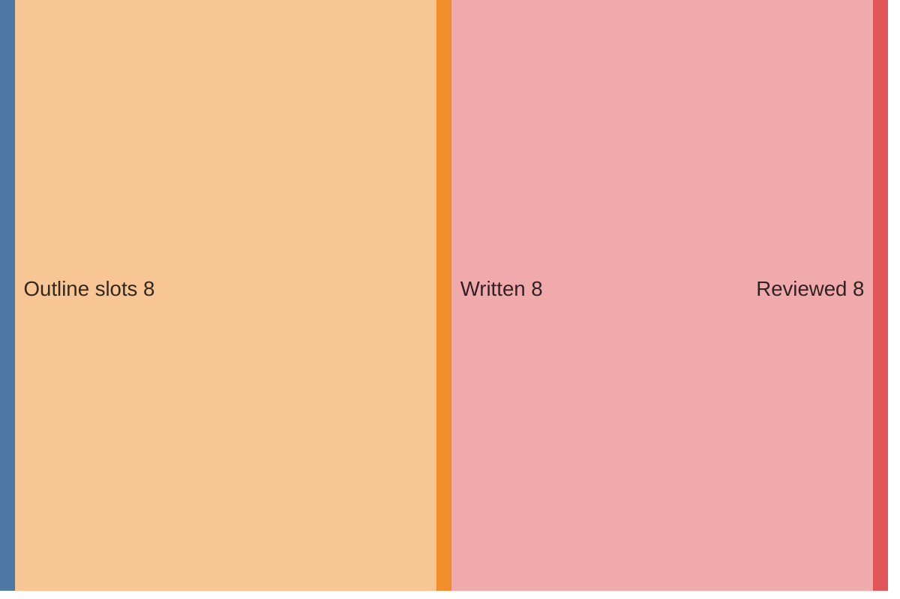

# Run report — edition 2026-07-26

## Funnel overview

Items — fetched → in → filtered → scored → selected → enriched (drop branches show why and what type):

Edition — outline slots → written → reviewed:

## Funnel

- window: 11 days (from 2026-07-15T00:00:00+02:00, SRC-4)
- F1 fetch: 908 feed items → 425 in (34/36 feeds ok)
- F2 filter: 425 → 277 candidates (148 rejected)
- F3 score: 277 scored → 134 at +1/+2
- F4 select: 24 topics (35 source rows)
- F5 enrich: 35 source rows → 30 full texts (requests 30, playwright 0); 4 topics dropped (F5)
- F6 outline: 8 slots, planned 2100–4000 words
- F7 write: 8 articles, 2490 words
- F8 review: 27 correction(s), 2489 words body text (ED-5 target 2800–3400)
- F9 compose: nr 4, 0 recompile(s); **1 unresolved typeset violation(s)**

## Feeds

| bron | items | in | error |
|---|---|---|---|
| Gem Wijchen | 20 | 1 | — |
| nieuws.nl | 54 | 15 | — |
| DG Wijchen | 30 | 30 | — |
| Gld | 50 | 50 | — |
| Gld RvN | 50 | 50 | — |
| Overheid | 8 | 8 | — |
| NOS J | 20 | 20 | — |
| NOS Binnen | 20 | 20 | — |
| NOS Buiten | 20 | 20 | — |
| NOS Econ | 20 | 20 | — |
| NOS Sport | 20 | 20 | — |
| NOS Opm | 20 | 4 | — |
| NOS Cultuur | 20 | 3 | — |
| FTM | 10 | 10 | — |
| EW | 10 | 10 | — |
| DW | 21 | 21 | — |
| DW Env | 20 | 5 | — |
| DW Science | 0 | 0 | — |
| Positive | 10 | 6 | — |
| WijWijchen | 20 | 2 | — |
| Druten | 20 | 5 | — |
| KNMI | 5 | 1 | — |
| CBS n&m | 50 | 4 | — |
| CBS v&c | 50 | 0 | — |
| Natuurmon | 30 | 8 | — |
| IVN | 10 | 0 | — |
| MaatschapWij | 8 | 4 | — |
| BBC Future | 10 | 8 | — |
| RtbC | 10 | 5 | — |
| FixNews | 20 | 2 | — |
| Mongabay | 32 | 32 | — |
| HumanProg | 10 | 10 | — |
| NatureToday | 200 | 27 | — |
| ARK | 10 | 4 | — |
| WijchensNws | 0 | 0 | HTTPError: 404 Client Error: Not Found for url: https://www.wijchensnieuws.nl/feed/ |
| Wegwijs | 0 | 0 | HTTPError: 404 Client Error: Not Found for url: https://www.weekblad-wegwijs.nl/feed |

## LLM usage

| fase | model | effort | calls | turns | in tok | out tok | tools | think chars | wall | cost |
|---|---|---|---|---|---|---|---|---|---|---|
| F3 score | claude-haiku-4-5-20251001 | — | 4 | 8 | 113,953 | 17,493 | 4 | 37,545 | 205.0s | $0.3209 |
| F4 select | claude-sonnet-5 | low | 1 | 3 | 159,044 | 6,534 | 2 | 0 | 75.1s | $0.6462 |
| F5 enrich | claude-haiku-4-5-20251001 | — | 24 | 64 | 850,465 | 27,087 | 23 | 52,076 | 354.8s | $0.4911 |
| F6 outline | claude-opus-4-8 | medium | 1 | 2 | 49,885 | 5,995 | 1 | 0 | 89.1s | $0.6663 |
| F7 write | claude-sonnet-5 | high | 8 | 16 | 298,770 | 54,189 | 8 | 0 | 648.5s | $2.0240 |
| F8 review | claude-sonnet-5 | medium | 8 | 21 | 493,895 | 43,532 | 13 | 0 | 485.3s | $1.2877 |
| F9 compose | — | — | 1 | 6 | 70,131 | 5,070 | 5 | 0 | 69.8s | $0.5680 |
| **total** |  |  | 47 | 120 | 2,036,143 | 159,900 | 56 | 89,621 | 1927.8s | $6.0042 |

## Rejected (F2)

| reason | count |
|---|---|
| B1 | 45 |
| B2 | 65 |
| B3 | 9 |
| B4 | 6 |
| B5 | 22 |
| duplicate | 23 |

## Scores (F3)

model claude-haiku-4-5-20251001, prompt score.md v3

| score | count |
|---|---|
| -2 | 18 |
| -1 | 42 |
| 0 | 83 |
| +1 | 98 |
| +2 | 36 |

## Selected topics (F4)

| s | topic | bronnen |
|---|---|---|
| L | Dag van Wijchen tijdens de Vierdaagse | nieuws.nl, nieuws.nl, nieuws.nl, nieuws.nl |
| L | Zomerprogramma voor gezinnen in Wijchen | Gem Wijchen, nieuws.nl, nieuws.nl |
| L | Toezichthouders werken over gemeentegrenzen | nieuws.nl |
| L | Batenburg Baroque Festival trekt meer bezoekers | nieuws.nl |
| L | Groot onderhoud openbare ruimte Wijchen | nieuws.nl |
| L | Minder mensen in Wijchen met WW-uitkering | DG Wijchen |
| L | Reanimatiecursus voor iedereen | WijWijchen |
| R | Doorzetters van de Vierdaagse | Gld, Gld, DG Wijchen, Gld |
| R | Sharda haalt de finish net op tijd | DG Wijchen |
| R | Via Flamingo maakt Weurt uitbundiger | DG Wijchen |
| R | Liefde gevonden bij de Vierdaagse, dochter loopt nu mee | DG Wijchen |
| R | A30 gaat eerder open na maanden werk | Gld |
| R | Ecopassages Hoge Veluwe verbeterd voor wilde dieren | Gld |
| R | NEC naar Champions League voorronde | Gld RvN, Gld RvN, Gld RvN |
| N | Arnhemse schuldenaanpak krijgt vervolg | NOS Econ |
| N | Stikstofdoelen 2035 in zicht | NatureToday |
| N | Nederlanders produceren minder afval | CBS n&m |
| N | EK Rubiks kubus brengt Europa samen in Arnhem | NOS Opm |
| N | Nederland gastland EK padel 2027 | NOS Sport |
| I | Amazoncanopybruggen voorkomen wegverkeersslachtoffers | Mongabay, HumanProg |
| I | Bultruggen keren massaal terug bij Rio | HumanProg |
| I | Landbouwprogramma helpt amputees in Sierra Leone | Positive |
| I | Scholeksters maken comeback dankzij natuurbescherming | Mongabay |
| I | Gemarginaliseerde groepen vinden gemeenschap via voetbal | Positive |

## Enrichment (F5)

| s | topic | bron | sum | text | refs | ref words | ref links | status |
|---|---|---|---|---|---|---|---|---|
| L | Dag van Wijchen tijdens de Vierdaagse | nieuws.nl | 48 | 149 | 0 | 0 | — | ok |
| L | Dag van Wijchen tijdens de Vierdaagse | nieuws.nl | 50 | 135 | 0 | 0 | — | ok |
| L | Dag van Wijchen tijdens de Vierdaagse | nieuws.nl | 52 | 431 | 1 | 0 | ikkiesvooreenanderdoel.devierdaagsesponsorloop.nl/fundraise… | ok |
| L | Dag van Wijchen tijdens de Vierdaagse | nieuws.nl | 53 | 155 | 2 | 363 | propersona.nl/zorgaanbod/preventie/ hoe-is-het.nl/ | ok |
| L | Zomerprogramma voor gezinnen in Wijchen | Gem Wijchen | 20 | 143 | 3 | 1011 | meervoormekaar.nl/activiteiten-zomeragenda-wijchen-en-drute… wijchenis.nl/agenda/ instagram.com/jongerenwerk_wijchen/ | ok |
| L | Zomerprogramma voor gezinnen in Wijchen | nieuws.nl | 42 | 144 | 3 | 345 | joepiedoe.com/?srsltid=AfmBOoq4e9HvxsZZ4LdzwMtl1HzSS3tAAWah… kids-town.nl/ bijdaankindermode.nl/ | ok |
| L | Zomerprogramma voor gezinnen in Wijchen | nieuws.nl | 49 | 280 | 1 | 166 | nl.wikipedia.org/wiki/Beltmolen | ok |
| L | Toezichthouders werken over gemeentegrenzen | nieuws.nl | 44 | 154 | 0 | 0 | — | ok |
| L | Batenburg Baroque Festival trekt meer bezoekers | nieuws.nl | 43 | 381 | 2 | 639 | wijchen.nieuws.nl/cultuur/batenburg-baroque-festival-is-beg… npoklassiek.nl/uitzendingen/zomeravondconcert/019dd367-36f7… | ok |
| L | Groot onderhoud openbare ruimte Wijchen | nieuws.nl | 45 | 180 | 0 | 0 | — | ok |
| L | Minder mensen in Wijchen met WW-uitkering | DG Wijchen | 28 | 0 | 0 | 0 | — | **dropped** — no sufficient row |
| L | Reanimatiecursus voor iedereen | WijWijchen | 60 | 131 | 0 | 0 | — | ok |
| R | Doorzetters van de Vierdaagse | Gld | 49 | 445 | 0 | 0 | — | ok |
| R | Doorzetters van de Vierdaagse | Gld | 50 | 500 | 1 | 67 | gld.nl/tv/programma/linda-breekt-uit/1502 | ok |
| R | Doorzetters van de Vierdaagse | DG Wijchen | 51 | 0 | 0 | 0 | — | insufficient |
| R | Doorzetters van de Vierdaagse | Gld | 35 | 330 | 1 | 376 | nhnieuws.nl/nieuws/361599/na-lang-wachten-mag-tim-11-de-nij… | ok |
| R | Sharda haalt de finish net op tijd | DG Wijchen | 39 | 0 | 0 | 0 | — | **dropped** — no sufficient row |
| R | Via Flamingo maakt Weurt uitbundiger | DG Wijchen | 51 | 0 | 0 | 0 | — | **dropped** — no sufficient row |
| R | Liefde gevonden bij de Vierdaagse, dochter loopt nu mee | DG Wijchen | 50 | 0 | 0 | 0 | — | **dropped** — no sufficient row |
| R | A30 gaat eerder open na maanden werk | Gld | 32 | 210 | 1 | 227 | vrmg.nl/a30-bijna-twee-dagen-eerder-open-einde-aan-maandenl… | ok |
| R | Ecopassages Hoge Veluwe verbeterd voor wilde dieren | Gld | 47 | 381 | 0 | 0 | — | ok |
| R | NEC naar Champions League voorronde | Gld RvN | 26 | 298 | 0 | 0 | — | ok |
| R | NEC naar Champions League voorronde | Gld RvN | 55 | 332 | 0 | 0 | — | ok |
| R | NEC naar Champions League voorronde | Gld RvN | 25 | 211 | 0 | 0 | — | ok |
| N | Arnhemse schuldenaanpak krijgt vervolg | NOS Econ | 681 | 723 | 1 | 1101 | openresearch.amsterdam/nl/page/116887/samen-met-bewoners-we… | ok |
| N | Stikstofdoelen 2035 in zicht | NatureToday | 55 | 322 | 3 | 1065 | naturetoday.com/intl/nl/nature-reports/?publisher=7 bnnvara.nl/vroegevogels saxifraga.nl/ | ok |
| N | Nederlanders produceren minder afval | CBS n&m | 0 | 785 | 3 | 1200 | cbs.nl/nl-nl/nieuws/2026/29/6-kilo-minder-afval-per-inwoner… cbs.nl/nl-nl/nieuws/2026/29/6-kilo-minder-afval-per-inwoner… cbs.nl/nl-nl/cijfers/detail/83558NED | ok |
| N | EK Rubiks kubus brengt Europa samen in Arnhem | NOS Opm | 429 | 511 | 3 | 560 | gld.nl/nieuws/8498006/op-het-ek-rubiks-cube-draait-het-om-s… jeugdjournaal.nl/artikel/2601583-jongen-9-breekt-wereldreco… nos.nl/artikel/2141914-nederlander-herovert-wereldrecord-op… | ok |
| N | Nederland gastland EK padel 2027 | NOS Sport | 228 | 225 | 0 | 0 | — | ok |
| I | Amazoncanopybruggen voorkomen wegverkeersslachtoffers | Mongabay | 19 | 1707 | 3 | 253 | iucnredlist.org/search?query=Callithrix%20flaviceps&searchT… projetoreconecta.com/ iucnredlist.org/species/210363264/222945240 | ok |
| I | Amazoncanopybruggen voorkomen wegverkeersslachtoffers | HumanProg | 73 | 171 | 1 | 1200 | news.mongabay.com/2026/07/zero-roadkill-as-amazon-canopy-br… | ok |
| I | Bultruggen keren massaal terug bij Rio | HumanProg | 73 | 63 | 1 | 466 | apnews.com/article/brazil-humpback-whales-rio-de-janeiro-gu… | ok |
| I | Landbouwprogramma helpt amputees in Sierra Leone | Positive | 36 | 745 | 3 | 1565 | thenewhumanitarian.org/report/94037/sierra-leone-amputees-s… facebook.com/SingleLegAmputeeSportsClub/ ari.ac.jp/en/about/ | ok |
| I | Scholeksters maken comeback dankzij natuurbescherming | Mongabay | 56 | 197 | 0 | 0 | — | ok |
| I | Gemarginaliseerde groepen vinden gemeenschap via voetbal | Positive | 33 | 1506 | 2 | 821 | athenlayfootballclub.org.uk positive.news/society/lionesses-euro-2022-win-inspires-camp… | ok |

## Edition plan (F6)

| pos | s | length | topic | locatie | datum |
|---|---|---|---|---|---|
| 1 | L | lang | Dag van Wijchen tijdens de Vierdaagse | Wijchen | 2026-07-21 |
| 2 | L | mid | Batenburg Baroque Festival trekt meer bezoekers | Batenburg | 2026-07-16 |
| 3 | R | mid | A30 gaat eerder open na maanden werk | Barneveld | 2026-07-21 |
| 4 | R | kort | NEC naar Champions League voorronde | Nijmegen | 2026-07-20 |
| 5 | N | lang | Arnhemse schuldenaanpak krijgt vervolg | Arnhem | 2026-07-15 |
| 6 | N | kort | EK Rubiks kubus brengt Europa samen in Arnhem | Arnhem | 2026-07-17 |
| 7 | I | mid | Landbouwprogramma helpt amputees in Sierra Leone | Sierra Leone | 2026-07-16 |
| 8 | I | kort | Bultruggen keren massaal terug bij Rio | Rio de Janeiro | 2026-07-17 |

## Articles (F7/8)

| pos | title | words draft → reviewed |
|---|---|---|
| 1 | Trouwe wandelaars lopen door, jaar na jaar | 418 → 420 |
| 2 | Batenburgs barokfestival bereikt ook radioluisteraars | 288 → 290 |
| 3 | A30 tussen Ede en Barneveld eerder open | 222 → 219 |
| 4 | Faberplein juicht bij loting Champions League | 210 → 209 |
| 5 | Vaste coach en een schone lei in Arnhem-Oost | 526 → 526 |
| 6 | EK speedcuben draait vooral om vriendschap | 217 → 218 |
| 7 | Boerderij in Sierra Leone geeft geamputeerden een vak | 383 → 381 |
| 8 | Walvissen keren terug naar Guanabara-baai | 226 → 226 |

## Correction log (F8)

- slot 1: Kilometeraanduidingen (40 kilometer, 30 kilometer) omgezet naar de metrische notatie 40 km en 30 km, conform de eenhedenstijl.
- slot 1: 'tot vorig jaar' vervangen door het concrete jaartal 2025, omdat relatieve tijdsaanduidingen worden vermeden.
- slot 1: Afkorting ALS bij eerste vermelding voluit geschreven (amyotrofische laterale sclerose) met de afkorting tussen haakjes.
- slot 2: "van Steenbrink" gewijzigd in "van Judith": in een lokaal stuk (Batenburg valt onder gemeente Wijchen) moet de vervolgvermelding de voornaam zijn, niet de achternaam.
- slot 2: "in een ruimte waarin locatie en muziek naadloos samenkwamen" herschreven naar "in een ruimte die zich naar de muziek leek te voegen", om het persbericht-woord 'naadloos' te vermijden.
- slot 2: Zinsvolgorde "het festival samen met musici van Holland Baroque opende" aangepast naar "het festival opende samen met musici van Holland Baroque" voor een vlottere leesbaarheid.
- slot 3: 'lag er... uit voor groot onderhoud' vervangen door 'was... afgesloten voor groot onderhoud' (helderder, minder informeel)
- slot 3: Zin over 'te vroeg klaar... regel dan uitzondering' herschreven voor een vloeiender zinsconstructie
- slot 3: Zin over het bereiken van het einde van de levensduur herschikt: 'eerlijk verdiend' stond los en onduidelijk gekoppeld aan de rest van de zin
- slot 3: Kop toegevoegd: 'A30 tussen Ede en Barneveld eerder open'
- slot 4: Zin over de opkomst en de kansrijke tegenstander gesplitst in twee zinnen voor betere leesbaarheid.
- slot 4: De formulering over algemeen directeur Wilco van Schaik herschreven: 'liet weten al jaren te hebben gehoord over de tripjes van vroeger en er nu zelf bij te willen zijn' klonk stroef en indirect; nu directer als citaatachtige constructie.
- slot 5: Woordvolgorde in de openingszin rechtgezet: 'Jarenlang bleven de brieven bij Shaquina ongeopend liggen.'
- slot 5: Onduidelijke verwijzing in de CBS-zin verduidelijkt door 'het huishouden' expliciet te benoemen.
- slot 5: Parallelle zinsbouw hersteld: 'kregen minder vaak beslag op hun inkomen' in plaats van de afwijkende lijdende vorm.
- slot 5: Komma-fout in het citaat van Anna Custers verwijderd (vóór 'maakt').
- slot 5: Overbodige komma vóór 'en voegt toe' (Benrida) verwijderd.
- slot 5: Slotzin herschreven voor een vloeiendere landing: 'Voor Shaquina staat vast wie dat mogelijk maakte: Petra, zegt ze, is een reddende engel.'
- slot 6: 'was er nog nooit geweest' herschreven naar 'was er nog nooit eerder bij', om dubbelzinnigheid te vermijden over waar Marta nog niet eerder was.
- slot 7: Functie 'predikant' bij Mambud Samai naar de eerste vermelding van zijn naam verplaatst (stijlregel eerste vermelding met functie).
- slot 7: 'Als predikant vluchtte hij' herschreven tot 'Tijdens de oorlog vluchtte hij', om herhaling van de functie te vermijden.
- slot 7: 'ook zonder zelf een amputatie te hebben ondergaan' vervangen door 'al onderging hij zelf nooit een amputatie' voor een vlottere zin.
- slot 7: Mustapha Bockarie bij eerste vermelding voorzien van de aanduiding 'deelnemer'.
- slot 7: 'Bockarie hield er zelf ook nog bijen aan over' herschreven tot 'Bockarie begon er daarnaast ook met bijenhouden' voor duidelijkheid.
- slot 7: 'zijn honderdste deelnemer' genoteerd als 'zijn 100e deelnemer', conform de schrijfwijze voor getallen vanaf 21.
- slot 8: De zin over Louise Raulais herschreven: de oorspronkelijke formulering liet zich lezen alsof 'de Rio Ocean Club' bij de naam van partner Theo Andrade hoorde; nu is duidelijk wie de club runt.
- slot 8: Het citaat van Raulais lichtjes vlotgetrokken (komma vervangen door dubbele punt) zodat de twee zinsdelen logisch op elkaar aansluiten, zonder de betekenis te wijzigen.

## Typeset & compose (F9)

- illustration (EL-3): 'Een speedcube (Rubik-kubus) in driekwart aanzicht' with the article at pos 6 — `work/f9-illustration-1.svg`
- illustration (EL-3): 'Een omhooggehouden voetbalsjaal tussen twee handen' with the article at pos 4 — `work/f9-illustration-2.svg`
- 0 recompile(s)

**Unresolved violations:**

- LAY-1: content fills 3.01 pages, below 3.3 (page 4) — **accepted by PO for this edition only**

_PO explicitly accepted the LAY-1 page-fill shortfall for this edition only (2026-07-26) — one-off waiver, no change to MIN_FILL/body_words targets for future editions._
