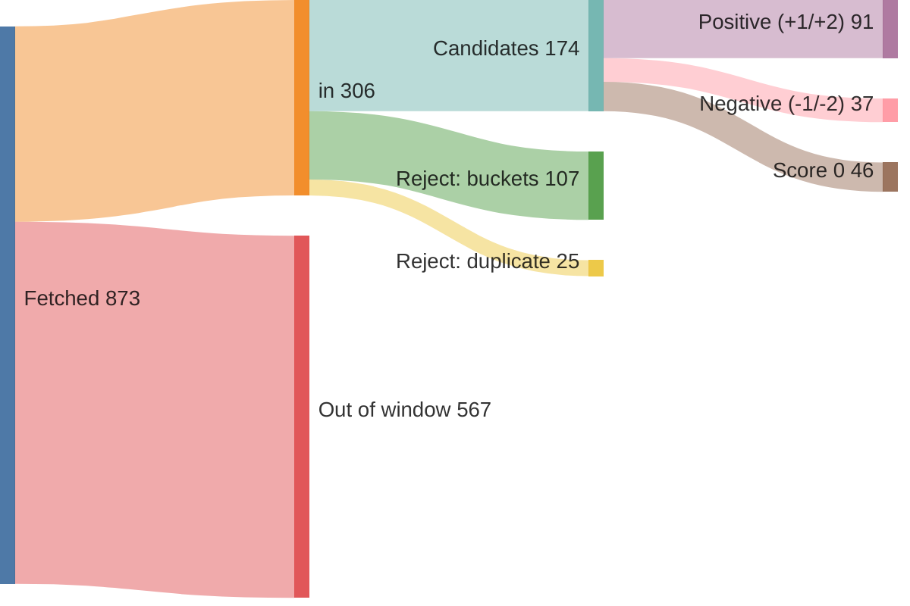

# Run report — edition 2026-07-26

## Funnel overview

Items — fetched → in → filtered → scored → selected → enriched (drop branches show why and what type):

## Funnel

- window: 4 days (from 2026-07-22T00:00:00+02:00, SRC-4)
- F1 fetch: 873 feed items → 306 in (33/33 feeds ok)
- F2 filter: 306 → 174 candidates (132 rejected)
- F3 score: 174 scored → 91 at +1/+2

## Feeds

| bron | items | in | error |
|---|---|---|---|
| Gem Wijchen | 20 | 1 | — |
| nieuws.nl | 49 | 4 | — |
| Gld | 50 | 50 | — |
| Gld RvN | 50 | 39 | — |
| Overheid | 8 | 8 | — |
| NOS J | 20 | 20 | — |
| NOS Binnen | 20 | 20 | — |
| NOS Buiten | 20 | 20 | — |
| NOS Econ | 20 | 12 | — |
| NOS Sport | 20 | 20 | — |
| NOS Opm | 20 | 1 | — |
| NOS Cultuur | 20 | 1 | — |
| FTM | 7 | 3 | — |
| EW | 10 | 10 | — |
| DW | 21 | 21 | — |
| DW Env | 20 | 2 | — |
| DW Science | 3 | 3 | — |
| Positive | 10 | 3 | — |
| WijWijchen | 20 | 2 | — |
| Druten | 20 | 1 | — |
| KNMI | 5 | 0 | — |
| CBS n&m | 50 | 0 | — |
| CBS v&c | 50 | 0 | — |
| Natuurmon | 30 | 6 | — |
| IVN | 10 | 0 | — |
| MaatschapWij | 8 | 2 | — |
| BBC Future | 10 | 2 | — |
| RtbC | 10 | 3 | — |
| FixNews | 20 | 3 | — |
| Mongabay | 32 | 30 | — |
| HumanProg | 10 | 10 | — |
| NatureToday | 200 | 9 | — |
| ARK | 10 | 0 | — |

## LLM usage

| fase | model | effort | calls | turns | in tok | out tok | tools | think chars | wall | cost |
|---|---|---|---|---|---|---|---|---|---|---|
| F3 score | claude-haiku-4-5-20251001 | — | 3 | 6 | 81,839 | 10,652 | 3 | 20,061 | 117.3s | $0.2092 |
| **total** |  |  | 3 | 6 | 81,839 | 10,652 | 3 | 20,061 | 117.3s | $0.2092 |

## Rejected (F2)

| reason | count |
|---|---|
| B1 | 48 |
| B2 | 57 |
| B3 | 10 |
| B4 | 4 |
| B5 | 14 |
| duplicate | 25 |

## Scores (F3)

model claude-haiku-4-5-20251001, prompt score.md v3

| score | count |
|---|---|
| -2 | 5 |
| -1 | 32 |
| 0 | 46 |
| +1 | 69 |
| +2 | 22 |
