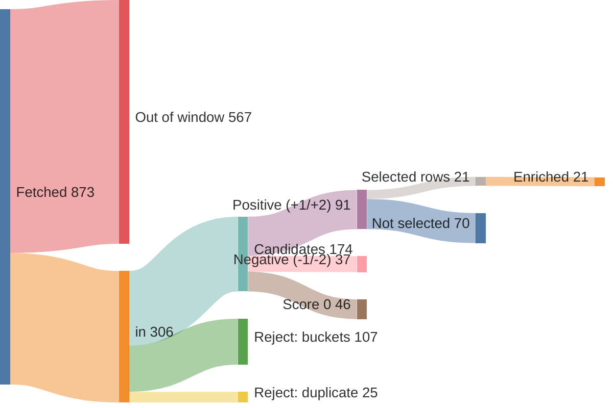
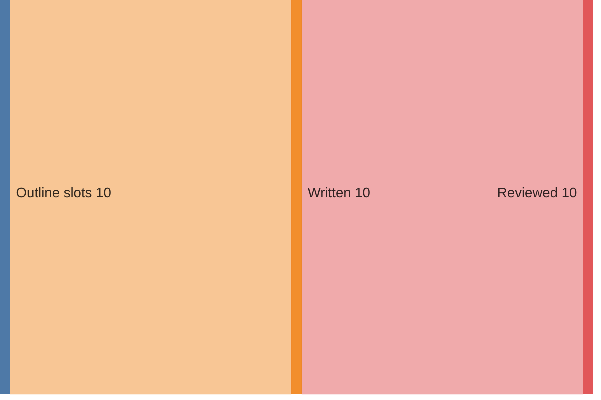

# Run report — edition 2026-07-26

## Funnel overview

Items — fetched → in → filtered → scored → selected → enriched (drop branches show why and what type):

Edition — outline slots → written → reviewed:

## Funnel

- window: 4 days (from 2026-07-22T00:00:00+02:00, SRC-4)
- F1 fetch: 873 feed items → 306 in (33/33 feeds ok)
- F2 filter: 306 → 174 candidates (132 rejected)
- F3 score: 174 scored → 91 at +1/+2
- F4 select: 21 topics (21 source rows)
- F5 enrich: 21 source rows → 21 full texts (requests 21, playwright 0)
- F6 outline: 10 slots, planned 2500–4800 words
- F7 write: 10 articles, 2987 words
- F8 review: 2951 words body text (ED-5 target 2800–3400)
- F9 compose: nr 4, 0 recompile(s) — typeset checks clean

## Feeds

| bron | items | in | error |
|---|---|---|---|
| Gem Wijchen | 20 | 1 | — |
| nieuws.nl | 49 | 4 | — |
| Gld | 50 | 50 | — |
| Gld RvN | 50 | 39 | — |
| Overheid | 8 | 8 | — |
| NOS J | 20 | 20 | — |
| NOS Binnen | 20 | 20 | — |
| NOS Buiten | 20 | 20 | — |
| NOS Econ | 20 | 12 | — |
| NOS Sport | 20 | 20 | — |
| NOS Opm | 20 | 1 | — |
| NOS Cultuur | 20 | 1 | — |
| FTM | 7 | 3 | — |
| EW | 10 | 10 | — |
| DW | 21 | 21 | — |
| DW Env | 20 | 2 | — |
| DW Science | 3 | 3 | — |
| Positive | 10 | 3 | — |
| WijWijchen | 20 | 2 | — |
| Druten | 20 | 1 | — |
| KNMI | 5 | 0 | — |
| CBS n&m | 50 | 0 | — |
| CBS v&c | 50 | 0 | — |
| Natuurmon | 30 | 6 | — |
| IVN | 10 | 0 | — |
| MaatschapWij | 8 | 2 | — |
| BBC Future | 10 | 2 | — |
| RtbC | 10 | 3 | — |
| FixNews | 20 | 3 | — |
| Mongabay | 32 | 30 | — |
| HumanProg | 10 | 10 | — |
| NatureToday | 200 | 9 | — |
| ARK | 10 | 0 | — |

## LLM usage

| fase | model | effort | calls | turns | in tok | out tok | tools | think chars | wall | cost |
|---|---|---|---|---|---|---|---|---|---|---|
| F3 score | claude-haiku-4-5-20251001 | — | 3 | 6 | 81,839 | 10,652 | 3 | 20,061 | 117.3s | $0.2092 |
| F4 select | claude-sonnet-5 | low | 1 | 3 | 144,678 | 4,324 | 2 | 0 | 53.5s | $0.5574 |
| F5 enrich | claude-haiku-4-5-20251001 | — | 14 | 41 | 565,466 | 16,465 | 14 | 30,190 | 229.3s | $0.3166 |
| F6 outline | claude-opus-4-8 | medium | 1 | 2 | 44,208 | 18,051 | 1 | 0 | 273.9s | $0.9068 |
| F7 write | claude-sonnet-5 | high | 10 | 20 | 363,537 | 80,707 | 10 | 0 | 942.8s | $1.5323 |
| F8 review | claude-sonnet-5 | medium | 10 | 20 | 350,890 | 26,946 | 10 | 0 | 407.0s | $1.0884 |
| F9 compose | — | — | 1 | 7 | 74,876 | 4,064 | 6 | 0 | 57.9s | $0.5873 |
| **total** |  |  | 40 | 99 | 1,625,494 | 161,209 | 46 | 50,251 | 2081.6s | $5.1980 |

## Rejected (F2)

| reason | count |
|---|---|
| B1 | 48 |
| B2 | 57 |
| B3 | 10 |
| B4 | 4 |
| B5 | 14 |
| duplicate | 25 |

## Scores (F3)

model claude-haiku-4-5-20251001, prompt score.md v3

| score | count |
|---|---|
| -2 | 5 |
| -1 | 32 |
| 0 | 46 |
| +1 | 69 |
| +2 | 22 |

## Selected topics (F4)

| s | topic | bronnen |
|---|---|---|
| L | Vierdaagse als beweegritueel | Gem Wijchen |
| L | Wijchense Wereldwinkel fairtrade actie | WijWijchen |
| L | Gratis Happy Mind Moment workshop | WijWijchen |
| L | Groesbeekse vriendinnen lopen Vierdaagse samen door | Gld RvN |
| R | Huwelijksaanzoek tijdens de Vierdaagse | Gld |
| R | Lochem vernieuwt twee buitenzwembaden | Gld |
| R | Zestig jaar trouw aan de Oud Veluwse Markt | Gld |
| R | Koninklijke onderscheiding voor decorontwerper Roland de Groot | Gld |
| R | Bloemist Joost zorgt voor bloemen op de Zwarte Cross | Gld |
| R | Wibren Jonkers wordt organist van de Sint-Joriskerk | Gld |
| R | Liek loopt Vierdaagse voor ongeneeslijk zieke dochter Bo | Gld |
| N | 42.000 lopers halen de eindstreep van de Vierdaagse | NOS Binnen |
| N | Publiek mag meebeslissen over nieuwe eurobiljetten | NOS Econ |
| N | WorldPride Amsterdam viert 25 jaar homohuwelijk | NOS Binnen |
| N | Opvallend kwarteljaar in Nederland | NatureToday |
| N | Ecologisch bermbeheer wordt de standaard, goed voor insecten | NatureToday |
| I | Hawaiiaanse steltloper herstelt van 200 naar 1500 vogels | HumanProg |
| I | Razorback sucker van bedreigd naar kwetsbaar | HumanProg |
| I | Japan rondt herstelprogramma voor zeldzame vogels af | HumanProg |
| I | Wilde honden na tien jaar terug in Malawi's nationaal park | Mongabay |
| I | Eerste dengue-vaccin goedgekeurd in India | HumanProg |

## Enrichment (F5)

| s | topic | bron | sum | text | refs | ref words | ref links | status |
|---|---|---|---|---|---|---|---|---|
| L | Vierdaagse als beweegritueel | Gem Wijchen | 26 | 274 | 0 | 0 | — | ok |
| L | Wijchense Wereldwinkel fairtrade actie | WijWijchen | 62 | 147 | 0 | 0 | — | ok |
| L | Gratis Happy Mind Moment workshop | WijWijchen | 64 | 155 | 2 | 763 | cemsupport.nl/training-gratis-happy-mind-momenten.php cemsupport.nl/trainingen-vrouwen.php | ok |
| L | Groesbeekse vriendinnen lopen Vierdaagse samen door | Gld RvN | 41 | 428 | 1 | 85 | gld.nl/tv/programma/vierdaagsefeesten/172 | ok |
| R | Huwelijksaanzoek tijdens de Vierdaagse | Gld | 40 | 224 | 1 | 975 | gld.nl/nieuws/8336797/bert-liep-71-keer-de-vierdaagse-nu-lo… | ok |
| R | Lochem vernieuwt twee buitenzwembaden | Gld | 44 | 678 | 0 | 0 | — | ok |
| R | Zestig jaar trouw aan de Oud Veluwse Markt | Gld | 48 | 409 | 0 | 0 | — | ok |
| R | Koninklijke onderscheiding voor decorontwerper Roland de Groot | Gld | 25 | 368 | 0 | 0 | — | ok |
| R | Bloemist Joost zorgt voor bloemen op de Zwarte Cross | Gld | 45 | 387 | 1 | 403 | rtvnunspeet.nl/oh-my-god-bloemist-joost-29-uit-nunspeet-fle… | ok |
| R | Wibren Jonkers wordt organist van de Sint-Joriskerk | Gld | 55 | 488 | 1 | 514 | rtvnunspeet.nl/het-telefoontje-waar-hij-op-hoopte-wibren-27… | ok |
| R | Liek loopt Vierdaagse voor ongeneeslijk zieke dochter Bo | Gld | 42 | 358 | 0 | 0 | — | ok |
| N | 42.000 lopers halen de eindstreep van de Vierdaagse | NOS Binnen | 410 | 417 | 2 | 1200 | instagram.com/stories/4daagse_nijmegen/3948268390607262121?… gld.nl/nieuws/8501325/live-vierdaagse-op-naar-de-via-gladio… | ok |
| N | Publiek mag meebeslissen over nieuwe eurobiljetten | NOS Econ | 502 | 518 | 3 | 1197 | ecb.europa.eu/euro/banknotes/future_banknotes/html/design-p… surveys.ecb.europa.eu/10b/neweuro/ dnb.nl/algemeen-nieuws/nieuws-2026/stem-mee-over-ontwerp-ni… | ok |
| N | WorldPride Amsterdam viert 25 jaar homohuwelijk | NOS Binnen | 780 | 762 | 2 | 662 | amsterdam.nl/nieuws/nieuwsoverzicht/roze-driehoek-regenboog… uva.nl/content/nieuws/persberichten/2026/03/nederlandse-jon… | ok |
| N | Opvallend kwarteljaar in Nederland | NatureToday | 62 | 327 | 2 | 551 | xeno-canto.org/1022431 sovon.nl/ | ok |
| N | Ecologisch bermbeheer wordt de standaard, goed voor insecten | NatureToday | 53 | 480 | 3 | 1442 | vlinderstichting.nl/kleurkeur-werkt-meer-biodiversiteit/ vlinderstichting.nl/kleurkeur/ naturetoday.com/intl/nl/nature-reports/message/?msg=33606 | ok |
| I | Hawaiiaanse steltloper herstelt van 200 naar 1500 vogels | HumanProg | 74 | 96 | 1 | 514 | mauinow.com/2026/07/23/hawaiian-stilt-population-improves-f… | ok |
| I | Razorback sucker van bedreigd naar kwetsbaar | HumanProg | 71 | 130 | 0 | 0 | — | ok |
| I | Japan rondt herstelprogramma voor zeldzame vogels af | HumanProg | 73 | 171 | 1 | 0 | mainichi.jp/english/articles/20260723/p2a/00m/0sc/006000c | ok |
| I | Wilde honden na tien jaar terug in Malawi's nationaal park | Mongabay | 56 | 504 | 0 | 0 | — | ok |
| I | Eerste dengue-vaccin goedgekeurd in India | HumanProg | 72 | 168 | 1 | 0 | reuters.com/business/healthcare-pharmaceuticals/takedas-qde… | ok |

## Edition plan (F6)

| pos | s | length | topic | locatie | datum |
|---|---|---|---|---|---|
| 1 | L | kort | Vierdaagse als beweegritueel | Wijchen | 2026-07-22 |
| 2 | L | mid | Groesbeekse vriendinnen lopen Vierdaagse samen door | Groesbeek | 2026-07-23 |
| 3 | R | lang | Lochem vernieuwt twee buitenzwembaden | Gorssel | 2026-07-23 |
| 4 | R | mid | Koninklijke onderscheiding voor decorontwerper Roland de Groot | Hoog Soeren | 2026-07-23 |
| 5 | R | kort | Bloemist Joost zorgt voor bloemen op de Zwarte Cross | Nunspeet | 2026-07-23 |
| 6 | N | mid | 42.000 lopers halen de eindstreep van de Vierdaagse | Nijmegen | 2026-07-24 |
| 7 | N | lang | Publiek mag meebeslissen over nieuwe eurobiljetten | Frankfurt | 2026-07-23 |
| 8 | N | mid | WorldPride Amsterdam viert 25 jaar homohuwelijk | Amsterdam | 2026-07-24 |
| 9 | I | kort | Wilde honden na tien jaar terug in Malawi's nationaal park | Kasungu, Malawi | 2026-07-24 |
| 10 | I | kort | Eerste dengue-vaccin goedgekeurd in India | India | 2026-07-23 |

## Articles (F7/8)

| pos | title | words draft → reviewed |
|---|---|---|
| 1 | Roze wappert mee langs de Vierdaagseroute | 180 → 180 |
| 2 | Van 'nooit meer' naar opnieuw de Vierdaagse | 291 → 288 |
| 3 | Lochem bouwt twee zwembaden helemaal opnieuw | 500 → 500 |
| 4 | Decorontwerper Pipo de Clown na zestig jaar geridderd | 273 → 274 |
| 5 | Bloemist geeft Zwarte Cross een zachte rand | 248 → 223 |
| 6 | Vierdaagse trekt steeds meer jonge wandelaars | 282 → 281 |
| 7 | Stem mee over het nieuwe eurobiljet | 474 → 466 |
| 8 | Vijfentwintig jaar na het eerste huwelijk, WorldPride | 381 → 380 |
| 9 | Afrikaanse wilde honden terug in Kasungu | 227 → 227 |
| 10 | India keurt eerste denguevaccin goed | 131 → 132 |

## Typeset & compose (F9)

- illustration (EL-3): 'Vierdaagse-kruisje aan lint' with the article at pos 6 — `work/f9-illustration-1.svg`
- illustration (EL-3): 'Nieuw eurobiljet met potlood' with the article at pos 7 — `work/f9-illustration-2.svg`
- 0 recompile(s)
- all typeset checks passed
