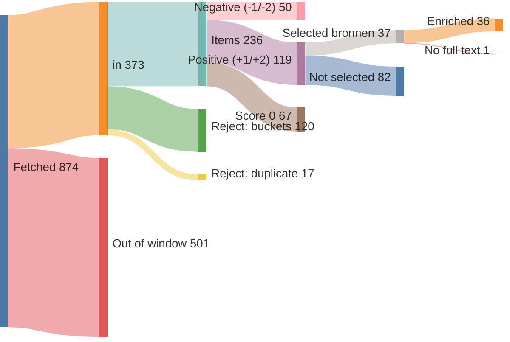
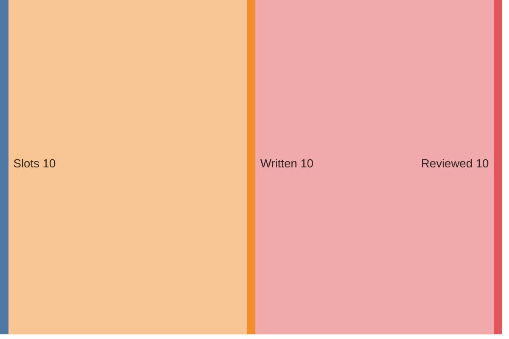

# Run report — edition 2026-07-26

## Funnel overview

Items — fetched → in → filtered → scored → selected → enriched (drop branches show why and what type):

Edition — slots → written → reviewed:

## Funnel

- window: 6 days (from 2026-07-20T00:00:00+02:00, SRC-4)
- F1 fetch: 874 feed items → 373 in (33/33 feeds ok)
- F2 filter: 373 → 236 items (137 rejected)
- F3 score: 236 scored → 119 at +1/+2
- F4 select: 24 onderwerpen (37 bronnen)
- F5 enrich: 37 bronnen → 36 full texts (requests 36, playwright 0); 1 onderwerpen dropped (F5)
- F6 outline: 10 slots, planned 2500–4800 words
- F7 write: 10 articles, 3198 words
- F8 review: 3199 words body text (ED-5 target 2800–3400)
- F9 compose: nr 4, 0 recompile(s) — typeset checks clean

## Feeds

| medium | items | in | error |
|---|---|---|---|
| Gem Wijchen | 20 | 1 | — |
| nieuws.nl | 48 | 10 | — |
| Gld | 50 | 50 | — |
| Gld RvN | 50 | 50 | — |
| Overheid | 10 | 10 | — |
| NOS J | 20 | 20 | — |
| NOS Binnen | 20 | 20 | — |
| NOS Buiten | 20 | 20 | — |
| NOS Econ | 20 | 20 | — |
| NOS Sport | 20 | 20 | — |
| NOS Opm | 20 | 1 | — |
| NOS Cultuur | 20 | 3 | — |
| FTM | 7 | 6 | — |
| EW | 10 | 10 | — |
| DW | 21 | 21 | — |
| DW Env | 20 | 4 | — |
| DW Science | 3 | 3 | — |
| Positive | 10 | 5 | — |
| WijWijchen | 20 | 2 | — |
| Druten | 20 | 4 | — |
| KNMI | 5 | 0 | — |
| CBS n&m | 50 | 1 | — |
| CBS v&c | 50 | 0 | — |
| Natuurmon | 30 | 12 | — |
| IVN | 10 | 0 | — |
| MaatschapWij | 8 | 3 | — |
| BBC Future | 10 | 7 | — |
| RtbC | 10 | 5 | — |
| FixNews | 20 | 3 | — |
| Mongabay | 32 | 32 | — |
| HumanProg | 10 | 10 | — |
| NatureToday | 200 | 20 | — |
| ARK | 10 | 0 | — |

## LLM usage

| fase | model | effort | calls | turns | in tok | out tok | tools | think chars | wall | cost |
|---|---|---|---|---|---|---|---|---|---|---|
| F3 score | claude-haiku-4-5-20251001 | — | 3 | 6 | 89,717 | 17,350 | 3 | 28,935 | 194.3s | $0.2037 |
| F4 select | claude-sonnet-5 | low | 1 | 3 | 157,385 | 5,751 | 2 | 0 | 65.3s | $0.6260 |
| F5 enrich | claude-haiku-4-5-20251001 | — | 24 | 53 | 612,511 | 41,146 | 24 | 63,198 | 495.0s | $0.5444 |
| F6 outline | claude-opus-4-8 | medium | 1 | 2 | 54,446 | 8,142 | 1 | 0 | 122.5s | $0.7688 |
| F7 write | claude-sonnet-5 | high | 10 | 20 | 360,940 | 45,026 | 10 | 0 | 561.0s | $1.7316 |
| F8 review | claude-sonnet-5 | medium | 10 | 22 | 444,455 | 31,626 | 12 | 0 | 402.1s | $1.2588 |
| F9 compose | — | — | 1 | 6 | 70,534 | 1,723 | 5 | 0 | 25.4s | $0.4863 |
| **total** |  |  | 50 | 112 | 1,789,988 | 150,764 | 57 | 92,133 | 1865.6s | $5.6196 |

## Rejected (F2)

| reason | count |
|---|---|
| B1 | 49 |
| B2 | 60 |
| B3 | 15 |
| B4 | 6 |
| B5 | 16 |
| duplicate | 17 |

## Scores (F3)

model claude-haiku-4-5-20251001, prompt score.md v5

| score | count |
|---|---|
| -2 | 12 |
| -1 | 38 |
| 0 | 67 |
| +1 | 101 |
| +2 | 18 |

## Selected onderwerpen (F4)

| schaal | onderwerp | media |
|---|---|---|
| L | Vierdaagse trekt door Wijchen en Alverna | nieuws.nl, Gem Wijchen |
| L | Willie Heij loopt zijn 66e Vierdaagse | nieuws.nl |
| L | Wout Loeffen loopt Vierdaagse voor Huntington | nieuws.nl |
| L | Theatervoorstelling De Honingbij in kasteel Hernen | nieuws.nl |
| L | Truckshow Wijchen trekt vrachtwagenliefhebbers | nieuws.nl |
| L | Brons voor Laura Smulders op WK BMX | nieuws.nl |
| L | Zomerspeurtocht naar de verdwenen ijscoupes | nieuws.nl |
| R | Vierdaagse: verhalen van lopers en finish | Gld RvN, Gld RvN, Gld RvN, Gld, Gld, Gld |
| R | Gelderse atleten pakken medailles op NK atletiek | Gld |
| R | Lochem bouwt twee nieuwe buitenzwembaden | Gld |
| R | Maarten Oud sluit zestig jaar Veluwse Markt af | Gld |
| R | Koninklijke onderscheiding voor decorontwerper Roland de Groot | Gld |
| R | Wibren Jonkers wint prestigieuze orgelbaan | Gld |
| R | Wandelen verbindt: wethouder en energiecoaches in Druten | Druten, Druten |
| N | Amsterdam viert eerste WorldPride | NOS J, NOS Binnen |
| N | Voor het eerst een moeder als Queen Zomercarnaval | NOS J, NOS Binnen |
| N | 42.137 wandelaars halen finish Nijmeegse Vierdaagse | NOS Binnen, NOS J |
| N | Herinneringsbrief Donorregister voor 21-jarigen | Overheid |
| N | Ecologisch bermbeheer wordt de standaard, goed voor insecten | NatureToday |
| I | Eerste proefpersoon krijgt vaccin tegen ebola-variant | NOS Buiten |
| I | Steden, dieren en technologie boeken klimaatwinst | DW, DW Env |
| I | Bedreigde diersoorten herstellen na jarenlange bescherming | HumanProg, HumanProg, HumanProg |
| I | Backlash tegen Premier League brengt gemeenschapsvoetbal terug | Positive |
| I | Nederlands gebouw als plek van hoop en oplossingen | Positive |

## Enrichment (F5)

| schaal | onderwerp | medium | samenvatting | bron_woorden | refs | referentie_woorden | referentie_links | status |
|---|---|---|---|---|---|---|---|---|
| L | Vierdaagse trekt door Wijchen en Alverna | nieuws.nl | 48 | 149 | 0 | 0 | — | ok |
| L | Vierdaagse trekt door Wijchen en Alverna | Gem Wijchen | 26 | 274 | 0 | 0 | — | ok |
| L | Willie Heij loopt zijn 66e Vierdaagse | nieuws.nl | 50 | 135 | 0 | 0 | — | ok |
| L | Wout Loeffen loopt Vierdaagse voor Huntington | nieuws.nl | 52 | 431 | 1 | 0 | ikkiesvooreenanderdoel.devierdaagsesponsorloop.nl/fundraise… | ok |
| L | Theatervoorstelling De Honingbij in kasteel Hernen | nieuws.nl | 46 | 245 | 0 | 0 | — | ok |
| L | Truckshow Wijchen trekt vrachtwagenliefhebbers | nieuws.nl | 51 | 125 | 1 | 0 | kw-automotive.nl/ | ok |
| L | Brons voor Laura Smulders op WK BMX | nieuws.nl | 47 | 272 | 0 | 0 | — | ok |
| L | Zomerspeurtocht naar de verdwenen ijscoupes | nieuws.nl | 42 | 144 | 3 | 382 | joepiedoe.com/?srsltid=AfmBOoq4e9HvxsZZ4LdzwMtl1HzSS3tAAWah… kids-town.nl/ bijdaankindermode.nl/ | ok |
| R | Vierdaagse: verhalen van lopers en finish | Gld RvN | 42 | 3050 | 3 | 1097 | anwb.nl/verkeer?expoints=verkeersportalnl&latitude=51.78925… gardenersworldmagazine.nl/groene-school/kweken/gladiolen-op… gld.nl/podcast/07968ea7-e519-4860-a822-ef0475e3d9c9/de-dood… | ok |
| R | Vierdaagse: verhalen van lopers en finish | Gld RvN | 40 | 224 | 1 | 975 | gld.nl/nieuws/8336797/bert-liep-71-keer-de-vierdaagse-nu-lo… | ok |
| R | Vierdaagse: verhalen van lopers en finish | Gld RvN | 41 | 428 | 1 | 86 | gld.nl/tv/programma/vierdaagsefeesten/172 | ok |
| R | Vierdaagse: verhalen van lopers en finish | Gld | 42 | 358 | 0 | 0 | — | ok |
| R | Vierdaagse: verhalen van lopers en finish | Gld | 49 | 445 | 1 | 86 | gld.nl/tv/programma/vierdaagsefeesten/172 | ok |
| R | Vierdaagse: verhalen van lopers en finish | Gld | 45 | 412 | 1 | 556 | gld.nl/nieuws/8339532/ronald-wilde-de-vierdaagse-lopen-maar… | ok |
| R | Gelderse atleten pakken medailles op NK atletiek | Gld | 34 | 45 | 0 | 0 | — | **dropped** — geen toereikende bron |
| R | Lochem bouwt twee nieuwe buitenzwembaden | Gld | 44 | 678 | 0 | 0 | — | ok |
| R | Maarten Oud sluit zestig jaar Veluwse Markt af | Gld | 48 | 409 | 0 | 0 | — | ok |
| R | Koninklijke onderscheiding voor decorontwerper Roland de Groot | Gld | 25 | 368 | 0 | 0 | — | ok |
| R | Wibren Jonkers wint prestigieuze orgelbaan | Gld | 55 | 488 | 1 | 514 | rtvnunspeet.nl/het-telefoontje-waar-hij-op-hoopte-wibren-27… | ok |
| R | Wandelen verbindt: wethouder en energiecoaches in Druten | Druten | 35 | 270 | 0 | 0 | — | ok |
| R | Wandelen verbindt: wethouder en energiecoaches in Druten | Druten | 24 | 1074 | 1 | 34 | forms.druten.nl/aanmeldformulier-energiecoaches/startpagina | ok |
| N | Amsterdam viert eerste WorldPride | NOS J | 281 | 169 | 0 | 0 | — | ok |
| N | Amsterdam viert eerste WorldPride | NOS Binnen | 780 | 762 | 2 | 662 | amsterdam.nl/nieuws/nieuwsoverzicht/roze-driehoek-regenboog… uva.nl/content/nieuws/persberichten/2026/03/nederlandse-jon… | ok |
| N | Voor het eerst een moeder als Queen Zomercarnaval | NOS J | 142 | 117 | 0 | 0 | — | ok |
| N | Voor het eerst een moeder als Queen Zomercarnaval | NOS Binnen | 549 | 507 | 0 | 0 | — | ok |
| N | 42.137 wandelaars halen finish Nijmeegse Vierdaagse | NOS Binnen | 410 | 417 | 2 | 1200 | instagram.com/stories/4daagse_nijmegen/3948268390607262121?… gld.nl/nieuws/8501325/live-vierdaagse-op-naar-de-via-gladio… | ok |
| N | 42.137 wandelaars halen finish Nijmeegse Vierdaagse | NOS J | 122 | 150 | 0 | 0 | — | ok |
| N | Herinneringsbrief Donorregister voor 21-jarigen | Overheid | 42 | 376 | 0 | 0 | — | ok |
| N | Ecologisch bermbeheer wordt de standaard, goed voor insecten | NatureToday | 53 | 480 | 3 | 1442 | vlinderstichting.nl/kleurkeur-werkt-meer-biodiversiteit/ vlinderstichting.nl/kleurkeur/ naturetoday.com/intl/nl/nature-reports/message/?msg=33606 | ok |
| I | Eerste proefpersoon krijgt vaccin tegen ebola-variant | NOS Buiten | 181 | 191 | 0 | 0 | — | ok |
| I | Steden, dieren en technologie boeken klimaatwinst | DW | 34 | 312 | 3 | 2670 | dw.com/en/megafires-climate-change-intensified-fires-mitiga… dw.com/en/europe-wildfires-fires-france-spain-italy/a-78080… dw.com/en/heat-resistant-housing-how-we-need-to-adapt-our-h… | ok |
| I | Steden, dieren en technologie boeken klimaatwinst | DW Env | 34 | 312 | 3 | 2670 | dw.com/en/megafires-climate-change-intensified-fires-mitiga… dw.com/en/europe-wildfires-fires-france-spain-italy/a-78080… dw.com/en/heat-resistant-housing-how-we-need-to-adapt-our-h… | ok |
| I | Bedreigde diersoorten herstellen na jarenlange bescherming | HumanProg | 71 | 130 | 0 | 0 | — | ok |
| I | Bedreigde diersoorten herstellen na jarenlange bescherming | HumanProg | 74 | 96 | 1 | 514 | mauinow.com/2026/07/23/hawaiian-stilt-population-improves-f… | ok |
| I | Bedreigde diersoorten herstellen na jarenlange bescherming | HumanProg | 73 | 171 | 1 | 0 | mainichi.jp/english/articles/20260723/p2a/00m/0sc/006000c | ok |
| I | Backlash tegen Premier League brengt gemeenschapsvoetbal terug | Positive | 38 | 904 | 0 | 0 | — | ok |
| I | Nederlands gebouw als plek van hoop en oplossingen | Positive | 39 | 643 | 0 | 0 | — | ok |

## Edition plan (F6)

| pos | schaal | lengte | onderwerp | locatie | bron_datum |
|---|---|---|---|---|---|
| 1 | L | kort | Willie Heij loopt zijn 66e Vierdaagse | Wijchen | 2026-07-21 |
| 2 | L | kort | Theatervoorstelling De Honingbij in kasteel Hernen | Hernen | 2026-07-25 |
| 3 | L | mid | Zomerspeurtocht naar de verdwenen ijscoupes | Wijchen | 2026-07-20 |
| 4 | R | lang | Lochem bouwt twee nieuwe buitenzwembaden | Gorssel | 2026-07-23 |
| 5 | R | mid | Wandelen verbindt: wethouder en energiecoaches in Druten | Druten | 2026-07-22 |
| 6 | N | mid | Voor het eerst een moeder als Queen Zomercarnaval | Rotterdam | 2026-07-25 |
| 7 | N | kort | Herinneringsbrief Donorregister voor 21-jarigen | Den Haag | 2026-07-23 |
| 8 | I | mid | Bedreigde diersoorten herstellen na jarenlange bescherming | Green River, Colorado-bekken (VS) | 2026-07-23 |
| 9 | I | lang | Backlash tegen Premier League brengt gemeenschapsvoetbal terug | Spalding, Lincolnshire (VK) | 2026-07-22 |
| 10 | I | kort | Eerste proefpersoon krijgt vaccin tegen ebola-variant | Oxford (VK) | 2026-07-25 |

## Slot inputs (F5→F6)

| pos | schaal | lengte | onderwerp | medium | samenvatting | bron_woorden | refs | referentie_woorden |
|---|---|---|---|---|---|---|---|---|
| 1 | L | kort | Willie Heij loopt zijn 66e Vierdaagse | nieuws.nl | 50 | 135 | 0 | 0 |
| 2 | L | kort | Theatervoorstelling De Honingbij in kasteel Hernen | nieuws.nl | 46 | 245 | 0 | 0 |
| 3 | L | mid | Zomerspeurtocht naar de verdwenen ijscoupes | nieuws.nl | 42 | 144 | 3 | 382 |
| 4 | R | lang | Lochem bouwt twee nieuwe buitenzwembaden | Gld | 44 | 678 | 0 | 0 |
| 5 | R | mid | Wandelen verbindt: wethouder en energiecoaches in Druten | Druten, Druten | 59 | 1344 | 1 | 34 |
| 6 | N | mid | Voor het eerst een moeder als Queen Zomercarnaval | NOS J, NOS Binnen | 691 | 624 | 0 | 0 |
| 7 | N | kort | Herinneringsbrief Donorregister voor 21-jarigen | Overheid | 42 | 376 | 0 | 0 |
| 8 | I | mid | Bedreigde diersoorten herstellen na jarenlange bescherming | HumanProg, HumanProg, HumanProg | 218 | 397 | 2 (1 ok) | 514 |
| 9 | I | lang | Backlash tegen Premier League brengt gemeenschapsvoetbal terug | Positive | 38 | 904 | 0 | 0 |
| 10 | I | kort | Eerste proefpersoon krijgt vaccin tegen ebola-variant | NOS Buiten | 181 | 191 | 0 | 0 |
|  |  |  | **totaal** |  | 1411 | 5038 | 6 (5 ok) | 930 |

## Articles (F7/8)

| pos | artikelkop | woorden concept → artikel | model (F7) | effort |
|---|---|---|---|---|
| 1 | Willie Heij loopt al 66 jaar mee | 128 → 126 | claude-sonnet-5 | high |
| 2 | Ruziënde broer en zus redden de bijen | 200 → 200 | claude-opus-4-8 | high |
| 3 | Kinderen speuren naar verdwenen ijscoupes | 185 → 183 | claude-sonnet-5 | high |
| 4 | Laatste zomer in oude baden Gorssel en Almen | 533 → 532 | claude-sonnet-5 | high |
| 5 | Eerst koffie, dan de meterkast | 345 → 343 | claude-sonnet-5 | high |
| 6 | Rotterdamse moeder eerste Queen van Zomercarnaval | 354 → 362 | claude-sonnet-5 | high |
| 7 | Brief op 21e geeft donorkeuze een herkansing | 175 → 177 | claude-sonnet-5 | high |
| 8 | Razorbaars, steltkluut en houtsnip klimmen terug | 335 → 334 | claude-sonnet-5 | high |
| 9 | Terug naar het voetbal om de hoek | 784 → 784 | claude-sonnet-5 | high |
| 10 | Eerste proefpersoon krijgt vaccin tegen nieuwe ebolavariant | 159 → 158 | claude-sonnet-5 | high |

## Typeset & compose (F9)

- illustration (EL-3): 'Dampende kop koffie op tafel' with the article at pos 5 — `work/f9-illustration-1.svg`
- illustration (EL-3): 'Duikplank boven kabbelend zwembadwater' with the article at pos 4 — `work/f9-illustration-2.svg`
- 0 recompile(s)
- all typeset checks passed
