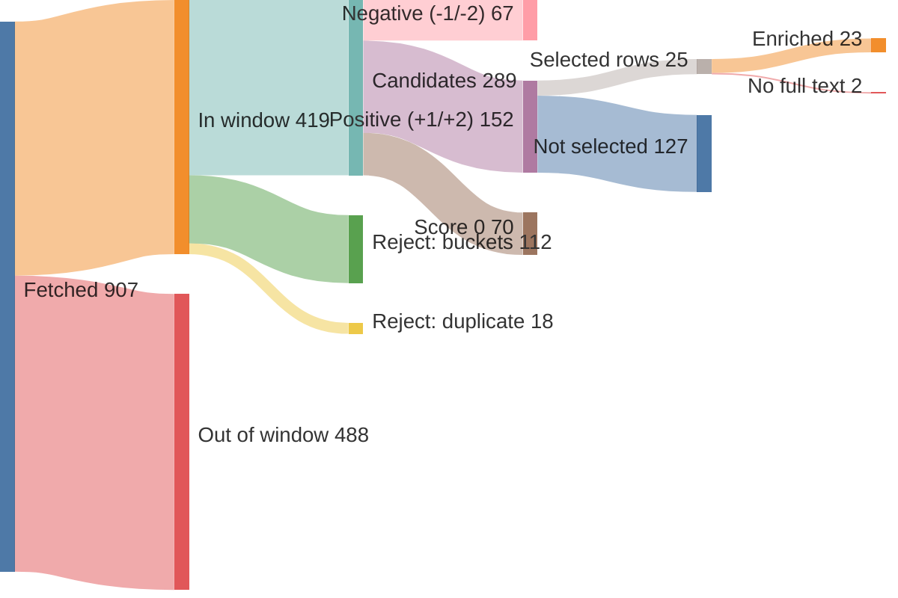
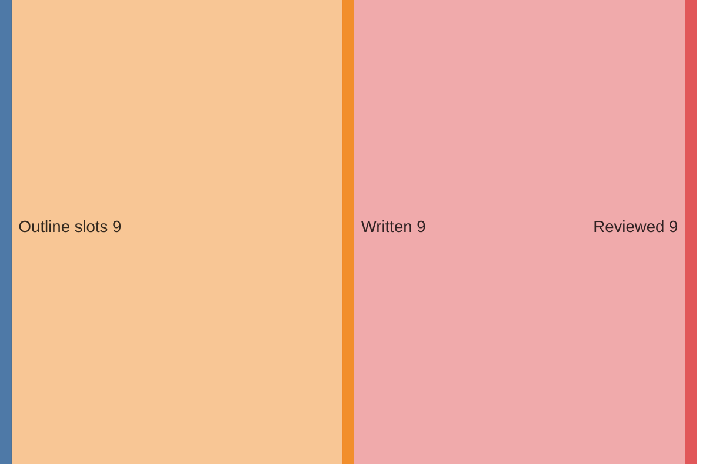

# Run report — edition 2026-07-26

## Funnel overview

Items — fetched → in window → filtered → scored → selected → enriched (drop branches show why and what type):

Edition — outline slots → written → reviewed:

## Funnel

- window: 11 days (from 2026-07-15T00:00:00+02:00, SRC-4)
- S1 fetch: 907 feed items → 419 in window (34/36 feeds ok)
- S2 filter: 419 → 289 candidates (130 rejected)
- S3 score: 289 scored → 152 at +1/+2
- S4 select: 24 topics (25 source rows)
- S5 enrich: 25 source rows → 23 full texts (requests 23, playwright 0); 2 topics dropped (PIPE-5)
- S6 outline: 9 slots, planned 2350–4500 words
- S7 write: 9 articles, 2999 words
- S8 review: 47 correction(s), 3000 words body text (ED-5 target 2800–3400)
- S9 compose: nr 4, 0 recompile(s) — typeset checks clean (LAY-1..5, LAY-7)

## Feeds

| bron | items | in window | undated | error |
|---|---|---|---|---|
| Gem Wijchen | 20 | 1 | 0 | — |
| nieuws.nl | 53 | 13 | 0 | — |
| DG Wijchen | 30 | 30 | 0 | — |
| Gld | 50 | 50 | 0 | — |
| Gld RvN | 50 | 50 | 0 | — |
| Overheid | 8 | 8 | 0 | — |
| NOS J | 20 | 20 | 0 | — |
| NOS Binnen | 20 | 20 | 0 | — |
| NOS Buiten | 20 | 20 | 0 | — |
| NOS Econ | 20 | 20 | 0 | — |
| NOS Sport | 20 | 20 | 0 | — |
| NOS Opm | 20 | 4 | 0 | — |
| NOS Cultuur | 20 | 2 | 0 | — |
| FTM | 10 | 10 | 0 | — |
| EW | 10 | 10 | 0 | — |
| DW | 21 | 21 | 0 | — |
| DW Env | 20 | 5 | 0 | — |
| DW Science | 0 | 0 | 0 | — |
| Positive | 10 | 6 | 0 | — |
| WijWijchen | 20 | 2 | 0 | — |
| Druten | 20 | 5 | 0 | — |
| KNMI | 5 | 1 | 0 | — |
| CBS n&m | 50 | 4 | 0 | — |
| CBS v&c | 50 | 0 | 0 | — |
| Natuurmon | 30 | 7 | 0 | — |
| IVN | 10 | 0 | 0 | — |
| MaatschapWij | 8 | 4 | 0 | — |
| BBC Future | 10 | 8 | 0 | — |
| RtbC | 10 | 5 | 0 | — |
| FixNews | 20 | 2 | 0 | — |
| Mongabay | 32 | 32 | 0 | — |
| HumanProg | 10 | 10 | 0 | — |
| NatureToday | 200 | 25 | 0 | — |
| ARK | 10 | 4 | 0 | — |
| WijchensNws | 0 | 0 | 0 | HTTPError: 404 Client Error: Not Found for url: https://www.wijchensnieuws.nl/feed/ |
| Wegwijs | 0 | 0 | 0 | HTTPError: 404 Client Error: Not Found for url: https://www.weekblad-wegwijs.nl/feed |

## LLM usage (OPS-4)

| stage | model | effort | calls | turns | in tok | out tok | tools | think chars | wall | cost |
|---|---|---|---|---|---|---|---|---|---|---|
| S3 score | claude-haiku-4-5-20251001 | — | 4 | 8 | 114,497 | 20,989 | 4 | 35,884 | 235.3s | $0.3094 |
| S4 select | claude-sonnet-5 | low | 1 | 3 | 172,402 | 4,802 | 2 | 0 | 52.3s | $0.6641 |
| S5 enrich | claude-haiku-4-5-20251001 | — | 16 | 42 | 533,104 | 15,269 | 16 | 33,474 | 222.6s | $0.3087 |
| S6 outline | claude-opus-4-8 | medium | 1 | 2 | 36,008 | 6,179 | 1 | 0 | 86.1s | $0.5235 |
| S7 write | claude-sonnet-5 | high | 9 | 18 | 300,317 | 17,993 | 9 | 0 | 256.4s | $1.2553 |
| S8 review | claude-sonnet-5 | low | 9 | 18 | 284,048 | 19,325 | 9 | 0 | 265.5s | $0.3874 |
| S9 compose | — | — | 1 | 6 | 67,332 | 1,511 | 5 | 0 | 22.4s | $0.4643 |
| **total** |  |  | 41 | 97 | 1,507,708 | 86,068 | 46 | 69,358 | 1140.5s | $3.9127 |

## Rejected (PIPE-2)

| reason | count |
|---|---|
| B1 | 40 |
| B2 | 61 |
| B3 | 6 |
| B4 | 4 |
| B5 | 23 |
| duplicate | 18 |

## Scores (PIPE-3)

model claude-haiku-4-5-20251001, prompt score.md v2

| score | count |
|---|---|
| -2 | 18 |
| -1 | 49 |
| 0 | 70 |
| +1 | 127 |
| +2 | 25 |

## Selected topics (PIPE-4)

| scope | topic | bronnen |
|---|---|---|
| L | Wout Loeffen loopt Vierdaagse voor Huntington | nieuws.nl |
| L | Zomerspeurtocht 'verdwenen ijscoupes' in Wijchen | nieuws.nl |
| L | Batenburg Baroque Festival trekt meer bezoekers | nieuws.nl |
| L | Molen en kasteel Hernen samen te bezoeken tijdens Kids-Zomerweken | nieuws.nl |
| L | Reanimatiecursus start in augustus bij Sport Cardiocare | WijWijchen |
| L | Gemeente Wijchen start groot onderhoud openbare ruimte | nieuws.nl |
| L | Limburgse drieling en moeder samen de Vierdaagse | Gld RvN |
| R | Willie (83) loopt recordaantal Vierdaagses | DG Wijchen |
| R | Edwin loopt Vierdaagse na zwaar ongeluk en revalidatie | DG Wijchen |
| R | Twintig jaar Vierdaagse-onderzoek Radboudumc | Gld |
| R | Herten, wolven en zwijnen kunnen makkelijker oversteken bij Hoge Veluwe | Gld |
| R | Studenten Rijn IJssel houden opleiding overeind na actie | Gld |
| R | Hoe de Vierdaagsefeesten uitgroeiden tot grootste feest van Nederland | Gld RvN |
| R | Grootste huiszwaluwkolonie van Nederland onder brug in Nijmegen | Gld |
| N | Arnhemse schuldenproef succesvol, gezinnen schuldenvrij | NOS Econ |
| N | ASML-medewerkers krijgen aandelenpakket van 20.000 euro | NOS Econ |
| N | Nederland gastland EK padel 2027 | NOS Sport |
| N | Oranje wint Fair Play-prijs op WK voetbal | NOS Sport, NOS J |
| N | Stikstofdoelen 2035 lijken haalbaar met nieuwe kabinetsplannen | NatureToday |
| I | Nieuw gebouw showcaset oplossingen voor wereldproblemen | Positive |
| I | Landbouwprogramma Sierra Leone helpt amputees leven opbouwen | Positive |
| I | India lanceert eerste zelfgebouwde waterstoftrein | Mongabay |
| I | Scholeksters maken comeback dankzij natuurbescherming | Mongabay |
| I | Aantal landen met hoge ongelijkheid met een derde gedaald | HumanProg |

## Enrichment (PIPE-5)

| scope | topic | bron | summary | text | refs | ref words | ref links | status |
|---|---|---|---|---|---|---|---|---|
| L | Wout Loeffen loopt Vierdaagse voor Huntington | nieuws.nl | 52 | 431 | 1 | 0 | ikkiesvooreenanderdoel.devierdaagsesponsorloop.nl/fundraise… | ok |
| L | Zomerspeurtocht 'verdwenen ijscoupes' in Wijchen | nieuws.nl | 42 | 144 | 3 | 345 | joepiedoe.com/?srsltid=AfmBOoq4e9HvxsZZ4LdzwMtl1HzSS3tAAWah… kids-town.nl/ bijdaankindermode.nl/ | ok |
| L | Batenburg Baroque Festival trekt meer bezoekers | nieuws.nl | 43 | 381 | 2 | 703 | wijchen.nieuws.nl/cultuur/batenburg-baroque-festival-is-beg… npoklassiek.nl/uitzendingen/zomeravondconcert/019dd367-36f7… | ok |
| L | Molen en kasteel Hernen samen te bezoeken tijdens Kids-Zomerweken | nieuws.nl | 49 | 280 | 1 | 166 | nl.wikipedia.org/wiki/Beltmolen | ok |
| L | Reanimatiecursus start in augustus bij Sport Cardiocare | WijWijchen | 60 | 131 | 0 | 0 | — | ok |
| L | Gemeente Wijchen start groot onderhoud openbare ruimte | nieuws.nl | 45 | 180 | 0 | 0 | — | ok |
| L | Limburgse drieling en moeder samen de Vierdaagse | Gld RvN | 50 | 500 | 0 | 0 | — | ok |
| R | Willie (83) loopt recordaantal Vierdaagses | DG Wijchen | 49 | 0 | 0 | 0 | — | **dropped** — no sufficient row |
| R | Edwin loopt Vierdaagse na zwaar ongeluk en revalidatie | DG Wijchen | 60 | 0 | 0 | 0 | — | **dropped** — no sufficient row |
| R | Twintig jaar Vierdaagse-onderzoek Radboudumc | Gld | 52 | 177 | 1 | 129 | gld.nl/vierdaagse2006 | ok |
| R | Herten, wolven en zwijnen kunnen makkelijker oversteken bij Hoge Veluwe | Gld | 47 | 381 | 0 | 0 | — | ok |
| R | Studenten Rijn IJssel houden opleiding overeind na actie | Gld | 59 | 623 | 0 | 0 | — | ok |
| R | Hoe de Vierdaagsefeesten uitgroeiden tot grootste feest van Nederland | Gld RvN | 37 | 540 | 0 | 0 | — | ok |
| R | Grootste huiszwaluwkolonie van Nederland onder brug in Nijmegen | Gld | 34 | 300 | 0 | 0 | — | ok |
| N | Arnhemse schuldenproef succesvol, gezinnen schuldenvrij | NOS Econ | 681 | 723 | 1 | 1101 | openresearch.amsterdam/nl/page/116887/samen-met-bewoners-we… | ok |
| N | ASML-medewerkers krijgen aandelenpakket van 20.000 euro | NOS Econ | 323 | 337 | 3 | 1226 | nos.nl/artikel/2623051-asml-overtreft-verwachtingen-maar-ni… nos.nl/artikel/2600054-bijna-10-miljard-euro-winst-en-toch-… nos.nl/artikel/2617973-komende-maanden-geen-gedwongen-ontsl… | ok |
| N | Nederland gastland EK padel 2027 | NOS Sport | 228 | 225 | 0 | 0 | — | ok |
| N | Oranje wint Fair Play-prijs op WK voetbal | NOS Sport | 172 | 183 | 1 | 860 | nos.nl/artikel/2623685-spanje-krijgt-machteloos-argentinie-… | ok |
| N | Oranje wint Fair Play-prijs op WK voetbal | NOS J | 125 | 141 | 0 | 0 | — | ok |
| N | Stikstofdoelen 2035 lijken haalbaar met nieuwe kabinetsplannen | NatureToday | 55 | 322 | 3 | 895 | bnnvara.nl/vroegevogels saxifraga.nl/ hogeveluwe.nl/ | ok |
| I | Nieuw gebouw showcaset oplossingen voor wereldproblemen | Positive | 39 | 643 | 0 | 0 | — | ok |
| I | Landbouwprogramma Sierra Leone helpt amputees leven opbouwen | Positive | 36 | 745 | 3 | 1565 | thenewhumanitarian.org/report/94037/sierra-leone-amputees-s… facebook.com/SingleLegAmputeeSportsClub/ ari.ac.jp/en/about/ | ok |
| I | India lanceert eerste zelfgebouwde waterstoftrein | Mongabay | 56 | 265 | 2 | 680 | apnews.com/article/technology-germany-government-and-politi… apnews.com/article/technology-india-business-climate-and-en… | ok |
| I | Scholeksters maken comeback dankzij natuurbescherming | Mongabay | 56 | 197 | 0 | 0 | — | ok |
| I | Aantal landen met hoge ongelijkheid met een derde gedaald | HumanProg | 72 | 83 | 1 | 773 | blogs.worldbank.org/en/opendata/shared-prosperity-constitut… | ok |

## Edition plan (PIPE-6)

| pos | scope | length | topic | location | source date |
|---|---|---|---|---|---|
| 1 | L | standard | Wout Loeffen (74) loopt de Vierdaagse voor Campagneteam Huntington | Bergharen | 2026-07-21 |
| 2 | L | standard | Vijfde Batenburg Baroque Festival groeit: 5% meer bezoekers, uitverkochte concerten | Batenburg | 2026-07-16 |
| 3 | L | short | Gratis zomerspeurtocht 'De verdwenen ijscoupes' door het centrum | Wijchen | 2026-07-20 |
| 4 | R | standard | Verlaagde hekken op ecopassages laten reeën, edelherten, wolven en zwijnen weer makkelijker oversteken | De Hoge Veluwe | 2026-07-20 |
| 5 | R | short | Grootste huiszwaluwkolonie van Nederland onder de Lentloper trekt kijkers | Nijmegen | 2026-07-18 |
| 6 | N | long | Arnhemse schuldenproef krijgt vervolg: 21 gezinnen schuldenvrij, positief maatschappelijk rendement, uitbreiding naar 100 huishoudens | Arnhem | 2026-07-15 |
| 7 | N | standard | Stikstofdoelen voor 2035 weer in zicht met nieuwe kabinetsplannen | Den Haag | 2026-07-19 |
| 8 | I | long | Landbouwprogramma in Sierra Leone leert amputees duurzaam boeren en een eigen bedrijf opbouwen | Sierra Leone | 2026-07-16 |
| 9 | I | short | Amerikaanse scholekster maakt comeback dankzij jarenlange natuurbescherming | South Kingstown | 2026-07-20 |

## Articles (PIPE-7/8)

| pos | title | words draft → reviewed |
|---|---|---|
| 1 | Wout Loeffen (74) loopt zijn vijftiende Vierdaagse om het zwijgen rond Huntington te doorbreken | 340 → 347 |
| 2 | Batenburg Baroque Festival groeit naar uitverkochte vijfde editie | 304 → 304 |
| 3 | Speurtocht door het centrum: wie vindt de verdwenen ijscoupes? | 177 → 176 |
| 4 | Lager hek geeft hert, wolf en zwijn weer vrije doorgang | 345 → 345 |
| 5 | De grootste zwaluwkolonie van Nederland broedt, ongepland, onder de Lentloper | 239 → 240 |
| 6 | Arnhemse schuldenaanpak zo succesvol dat ze wordt uitgebreid naar honderd huishoudens | 565 → 564 |
| 7 | Stikstofdoel 2035 lijkt plotseling haalbaar | 315 → 312 |
| 8 | Farming on Crutches: de boerderij die oorlogsslachtoffers een nieuw bestaan leert opbouwen | 542 → 540 |
| 9 | Amerikaanse scholekster krabbelt terug van de rand van de afgrond | 172 → 172 |

## Correction log (PIPE-8)

- slot 1: Titel vervangen door een strakkere, informatievere kop die het kernfeit (75e... 15e Vierdaagse) en het motief (Huntington bespreekbaar maken) direct combineert.
- slot 1: Zin over de dagelijkse afstand herschreven ('Vier dagen, telkens dertig kilometer, en dat lukt hem wel...' → 'Vier dagen lang dertig kilometer per dag: hij twijfelt er niet aan dat het hem lukt...') voor betere leesbaarheid.
- slot 1: 'niet voor het kruisje alleen' → 'niet alleen voor het kruisje' (standaard woordvolgorde).
- slot 1: 'te weinig gezien wordt' → 'te weinig aandacht krijgt' (natuurlijker Nederlands).
- slot 1: 'gezamenlijk' → 'samen' voor consistentie met eerdere zin en minder stijf taalgebruik.
- slot 1: 'een kans van 50 procent' → 'een overervingskans van 50 procent' voor precisie.
- slot 1: Komma toegevoegd/puntkomma in 'Emoties en bewegingen raken ongecontroleerd, patiënten kunnen...' → puntkomma, om een komma-splice te vermijden.
- slot 1: 'binnengehaald' → 'opgehaald', gangbaarder woordgebruik bij fondsenwerving.
- slot 1: 'kan erop rekenen dat iedere cent wordt overgemaakt op de rekening' → '...overgemaakt naar de rekening' (juist voorzetsel bij overmaken).
- slot 2: Werktitel gehandhaafd: was al sterk en voldoet aan de eisen (concreet, dekt de kern, geen overdrijving).
- slot 2: 'repeteerden drie dagen lang toe naar een slotoptreden' grammaticaal gecorrigeerd naar 'werkten drie dagen lang toe naar een slotoptreden' (het werkwoord is 'toewerken naar', niet 'repeteren toe naar').
- slot 2: Geen verwijzingen naar de krant zelf of naar niet-getoonde beelden/illustraties aangetroffen; niets te corrigeren op dat punt.
- slot 2: Overige zinsbouw en woordkeus gecontroleerd op vloeiendheid en journalistieke toon; geen verdere ingrepen nodig.
- slot 3: Titel vervangen: de werktitel was correct maar minder pakkend als krantenkop; nieuwe titel legt de vraag/actie centraal.
- slot 3: 'ze liggen verspreid' → 'die liggen verspreid' voor correcte verwijzing naar 'ingrediënten'.
- slot 3: 'Vanaf maandag' → 'Van maandag' (juiste voorzetselcombinatie bij een periode met eindpunt).
- slot 3: 'De route is er voor twee leeftijden' → 'De route kent twee niveaus', natuurlijker Nederlands.
- slot 3: 'kan zo een speurtocht worden' → 'kan zomaar uitgroeien tot een speurtocht', vlottere en correctere zinsconstructie.
- slot 3: 'blijven de etalages hun geheim verbergen' → 'houden de etalages hun geheim verborgen', correcter taalgebruik.
- slot 4: Titel vervangen: 'Lager hek, vrije doorgang voor hert, wolf en zwijn' → 'Lager hek geeft hert, wolf en zwijn weer vrije doorgang' (actievere, sterkere kop)
- slot 4: 'Zo blijft de doorgang voor het merendeel van het jaar open' → 'Zo blijft de doorgang het grootste deel van het jaar open' (natuurlijker Nederlands)
- slot 5: Titel vervangen: was lang en zwaar geformuleerd; nieuwe kop is compacter en zet het nieuws (grootste kolonie) meteen voorop.
- slot 5: 'het slib die de vogels nodig hebben' → 'het slib dat de vogels nodig hebben' (slib is onzijdig, dus 'dat', niet 'die').
- slot 5: 'Wat begon met een handvol van negen nesten' → 'Wat begon als een handvol van negen nesten' (verkeerd voorzetsel).
- slot 5: 'Pas nu de gemeente er een filmpje over deelde' → 'Pas nadat de gemeente er een filmpje over deelde' (tijdsverhouding was onduidelijk; 'nu' suggereerde gelijktijdigheid in plaats van een eerder moment dat tot bezoek leidde).
- slot 5: 'Vaste klant Henk Ramakers is om' → 'Vaste bezoeker Henk Ramakers is inmiddels overtuigd' ('klant' paste niet bij een brug/natuurplek; 'is om' is te informele spreektaal voor de krant).
- slot 6: Titel aangescherpt: 'gezinnen' vervangen door 'huishoudens' (consistent met de rest van het artikel, waar steeds over huishoudens wordt gesproken) en 'hij' vervangen door 'ze' (correct voornaamwoord bij 'de aanpak').
- slot 6: 'wat erin staat' i.p.v. 'wat er instaat' (spelfout, aaneenschrijving foutief gesplitst).
- slot 6: 'je hoeft je geen zorgen meer te maken' i.p.v. 'je hoeft je geen druk meer te maken' (idiomatischer/correcter Nederlands).
- slot 6: Komma voor 'maakt' in het citaat van Custers weggehaald ('Het actief toenadering zoeken en meer ruimte... maakt dit traject anders' bevatte een foutieve komma tussen onderwerp en persoonsvorm) en de zin herschreven naar 'De actieve toenadering en meer ruimte voor het opbouwen van vertrouwen maken dit traject anders dan reguliere schuldhulpverlening' voor grammaticale correctheid (onderwerp-werkwoordcongruentie: meervoudig onderwerp, dus 'maken' i.p.v. 'maakt').
- slot 7: Titel aangescherpt: 'blijkt ineens binnen bereik' vervangen door 'lijkt plotseling haalbaar' voor precisie ('lijkt', niet 'blijkt', want het is nog een eerste doorrekening)
- slot 7: Zin 'Van 40 naar zo goed als 74 procent, in twee jaar tijd op papier' herschreven tot volledige, vloeiende zin
- slot 7: 'tellen de regels net iets zwaarder dan' vervangen door 'gelden strengere regels dan' (onduidelijke formulering)
- slot 7: 'boeren zelf' verduidelijkt tot 'de boeren zelf'
- slot 7: 'relativeert zijn eigen cijfers daarom meteen' aangepast naar 'relativeert zijn eigen cijfers dan ook meteen' voor betere logische aansluiting
- slot 8: Titel vervangen: de werktitel noemde Samai ten onrechte 'de dominee', een functie die nergens in de tekst wordt onderbouwd; nieuwe titel verwijst naar het project zelf.
- slot 8: Land van de burgeroorlog (Sierra Leone) toegevoegd bij eerste vermelding, voor duidelijkheid.
- slot 8: 'een gemeenschap die nauwelijks was opgevangen' herschreven naar 'een gemeenschap die nauwelijks hulp had gekregen' — gemeenschappen worden niet 'opgevangen', dat gebeurt met vluchtelingen.
- slot 8: 'die uitgroeide tot competities' herschreven naar 'waaruit competities voortkwamen' — een vereniging groeit niet zelf uit tot een competitie.
- slot 8: 'Die competitie draait nog altijd' aangepast naar meervoud 'Die competities draaien nog altijd', consistent met de eerder genoemde meervoudige competities.
- slot 8: 'gemeenschap alleen' verduidelijkt naar 'gemeenschapszin alleen', en 'niet genoeg was' naar 'niet volstond' voor natuurlijkere formulering.
- slot 8: Zin over Bockaries bijenteelt herschreven ('hield er ook nog bijenteelt aan over' klonk gewrongen) naar 'Daarnaast begon Bockarie met bijenteelt'.
- slot 8: 'bamboe kruiwagen' gecorrigeerd naar de correcte samenstelling 'bamboekruiwagen'.
- slot 8: 'technieken om oogsten waarde te geven door ze te drogen' herschreven naar 'technieken om oogst waarde toe te voegen door te drogen' voor correcter Nederlands.
- slot 9: Komma toegevoegd na 'steltloper' voor de bijstelling, voor betere leesbaarheid
- slot 9: Komma vervangen door dubbele punt voor 'simpel op het zand...' om de toelichting duidelijker te markeren
- slot 9: Werktitel behouden: was al sterk en dekkend

## Typeset & compose (PIPE-9)

- illustration (EL-3): 'Huiszwaluwen scheren onder de boog van de Lentloper, boven het water' with the article at pos 5 — `work/85-illustration.svg`
- 0 recompile(s)
- all typeset checks passed (LAY-1..5, LAY-7)
