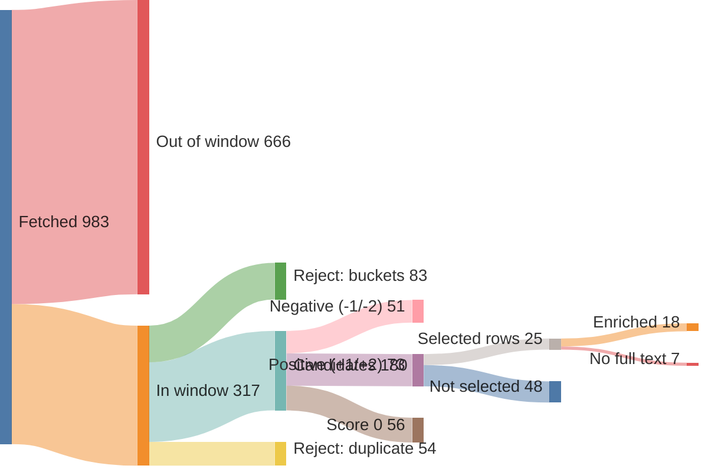
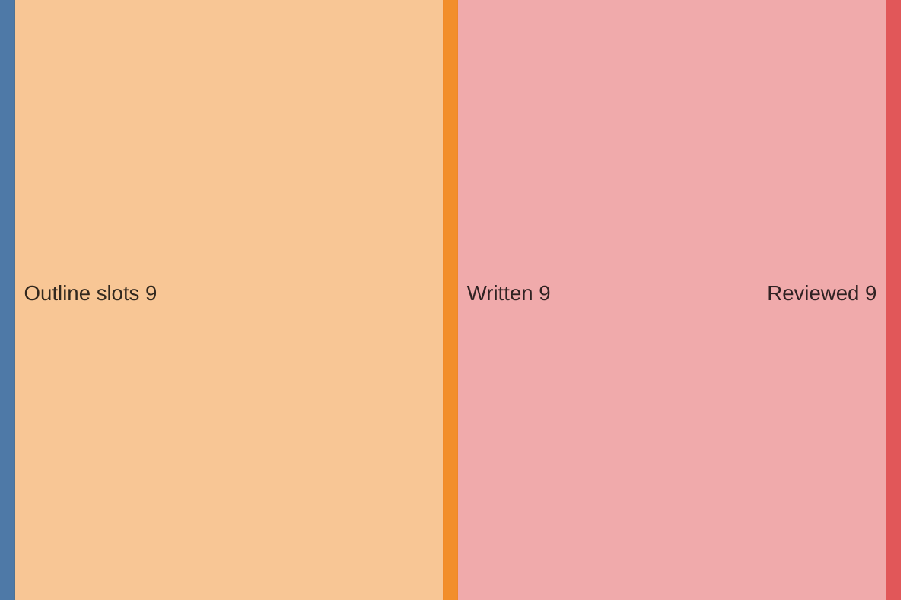

# Run report — edition 2026-07-26

## Funnel overview

Items — fetched → in window → filtered → scored → selected → enriched (drop branches show why and what type):

Edition — outline slots → written → reviewed:

## Funnel

- window: 7 days (from 2026-07-19T00:00:00+02:00, SRC-4)
- S1 fetch: 983 feed items → 317 in window (37/40 feeds ok)
- S2 filter: 317 → 180 candidates (137 rejected)
- S3 score: 180 scored → 73 at +1/+2
- S4 select: 24 topics (25 source rows)
- S5 enrich: 25 source rows → 18 full texts (requests 18, playwright 0); 7 topics dropped (PIPE-5)
- S6 outline: 9 slots, planned 2350–4500 words
- S7 write: 9 articles, 2740 words
- S8 review: 63 correction(s), 3042 words body text (ED-5 target 2800–3400)
- S9 compose: nr 4, 0 recompile(s); **2 unresolved typeset violation(s)**

## Feeds

| bron | items | in window | undated | error |
|---|---|---|---|---|
| Gem Wijchen | 20 | 0 | 0 | — |
| nieuws.nl | 54 | 4 | 0 | — |
| DG Wijchen | 30 | 30 | 0 | — |
| Gld | 50 | 40 | 0 | — |
| Gld RvN | 50 | 16 | 0 | — |
| DG | 30 | 30 | 0 | — |
| DG Binnen | 30 | 30 | 0 | — |
| Overheid | 1 | 1 | 0 | — |
| NOS J | 20 | 20 | 0 | — |
| NOS Alg | 20 | 20 | 0 | — |
| NOS Binnen | 20 | 19 | 0 | — |
| NOS Buiten | 20 | 20 | 0 | — |
| NOS Econ | 20 | 6 | 0 | — |
| NOS Sport | 20 | 20 | 0 | — |
| NOS Opm | 20 | 1 | 0 | — |
| NOS Cultuur | 20 | 1 | 0 | — |
| FTM | 10 | 2 | 0 | — |
| EW | 10 | 10 | 0 | — |
| HP | 0 | 0 | 0 | HTTPError: 403 Client Error: Forbidden for url: https://www.hpdetijd.nl/rss |
| DW | 21 | 21 | 0 | — |
| DW Env | 20 | 0 | 0 | — |
| DW Science | 2 | 0 | 0 | — |
| Positive | 10 | 1 | 0 | — |
| WijWijchen | 20 | 0 | 0 | — |
| Druten | 20 | 0 | 0 | — |
| KNMI | 5 | 0 | 0 | — |
| CBS n&m | 50 | 0 | 0 | — |
| CBS v&c | 50 | 0 | 0 | — |
| Natuurmon | 30 | 4 | 0 | — |
| IVN | 10 | 0 | 0 | — |
| MaatschapWij | 8 | 1 | 0 | — |
| BBC Future | 10 | 2 | 0 | — |
| RtbC | 10 | 1 | 0 | — |
| FixNews | 20 | 0 | 0 | — |
| Mongabay | 32 | 8 | 0 | — |
| HumanProg | 10 | 0 | 0 | — |
| NatureToday | 200 | 8 | 0 | — |
| ARK | 10 | 1 | 0 | — |
| WijchensNws | 0 | 0 | 0 | HTTPError: 404 Client Error: Not Found for url: https://www.wijchensnieuws.nl/feed/ |
| Wegwijs | 0 | 0 | 0 | HTTPError: 403 Client Error: Forbidden for url: https://www.weekblad-wegwijs.nl/feed |

## LLM usage (OPS-4)

| stage | model | effort | calls | turns | in tok | out tok | tools | think chars | wall | cost |
|---|---|---|---|---|---|---|---|---|---|---|
| S3 score | claude-haiku-4-5-20251001 | — | 3 | 7 | 116,390 | 13,323 | 3 | 30,372 | 143.8s | $0.2684 |
| S4 select | claude-sonnet-5 | medium | 1 | 3 | 128,539 | 8,426 | 2 | 0 | 124.2s | $0.5739 |
| S5 enrich | claude-haiku-4-5-20251001 | — | 12 | 30 | 373,585 | 15,855 | 12 | 33,179 | 192.7s | $0.2657 |
| S6 outline | claude-opus-4-8 | medium | 1 | 2 | 30,546 | 8,183 | 1 | 0 | 118.6s | $0.5155 |
| S7 write | claude-sonnet-5 | medium | 9 | 26 | 563,512 | 18,152 | 9 | 0 | 293.2s | $1.2287 |
| S8 review | claude-sonnet-5 | medium | 9 | 18 | 277,000 | 32,651 | 9 | 0 | 431.2s | $0.9443 |
| **total** |  |  | 35 | 86 | 1,489,572 | 96,590 | 36 | 63,551 | 1303.7s | $3.7965 |

## Rejected (PIPE-2)

| reason | count |
|---|---|
| B1 | 35 |
| B2 | 49 |
| B3 | 4 |
| B4 | 4 |
| B5 | 12 |
| duplicate | 54 |

## Scores (PIPE-3)

model claude-haiku-4-5-20251001, prompt score.md v1

| score | count |
|---|---|
| -2 | 5 |
| -1 | 46 |
| 0 | 56 |
| +1 | 36 |
| +2 | 37 |

## Selected topics (PIPE-4)

| scope | topic | bronnen |
|---|---|---|
| L | Toezichthouders werken over gemeentegrenzen tegen overlast | nieuws.nl |
| L | Gratis zomerspeurtocht 'De verdwenen ijscoupes' in Wijchen | nieuws.nl |
| L | Kapper Theo mag na 40 jaar tóch goede doelen knippen | DG Wijchen |
| L | Tweeling miste vlag van Guinee bij Vierdaagse, doet nu zelf mee | DG Wijchen |
| L | Vereniging Gouden-Kruisdragers verrast met koninklijke status | DG Wijchen |
| L | Duizenden uren werk om Vierdaagseplek Kelfkensbos klaar te krijgen | DG Wijchen |
| L | Slechtziende Boaz (11) wandelt Vierdaagse voor klasgenoten | DG Wijchen |
| R | Wilde dieren krijgen meer ruimte op ecoducten bij Hoge Veluwe | Gld |
| R | Burgemeester Rheden debuteert in de Vierdaagse na jaren zwaaien | Gld |
| R | Wolf met prooi en ijsvogel: mooie momenten in de Gelderse natuur | Gld |
| R | Nijmegen krijgt wegwijsborden voor vleermuizen | Gld |
| R | Steeds meer mensen kamperen in Gelderland, en dat is goed | Gld |
| R | Gelderse wijngaarden floreren dankzij droog weer | Gld |
| R | Steeds meer jongeren ontdekken wandelen als sport | Gld |
| N | Stikstofdoelen 2035 in zicht met nieuwe kabinetsplannen | NatureToday |
| N | Gestrande walvis krijgt hulp van dolfijnen terug naar zee | NOS J |
| N | Oranje wint Fair Play-prijs op het WK voetbal | NOS J, NOS Sport |
| N | Historische vereniging redt vervallen molen van sloop | DG |
| N | Veertien kraamhotels vangen tekorten in kraamzorg op | DG Binnen |
| I | EU-verbod op vernietigen onverkochte kleding gaat in | DW |
| I | Hoe Cuba omschakelde van zeeschildpaddenvangst naar bescherming | Mongabay |
| I | Zwitserse architect bewijst: het groenste gebouw staat er al | RtbC |
| I | Zeldzame gier keert na tien jaar terug in Cambodjaans reservaat | Mongabay |
| I | Wetenschappers laten menselijke tanden opnieuw groeien | BBC Future |

## Enrichment (PIPE-5)

| scope | topic | bron | summary | text | refs | ref words | ref links | status |
|---|---|---|---|---|---|---|---|---|
| L | Toezichthouders werken over gemeentegrenzen tegen overlast | nieuws.nl | 43 | 154 | 0 | 0 | — | ok |
| L | Gratis zomerspeurtocht 'De verdwenen ijscoupes' in Wijchen | nieuws.nl | 42 | 144 | 3 | 345 | joepiedoe.com/?srsltid=AfmBOoq4e9HvxsZZ4LdzwMtl1HzSS3tAAWah… kids-town.nl/ bijdaankindermode.nl/ | ok |
| L | Kapper Theo mag na 40 jaar tóch goede doelen knippen | DG Wijchen | 43 | 0 | 0 | 0 | — | **dropped** — no sufficient row |
| L | Tweeling miste vlag van Guinee bij Vierdaagse, doet nu zelf mee | DG Wijchen | 42 | 0 | 0 | 0 | — | **dropped** — no sufficient row |
| L | Vereniging Gouden-Kruisdragers verrast met koninklijke status | DG Wijchen | 42 | 0 | 0 | 0 | — | **dropped** — no sufficient row |
| L | Duizenden uren werk om Vierdaagseplek Kelfkensbos klaar te krijgen | DG Wijchen | 39 | 0 | 0 | 0 | — | **dropped** — no sufficient row |
| L | Slechtziende Boaz (11) wandelt Vierdaagse voor klasgenoten | DG Wijchen | 51 | 0 | 0 | 0 | — | **dropped** — no sufficient row |
| R | Wilde dieren krijgen meer ruimte op ecoducten bij Hoge Veluwe | Gld | 47 | 381 | 0 | 0 | — | ok |
| R | Burgemeester Rheden debuteert in de Vierdaagse na jaren zwaaien | Gld | 31 | 478 | 1 | 308 | gld.nl/4daagse | ok |
| R | Wolf met prooi en ijsvogel: mooie momenten in de Gelderse natuur | Gld | 33 | 356 | 0 | 0 | — | ok |
| R | Nijmegen krijgt wegwijsborden voor vleermuizen | Gld | 44 | 309 | 1 | 0 | rn7.nl/nieuws/artikel/wat-zijn-toch-die-vleermuispalen-lang… | ok |
| R | Steeds meer mensen kamperen in Gelderland, en dat is goed | Gld | 44 | 876 | 2 | 1419 | gld.nl/nieuws/8493152/geen-provincie-is-zo-populair-als-gel… journals.plos.org/plosone/article?id=10.1371%2Fjournal.pone… | ok |
| R | Gelderse wijngaarden floreren dankzij droog weer | Gld | 46 | 663 | 0 | 0 | — | ok |
| R | Steeds meer jongeren ontdekken wandelen als sport | Gld | 30 | 680 | 1 | 670 | nos.nl/artikel/2623579-meer-jonge-wandelaars-bij-nijmeegse-… | ok |
| N | Stikstofdoelen 2035 in zicht met nieuwe kabinetsplannen | NatureToday | 55 | 322 | 3 | 896 | bnnvara.nl/vroegevogels saxifraga.nl/ hogeveluwe.nl/ | ok |
| N | Gestrande walvis krijgt hulp van dolfijnen terug naar zee | NOS J | 86 | 98 | 0 | 0 | — | ok |
| N | Oranje wint Fair Play-prijs op het WK voetbal | NOS J | 125 | 133 | 0 | 0 | — | ok |
| N | Oranje wint Fair Play-prijs op het WK voetbal | NOS Sport | 172 | 183 | 1 | 860 | nos.nl/artikel/2623685-spanje-krijgt-machteloos-argentinie-… | ok |
| N | Historische vereniging redt vervallen molen van sloop | DG | 37 | 0 | 0 | 0 | — | **dropped** — no sufficient row |
| N | Veertien kraamhotels vangen tekorten in kraamzorg op | DG Binnen | 59 | 0 | 0 | 0 | — | **dropped** — no sufficient row |
| I | EU-verbod op vernietigen onverkochte kleding gaat in | DW | 22 | 573 | 1 | 384 | dw.com/en/eu-approves-ban-on-destruction-of-unsold-clothing… | ok |
| I | Hoe Cuba omschakelde van zeeschildpaddenvangst naar bescherming | Mongabay | 56 | 506 | 0 | 0 | — | ok |
| I | Zwitserse architect bewijst: het groenste gebouw staat er al | RtbC | 68 | 1910 | 3 | 603 | circle-economy.com/knowledge-hub/article/29941?title=K118-A… carbonleadershipforum.org/embodied-carbon-101-v2/ researchgate.net/publication/376148869_Case_Study_K118_-_Th… | ok |
| I | Zeldzame gier keert na tien jaar terug in Cambodjaans reservaat | Mongabay | 56 | 370 | 0 | 0 | — | ok |
| I | Wetenschappers laten menselijke tanden opnieuw groeien | BBC Future | 10 | 1465 | 3 | 826 | jada.ada.org/article/S0002-8177(25 frontiersin.org/journals/dental-medicine/articles/10.3389/f… cdc.gov/oral-health/data-research/facts-stats/fast-facts-to… | ok |

## Edition plan (PIPE-6)

| pos | scope | length | topic | location | source date |
|---|---|---|---|---|---|
| 1 | L | standard | Gratis zomerspeurtocht 'De verdwenen ijscoupes' in het centrum van Wijchen | Centrum Wijchen | 2026-07-20 |
| 2 | L | short | Toezichthouders werken voortaan over de gemeentegrens samen in het buitengebied | Gemeente Wijchen / buitengebied | 2026-07-20 |
| 3 | R | long | Gelderse wijngaarden floreren juist dankzij de droogte | Gelderland (wijngaarden) | 2026-07-19 |
| 4 | R | standard | Burgemeester van Rheden debuteert in de Vierdaagse na jaren zwaaien | Rheden / Nijmegen (Vierdaagse) | 2026-07-20 |
| 5 | R | short | Nijmegen krijgt wegwijsborden voor vleermuizen | Nijmegen, Nelson Mandelaplein | 2026-07-19 |
| 6 | N | standard | Stikstofdoelen 2035 binnen bereik met nieuwe kabinetsplannen | Nederland | 2026-07-19 |
| 7 | N | short | Oranje wint de Fair Play-prijs op het WK ondanks vroege uitschakeling | Nederland / WK (Verenigde Staten) | 2026-07-20 |
| 8 | I | long | Wetenschappers laten menselijke tanden opnieuw groeien | Internationaal (onderzoek/lab) | 2026-07-19 |
| 9 | I | standard | Cuba schakelde om van zeeschildpaddenvangst naar bescherming | Cuba | 2026-07-20 |

## Articles (PIPE-7/8)

| pos | title | words draft → reviewed |
|---|---|---|
| 1 | Copy-edit: Speurtocht 'De verdwenen ijscoupes' | 248 → 257 |
| 2 | Handen over de grens | 158 → 162 |
| 3 | Droogte? Voor de Gelderse wijnstok is het een cadeautje | 549 → 539 |
| 4 | Van zwaaien naar lopen: burgemeester debuteert in Vierdaagse | 370 → 369 |
| 5 | Copy-edit: wegwijzers-item | 227 → 456 |
| 6 | Stikstofdoel 2035 voor het eerst binnen bereik | 311 → 306 |
| 7 | Vroeg naar huis, toch met een prijs: Oranje pakt Fair Play-onderscheiding | 187 → 188 |
| 8 | Nieuwe tanden uit eigen lichaam: de opmars van regeneratieve tandheelkunde | 671 → 668 |
| 9 | Concepttekst ontbreekt — kan nog niet redigeren | 19 → 97 |

## Correction log (PIPE-8)

- slot 1: Werktitel vervangen door 'De ijscoman is zijn coupes kwijt — Wijchen op zoete speurtocht': pakkender en dekt de lading beter dan de oorspronkelijke titel.
- slot 1: Alinea 2: inconsistente aanspreekvorm hersteld — was 'Wie al wat ouder is... verzamel je letters' (wisselde van derde naar tweede persoon), nu doorlopend derde persoon: 'verzamelt hij of zij letters, die... samen een geheime boodschap vormen'.
- slot 1: Alinea 2: 'is zo ingericht dat niemand aan de kant hoeft te blijven staan' vervangen door de directere en heldere formulering 'is voor alle leeftijden te doen'.
- slot 1: Alinea 4: overbodige komma voor 'en' verwijderd ('kijkt goed tussen de etalages door, en helpt hem' → '...door en helpt hem') volgens Nederlandse interpunctieconventie.
- slot 1: Slotzin herschreven om herhaling met alinea 2 te verminderen: 'Een geheime boodschap wacht op wie alle letters weet te vinden' werd 'Wie alle letters weet te vinden, ontrafelt de geheime boodschap die op hem wacht.'
- slot 1: Gecontroleerd op verwijzingen naar 'De Zonzijde', 'deze krant' of niet-getoonde afbeeldingen/illustraties: geen overtredingen aangetroffen, geen wijziging nodig.
- slot 2: Titel gehandhaafd: 'Handen over de grens' speelt treffend op 'handhaven' en past bij het onderwerp.
- slot 2: 'de toezicht' → 'het toezicht' (toezicht is onzijdig); openingszin herschreven voor grammaticale correctheid en vloeiendere leesbaarheid ('Buiten trekt zich niets aan van...' → 'Buiten trekt niemand zich iets aan van...').
- slot 2: 'Oost Nederland' → 'Oost-Nederland' (koppelteken, twee keer).
- slot 2: 'Visunie' vervangen door 'Sportvisserij Nederland' — 'Visunie' is geen bestaande organisatienaam in dit samenwerkingsverband; gecorrigeerd om feitelijke onduidelijkheid te voorkomen.
- slot 2: 'waar toezicht vroeger ophield' → 'waar het toezicht vroeger ophield' voor grammaticale consistentie.
- slot 2: 'betekent het vooral dat het net wat beter bekeken wordt' → 'betekent dit vooral dat er net wat beter op wordt gelet' (verwijderde verwarrende dubbele 'het'-verwijzing, natuurlijker taalgebruik).
- slot 2: 'beter afgestemd' → 'beter op elkaar afgestemd' voor duidelijkheid.
- slot 3: Titel gehandhaafd: de werktitel was al sterk en pakkend, dus niet vervangen.
- slot 3: Herhaling 'is, is' in de openingsalinea rechtgetrokken ('is voor hen juist een zegen') voor betere leesbaarheid.
- slot 3: Onlogische formulering hersteld: een bodem 'gedijt' niet — gecorrigeerd naar 'een bodem die volgens hem bij deze droogte juist goed het water vasthoudt'.
- slot 3: Stijlfout gecorrigeerd: de opsomming 'gedijen slecht bij vocht, bij regen en bij vochtige lucht' bevatte een drievoudige, verwarrende herhaling van 'bij' en een onjuiste causaliteit (vocht als overkoepelende term naast regen/lucht); herschreven tot 'regen en vochtige lucht doen de druivenplant geen goed'.
- slot 3: 'met alleen in juni wat meer neerslag' verstrakt tot 'op wat extra neerslag in juni na' voor vlottere zinsbouw.
- slot 3: Gecontroleerd op verwijzingen naar de krant zelf of naar niet-getoonde beelden/illustraties: geen overtredingen aangetroffen.
- slot 4: Titel gehandhaafd: de werktitel was al sterk en pakkend, geen vervanging nodig.
- slot 4: 'voor het eerst zelf mee aan de Nijmeegse Vierdaagse' → 'voor het eerst zelf mee met de Nijmeegse Vierdaagse' (juiste voorzetselconstructie bij 'meelopen').
- slot 4: 'Wandelen deed hij al langer' → 'Hij wandelde al langer' (stroeve inversie rechtgezet voor leesbaarheid).
- slot 4: 'de dertigkilometerafstand' → 'de afstand van dertig kilometer' (onnatuurlijke samenstelling vermeden).
- slot 4: 'Ze wisten allebei geen garantie op een startbewijs te hebben, en spraken daarom af' → 'Geen van beiden had garantie op een startbewijs, dus spraken ze af' (kromme zinsconstructie verduidelijkt).
- slot 4: 'door drukke agenda's' → 'vanwege drukke agenda's' (correcter voorzetselgebruik bij reden/oorzaak).
- slot 4: Quote 'Die dag ging meteen tien keer sneller voorbij' → 'meteen' geschrapt; voegde niets toe en verstoorde de zinsritme.
- slot 4: 'vanwege de planning' → 'vanwege zijn drukke schema' (vage verwijzing verduidelijkt, sluit aan bij eerdere 'drukke agenda's').
- slot 4: 'loopt hij op schapenwol in zijn sokken' → 'loopt hij met schapenwol in zijn sokken' (correct voorzetsel).
- slot 4: 'Achter zwaaien schuilt kennelijk toch enige jaloezie, want uitkijken doet hij vooral naar...' → 'Achter het zwaaien blijkt toch enige jaloezie te schuilen: hij kijkt vooral uit naar...' (stroeve, dubbele inversie vereenvoudigd; lidwoord toegevoegd).
- slot 4: 'Tegenop zien doet hij eigenlijk nergens naar' → 'Tegen niets ziet hij echt op' (fout voorzetselgebruik hersteld: 'opzien tegen iets', niet 'naar iets').
- slot 4: 'in de woorden van zijn vader' → 'in zijn eigen woorden' (verwarrende formulering: leek te verwijzen naar een andere, niet-geïntroduceerde vader, terwijl Van Eert zelf bedoeld werd).
- slot 5: Titel gewijzigd naar 'Wegwijzers bij Nelson Mandelaplein zijn niet voor mensen' voor meer precisie
- slot 5: 'Geen kunstproject en geen straatmeubilair voor de show' verduidelijkt
- slot 5: 'weerkaatsing daarvan' → 'weerkaatsing ervan'
- slot 5: 'zonder geluid om op te varen' → 'zonder herkenningspunten om op te varen' (logica hersteld)
- slot 5: Komma bij beperkende bijzin 'tussenstations, die' verwijderd; 'tot' → 'totdat'
- slot 5: 'bedacht er iets op' → 'bedacht een oplossing' (formeler)
- slot 5: Slotzin herschreven naar grammaticaal volledige zin
- slot 6: Titel vervangen: 'Kabinetsplannen brengen stikstofdoel 2035 dichterbij' → 'Stikstofdoel 2035 voor het eerst binnen bereik' (directer, sluit aan bij de kern van het nieuws — dat het doel voor het eerst haalbaar blijkt).
- slot 6: Alinea 1: 'de eerste doorrekening met het Nviro-model, gemaakt door onderzoeker Ton Brouwer' herschreven naar 'de eerste doorrekening met het Nviro-model van onderzoeker Ton Brouwer' — voorkomt de dubbelzinnigheid of 'gemaakt door' bij het model of de doorrekening hoort.
- slot 6: Alinea 2: het citaatblok herschreven. Origineel plaatste de attributie ('zegt hij over de ondergrens...') midden in de zin na het citaat, wat de tegenstelling met de bovengrens onduidelijk maakte. Nu: 'Over de ondergrens van zijn bandbreedte zegt hij: [...]' vooraf, gevolgd door een losse zin over de bovengrens. Ook 'ook net niet gehaald kan worden' (verkeerd modaal werkwoord, klinkt als mogelijkheid i.p.v. uitkomst) gecorrigeerd naar 'net niet gehaald zou worden'.
- slot 6: Alinea 4: 'noemt hij als voorbeeld' → 'geeft hij als voorbeeld' (gangbaarder werkwoordgebruik bij het geven van een voorbeeld).
- slot 6: Alinea 4: 'moet ergens van worden betaald' → 'moet ergens van betaald worden' (natuurlijkere Nederlandse woordvolgorde).
- slot 6: Alinea 5: 'Die volgt op een later moment' → 'Die doorrekening volgt later' (duidelijker verwijzing, minder omslachtig).
- slot 7: Titel gehandhaafd: de werktitel was al sterk en pakkend, geen vervanging nodig.
- slot 7: Zinsvolgorde in de eerste alinea rechtgezet: 'die Spanje met 1-0 na verlenging won van Argentinië' → 'die Spanje na verlenging met 1-0 won van Argentinië' (logische volgorde: verlenging vóór uitslag).
- slot 7: 'Nederland verzamelde drie gele kaarten in het toernooi' → 'Nederland verzamelde in het toernooi drie gele kaarten' (vermijdt de wat rommelige zinsstaart).
- slot 7: 'Voor Nederland is het de eerste keer dat de Fair Play-prijs wordt gewonnen' → 'Het is de eerste keer dat Nederland de Fair Play-prijs wint' (actiever, minder omslachtig).
- slot 7: 'Engeland was de vorige winnaar, in 2022' → 'De vorige winnaar was Engeland, in 2022' (consistentere zinsbouw met voorgaande zin).
- slot 7: Spelfout gecorrigeerd: 'voetbal gerelateerd' → 'voetbalgerelateerd' (samenstelling moet aaneen).
- slot 7: 'Wie het toernooi verder domineerde, werd voetballend beslist' → 'De overige onderscheidingen van het toernooi gingen naar wie het beste voetbalde' (onduidelijke/kromme formulering verhelderd).
- slot 8: Titel vervangen: 'Eigen tanden terug: wetenschappers leren het lichaam nieuwe tanden maken' → 'Nieuwe tanden uit eigen lichaam: de opmars van regeneratieve tandheelkunde' (minder herhaling van 'tanden', dekt de lading beter).
- slot 8: 'Biochemica Hannele Ruohola-Baker' → 'Biochemicus Hannele Ruohola-Baker' (geen gangbare Nederlandse vrouwelijke vorm van dit beroepswoord).
- slot 8: 'de eiwitten die dentine laten groeien en zichzelf laten herstellen' → 'de eiwitten die de groei en het zelfherstel van dentine aansturen' (onduidelijke verwijzing van 'zichzelf' verholpen).
- slot 8: 'Ze hielp mee een gen te ontrafelen' → 'Ze hielp een gen te ontrafelen' ('mee' overbodig/informeel).
- slot 8: 'het buitenste glazuurlaagje' → 'de buitenste glazuurlaag' (verkleinwoord paste niet bij register).
- slot 8: 'wisten de onderzoekers stamcellen alsnog om te vormen' → 'slaagden de onderzoekers erin stamcellen alsnog om te vormen' (vlottere, correctere constructie).
- slot 8: 'tandorganoide' → 'tandorganoïde' (ontbrekend trema).
- slot 8: 'onontloken volwassen tandknoppen' → 'niet-doorgebroken volwassen tandknoppen' ('onontloken' is geen gangbaar/juist woord in deze context).
- slot 8: 'met als einddoel tanden laten groeien' → 'met als einddoel uiteindelijk tanden te laten groeien' (ontbrekend 'te' hersteld).
- slot 8: 'Zo ver is het nog niet.' → 'Zover is het nog niet.' (aan elkaar geschreven).
- slot 8: 'moeten eerst proeven ... plaatsvinden' → 'moeten proeven ... plaatsvinden' ('eerst' overbodig na 'Voordat').
- slot 8: 'Maar de kennis die hierbij wordt opgedaan, reikt verder' → 'Maar de opgedane kennis reikt verder' (compacter, minder stroef).

## Typeset & compose (PIPE-9)

- 0 recompile(s)
- illustration failed: agent call failed: ProcessError: Command failed with exit code 1 (exit code: 1)
Error output: Check stderr output for details

**Unresolved violations (LAY hard gates):**

- LAY-1: content fills 3.44 pages, below 3.5 (page 4)
- LAY-3: single-word line 'formuleringen' (page 4, column 2)
