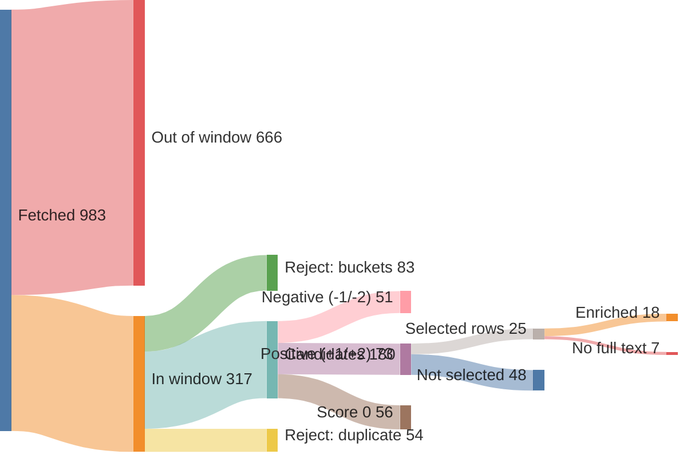
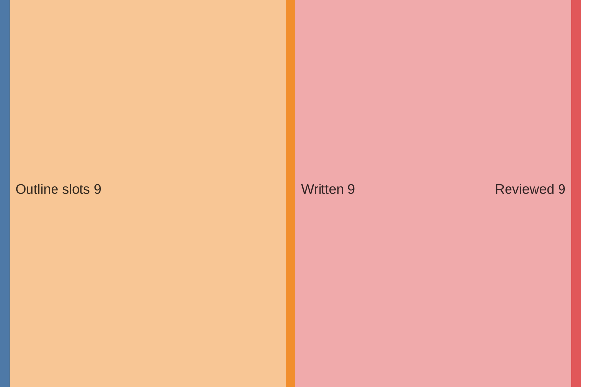

# Run report — edition 2026-07-26

## Funnel overview

Items — fetched → in window → filtered → scored → selected → enriched (drop branches show why and what type):

Edition — outline slots → written → reviewed:

## Funnel

- window: 7 days (from 2026-07-19T00:00:00+02:00, SRC-4)
- F1 fetch: 983 feed items → 317 in window (37/40 feeds ok)
- F2 filter: 317 → 180 candidates (137 rejected)
- F3 score: 180 scored → 73 at +1/+2
- F4 select: 24 topics (25 source rows)
- F5 enrich: 25 source rows → 18 full texts (requests 18, playwright 0); 7 topics dropped (PIPE-5)
- F6 outline: 9 slots, planned 2350–4500 words
- F7 write: 9 articles, 2998 words
- F8 review: 74 correction(s), 3066 words body text (ED-5 target 2800–3400)
- F9 compose: nr 4, 0 recompile(s) — typeset checks clean (LAY-1..5, LAY-7)

## Feeds

| bron | items | in window | undated | error |
|---|---|---|---|---|
| Gem Wijchen | 20 | 0 | 0 | — |
| nieuws.nl | 54 | 4 | 0 | — |
| DG Wijchen | 30 | 30 | 0 | — |
| Gld | 50 | 40 | 0 | — |
| Gld RvN | 50 | 16 | 0 | — |
| DG | 30 | 30 | 0 | — |
| DG Binnen | 30 | 30 | 0 | — |
| Overheid | 1 | 1 | 0 | — |
| NOS J | 20 | 20 | 0 | — |
| NOS Alg | 20 | 20 | 0 | — |
| NOS Binnen | 20 | 19 | 0 | — |
| NOS Buiten | 20 | 20 | 0 | — |
| NOS Econ | 20 | 6 | 0 | — |
| NOS Sport | 20 | 20 | 0 | — |
| NOS Opm | 20 | 1 | 0 | — |
| NOS Cultuur | 20 | 1 | 0 | — |
| FTM | 10 | 2 | 0 | — |
| EW | 10 | 10 | 0 | — |
| HP | 0 | 0 | 0 | HTTPError: 403 Client Error: Forbidden for url: https://www.hpdetijd.nl/rss |
| DW | 21 | 21 | 0 | — |
| DW Env | 20 | 0 | 0 | — |
| DW Science | 2 | 0 | 0 | — |
| Positive | 10 | 1 | 0 | — |
| WijWijchen | 20 | 0 | 0 | — |
| Druten | 20 | 0 | 0 | — |
| KNMI | 5 | 0 | 0 | — |
| CBS n&m | 50 | 0 | 0 | — |
| CBS v&c | 50 | 0 | 0 | — |
| Natuurmon | 30 | 4 | 0 | — |
| IVN | 10 | 0 | 0 | — |
| MaatschapWij | 8 | 1 | 0 | — |
| BBC Future | 10 | 2 | 0 | — |
| RtbC | 10 | 1 | 0 | — |
| FixNews | 20 | 0 | 0 | — |
| Mongabay | 32 | 8 | 0 | — |
| HumanProg | 10 | 0 | 0 | — |
| NatureToday | 200 | 8 | 0 | — |
| ARK | 10 | 1 | 0 | — |
| WijchensNws | 0 | 0 | 0 | HTTPError: 404 Client Error: Not Found for url: https://www.wijchensnieuws.nl/feed/ |
| Wegwijs | 0 | 0 | 0 | HTTPError: 403 Client Error: Forbidden for url: https://www.weekblad-wegwijs.nl/feed |

## LLM usage (OPS-4)

| fase | model | effort | calls | turns | in tok | out tok | tools | think chars | wall | cost |
|---|---|---|---|---|---|---|---|---|---|---|
| F3 score | claude-haiku-4-5-20251001 | — | 3 | 7 | 116,390 | 13,323 | 3 | 30,372 | 143.8s | $0.2684 |
| F4 select | claude-sonnet-5 | medium | 1 | 3 | 128,539 | 8,426 | 2 | 0 | 124.2s | $0.5739 |
| F5 enrich | claude-haiku-4-5-20251001 | — | 12 | 30 | 373,585 | 15,855 | 12 | 33,179 | 192.7s | $0.2657 |
| F6 outline | claude-opus-4-8 | medium | 1 | 2 | 30,546 | 8,183 | 1 | 0 | 118.6s | $0.5155 |
| F7 write | claude-sonnet-5 | medium | 9 | 27 | 595,448 | 18,271 | 9 | 0 | 299.8s | $1.2454 |
| F8 review | claude-sonnet-5 | medium | 9 | 18 | 277,807 | 36,435 | 9 | 0 | 457.0s | $0.9930 |
| F9 compose | — | — | 1 | 6 | 78,074 | 4,191 | 5 | 0 | 60.5s | $0.3534 |
| **total** |  |  | 36 | 93 | 1,600,389 | 104,684 | 41 | 63,551 | 1396.6s | $4.2153 |

## Rejected (PIPE-2)

| reason | count |
|---|---|
| B1 | 35 |
| B2 | 49 |
| B3 | 4 |
| B4 | 4 |
| B5 | 12 |
| duplicate | 54 |

## Scores (PIPE-3)

model claude-haiku-4-5-20251001, prompt score.md v1

| score | count |
|---|---|
| -2 | 5 |
| -1 | 46 |
| 0 | 56 |
| +1 | 36 |
| +2 | 37 |

## Selected topics (PIPE-4)

| scope | topic | bronnen |
|---|---|---|
| L | Toezichthouders werken over gemeentegrenzen tegen overlast | nieuws.nl |
| L | Gratis zomerspeurtocht 'De verdwenen ijscoupes' in Wijchen | nieuws.nl |
| L | Kapper Theo mag na 40 jaar tóch goede doelen knippen | DG Wijchen |
| L | Tweeling miste vlag van Guinee bij Vierdaagse, doet nu zelf mee | DG Wijchen |
| L | Vereniging Gouden-Kruisdragers verrast met koninklijke status | DG Wijchen |
| L | Duizenden uren werk om Vierdaagseplek Kelfkensbos klaar te krijgen | DG Wijchen |
| L | Slechtziende Boaz (11) wandelt Vierdaagse voor klasgenoten | DG Wijchen |
| R | Wilde dieren krijgen meer ruimte op ecoducten bij Hoge Veluwe | Gld |
| R | Burgemeester Rheden debuteert in de Vierdaagse na jaren zwaaien | Gld |
| R | Wolf met prooi en ijsvogel: mooie momenten in de Gelderse natuur | Gld |
| R | Nijmegen krijgt wegwijsborden voor vleermuizen | Gld |
| R | Steeds meer mensen kamperen in Gelderland, en dat is goed | Gld |
| R | Gelderse wijngaarden floreren dankzij droog weer | Gld |
| R | Steeds meer jongeren ontdekken wandelen als sport | Gld |
| N | Stikstofdoelen 2035 in zicht met nieuwe kabinetsplannen | NatureToday |
| N | Gestrande walvis krijgt hulp van dolfijnen terug naar zee | NOS J |
| N | Oranje wint Fair Play-prijs op het WK voetbal | NOS J, NOS Sport |
| N | Historische vereniging redt vervallen molen van sloop | DG |
| N | Veertien kraamhotels vangen tekorten in kraamzorg op | DG Binnen |
| I | EU-verbod op vernietigen onverkochte kleding gaat in | DW |
| I | Hoe Cuba omschakelde van zeeschildpaddenvangst naar bescherming | Mongabay |
| I | Zwitserse architect bewijst: het groenste gebouw staat er al | RtbC |
| I | Zeldzame gier keert na tien jaar terug in Cambodjaans reservaat | Mongabay |
| I | Wetenschappers laten menselijke tanden opnieuw groeien | BBC Future |

## Enrichment (PIPE-5)

| scope | topic | bron | summary | text | refs | ref words | ref links | status |
|---|---|---|---|---|---|---|---|---|
| L | Toezichthouders werken over gemeentegrenzen tegen overlast | nieuws.nl | 43 | 154 | 0 | 0 | — | ok |
| L | Gratis zomerspeurtocht 'De verdwenen ijscoupes' in Wijchen | nieuws.nl | 42 | 144 | 3 | 345 | joepiedoe.com/?srsltid=AfmBOoq4e9HvxsZZ4LdzwMtl1HzSS3tAAWah… kids-town.nl/ bijdaankindermode.nl/ | ok |
| L | Kapper Theo mag na 40 jaar tóch goede doelen knippen | DG Wijchen | 43 | 0 | 0 | 0 | — | **dropped** — no sufficient row |
| L | Tweeling miste vlag van Guinee bij Vierdaagse, doet nu zelf mee | DG Wijchen | 42 | 0 | 0 | 0 | — | **dropped** — no sufficient row |
| L | Vereniging Gouden-Kruisdragers verrast met koninklijke status | DG Wijchen | 42 | 0 | 0 | 0 | — | **dropped** — no sufficient row |
| L | Duizenden uren werk om Vierdaagseplek Kelfkensbos klaar te krijgen | DG Wijchen | 39 | 0 | 0 | 0 | — | **dropped** — no sufficient row |
| L | Slechtziende Boaz (11) wandelt Vierdaagse voor klasgenoten | DG Wijchen | 51 | 0 | 0 | 0 | — | **dropped** — no sufficient row |
| R | Wilde dieren krijgen meer ruimte op ecoducten bij Hoge Veluwe | Gld | 47 | 381 | 0 | 0 | — | ok |
| R | Burgemeester Rheden debuteert in de Vierdaagse na jaren zwaaien | Gld | 31 | 478 | 1 | 308 | gld.nl/4daagse | ok |
| R | Wolf met prooi en ijsvogel: mooie momenten in de Gelderse natuur | Gld | 33 | 356 | 0 | 0 | — | ok |
| R | Nijmegen krijgt wegwijsborden voor vleermuizen | Gld | 44 | 309 | 1 | 0 | rn7.nl/nieuws/artikel/wat-zijn-toch-die-vleermuispalen-lang… | ok |
| R | Steeds meer mensen kamperen in Gelderland, en dat is goed | Gld | 44 | 876 | 2 | 1419 | gld.nl/nieuws/8493152/geen-provincie-is-zo-populair-als-gel… journals.plos.org/plosone/article?id=10.1371%2Fjournal.pone… | ok |
| R | Gelderse wijngaarden floreren dankzij droog weer | Gld | 46 | 663 | 0 | 0 | — | ok |
| R | Steeds meer jongeren ontdekken wandelen als sport | Gld | 30 | 680 | 1 | 670 | nos.nl/artikel/2623579-meer-jonge-wandelaars-bij-nijmeegse-… | ok |
| N | Stikstofdoelen 2035 in zicht met nieuwe kabinetsplannen | NatureToday | 55 | 322 | 3 | 896 | bnnvara.nl/vroegevogels saxifraga.nl/ hogeveluwe.nl/ | ok |
| N | Gestrande walvis krijgt hulp van dolfijnen terug naar zee | NOS J | 86 | 98 | 0 | 0 | — | ok |
| N | Oranje wint Fair Play-prijs op het WK voetbal | NOS J | 125 | 133 | 0 | 0 | — | ok |
| N | Oranje wint Fair Play-prijs op het WK voetbal | NOS Sport | 172 | 183 | 1 | 860 | nos.nl/artikel/2623685-spanje-krijgt-machteloos-argentinie-… | ok |
| N | Historische vereniging redt vervallen molen van sloop | DG | 37 | 0 | 0 | 0 | — | **dropped** — no sufficient row |
| N | Veertien kraamhotels vangen tekorten in kraamzorg op | DG Binnen | 59 | 0 | 0 | 0 | — | **dropped** — no sufficient row |
| I | EU-verbod op vernietigen onverkochte kleding gaat in | DW | 22 | 573 | 1 | 384 | dw.com/en/eu-approves-ban-on-destruction-of-unsold-clothing… | ok |
| I | Hoe Cuba omschakelde van zeeschildpaddenvangst naar bescherming | Mongabay | 56 | 506 | 0 | 0 | — | ok |
| I | Zwitserse architect bewijst: het groenste gebouw staat er al | RtbC | 68 | 1910 | 3 | 603 | circle-economy.com/knowledge-hub/article/29941?title=K118-A… carbonleadershipforum.org/embodied-carbon-101-v2/ researchgate.net/publication/376148869_Case_Study_K118_-_Th… | ok |
| I | Zeldzame gier keert na tien jaar terug in Cambodjaans reservaat | Mongabay | 56 | 370 | 0 | 0 | — | ok |
| I | Wetenschappers laten menselijke tanden opnieuw groeien | BBC Future | 10 | 1465 | 3 | 826 | jada.ada.org/article/S0002-8177(25 frontiersin.org/journals/dental-medicine/articles/10.3389/f… cdc.gov/oral-health/data-research/facts-stats/fast-facts-to… | ok |

## Edition plan (PIPE-6)

| pos | scope | length | topic | location | source date |
|---|---|---|---|---|---|
| 1 | L | standard | Gratis zomerspeurtocht 'De verdwenen ijscoupes' in het centrum van Wijchen | Centrum Wijchen | 2026-07-20 |
| 2 | L | short | Toezichthouders werken voortaan over de gemeentegrens samen in het buitengebied | Gemeente Wijchen / buitengebied | 2026-07-20 |
| 3 | R | long | Gelderse wijngaarden floreren juist dankzij de droogte | Gelderland (wijngaarden) | 2026-07-19 |
| 4 | R | standard | Burgemeester van Rheden debuteert in de Vierdaagse na jaren zwaaien | Rheden / Nijmegen (Vierdaagse) | 2026-07-20 |
| 5 | R | short | Nijmegen krijgt wegwijsborden voor vleermuizen | Nijmegen, Nelson Mandelaplein | 2026-07-19 |
| 6 | N | standard | Stikstofdoelen 2035 binnen bereik met nieuwe kabinetsplannen | Nederland | 2026-07-19 |
| 7 | N | short | Oranje wint de Fair Play-prijs op het WK ondanks vroege uitschakeling | Nederland / WK (Verenigde Staten) | 2026-07-20 |
| 8 | I | long | Wetenschappers laten menselijke tanden opnieuw groeien | Internationaal (onderzoek/lab) | 2026-07-19 |
| 9 | I | standard | Cuba schakelde om van zeeschildpaddenvangst naar bescherming | Cuba | 2026-07-20 |

## Articles (PIPE-7/8)

| pos | title | words draft → reviewed |
|---|---|---|
| 1 | Copy-edit: 'Kom een ijscoupe redden in het centrum' | 186 → 214 |
| 2 | Grens? Welke grens | 203 → 200 |
| 3 | Wijnboeren juichen om de droge zomer | 552 → 550 |
| 4 | Van zwaaien naar zwoegen: burgemeester van Rheden loopt zijn eerste Vierdaagse | 419 → 420 |
| 5 | Vleermuizen krijgen eigen wegwijzers | 182 → 192 |
| 6 | Copy-edit: stikstofdoel-artikel (slot 6) | 258 → 271 |
| 7 | Titel: Oranje pakt Fair Play-prijs ondanks vroege exit op WK | 166 → 155 |
| 8 | Nieuwe tanden, gekweekt uit eigen cellen | 561 → 570 |
| 9 | Van vangst naar bescherming: de schildpaddenman van Cuba | 471 → 494 |

## Correction log (PIPE-8)

- slot 1: Titel vervangen: werktitel 'Kom een ijscoupe redden in het centrum' was functioneel maar niet scherp; nieuwe titel 'De verdwenen ijscoupes' sluit direct aan bij de kern van het verhaal en de naam van de speurtocht.
- slot 1: Zin 2 gecorrigeerd: 'zijn ijscoupes zijn hun onderdelen verloren' had een subject/werkwoord-mismatch; hersteld tot 'zijn ijscoupes zijn hun onderdelen kwijtgeraakt, die verspreid liggen over...'.
- slot 1: 'kunnen kinderen op zoek naar de vermiste stukjes' ontbrak een werkwoord; aangevuld tot 'kunnen kinderen op zoek gaan naar de vermiste stukjes'.
- slot 1: 'Er zijn twee routes, per leeftijd' verduidelijkt tot 'Er zijn twee routes, verdeeld naar leeftijd' voor vlottere leesbaarheid.
- slot 1: Engelse leenwoord 'suspense' vervangen door het Nederlandse 'spanning'.
- slot 1: 'Kinderen vanaf 6 jaar krijgen het lastiger' herschreven tot 'krijgen een lastigere opdracht' — natuurlijker Nederlands.
- slot 1: Werkwoordstijd hersteld in laatste zin van alinea 3: 'die om een plan vroeg' (verleden tijd, inconsistent met de rest) gewijzigd naar 'die om een plan vraagt' (tegenwoordige tijd, consistent met de rest van de tekst).
- slot 1: Gecontroleerd op verwijzingen naar 'De Zonzijde', 'deze krant' of niet-getoonde afbeeldingen/illustraties: geen overtredingen aangetroffen, tekst ongewijzigd op dit punt.
- slot 2: Titel gehandhaafd: 'Grens? Welke grens' is al scherp en past bij de toon; geen sterkere kop voorhanden.
- slot 2: 'kon tot voor kort rekenen op één zegen' → 'kon tot voor kort op één ding rekenen': 'zegen' (zegening) was een verwarrende woordkeuze in deze context.
- slot 2: 'toezichthouders voortaan gewoon doorlopen waar de kaart een streep trekt' → '...doorlopen, ook waar de kaart een streep trekt': verduidelijkt dat de streep geen halt meer is, in plaats van een onduidelijke richting.
- slot 2: 'Het is een stille, praktische vooruitgang' → 'Het is een stille, praktische stap vooruit': 'vooruitgang' functioneert hier niet goed als bijvoeglijk gebruikt zelfstandig naamwoord in deze zinsconstructie.
- slot 2: 'Het effect is vooral een kwestie van samenwerking die wint van verkokering' → 'Het effect is vooral dat samenwerking het wint van verkokering': oorspronkelijke zin liep grammaticaal mis (onderwerp/gezegde klopten niet).
- slot 2: 'het stokje over te dragen aan' → 'het stokje overdragen aan': afstemming op de eerdere infinitiefconstructie zonder 'te' (nevenschikking met 'rechtsomkeert te maken en...').
- slot 3: Titel vervangen: "Wijnboeren dromen bij deze droogte" → "Wijnboeren juichen om de droge zomer" (werktitel had een grammaticaal wankele constructie, "dromen bij").
- slot 3: "zoekend naar woorden voor wat de droogte zijn wijngaard heeft gebracht" → "op zoek naar woorden om te omschrijven wat de droogte zijn wijngaard heeft gebracht" (vlottere, correctere zinsbouw).
- slot 3: "een bodem die volgens hem uitstekend gedijt bij droog weer" → "een bodemsoort die zich volgens hem uitstekend leent voor droog weer" (logische fout hersteld: een bodem "gedijt" niet, planten gedijen).
- slot 3: "Een eigenaar van Wijnproeverij De Hennep" → "De eigenaar van Wijnproeverij De Hennep" (correcter lidwoordgebruik bij een specifiek, zij het ongenoemd, persoon).
- slot 3: "een problem van een aangenaam soort" → "een probleem van de aangename soort" (vaste, correcte uitdrukking).
- slot 3: "vaak windstil tussen de ranken" → "vaak in windstilte tussen de ranken" (bijvoeglijk naamwoord foutief gebruikt als bijwoordelijke bepaling).
- slot 3: "een boer die klaagt over te veel zon, dat komt niet vaak voor" → "een boer die klaagt over te veel zon, is zeldzaam" (zinsconstructie gestroomlijnd, herhaling van "dat" vermeden).
- slot 3: "passen de wijnboeren zelf de grootste voorzichtigheid toe" → "blijven de wijnboeren zelf voorzichtig" (stijve, vertaald aandoende formulering vervangen door natuurlijker Nederlands).
- slot 3: "de suikers die daarbij vrijkomen" → "de suikeropbouw die daarbij hoort" (suikers komen niet vrij tijdens rijping, ze worden juist opgebouwd).
- slot 3: "als we de laatste oogst hebben gehad" → "als we de oogst binnen hebben" ("laatste oogst" suggereerde ten onrechte meerdere oogsten per seizoen).
- slot 4: Titel gehandhaafd: de werktitel was al sterk (alliteratie, informatief) en voldeed aan de eis.
- slot 4: Komma-splice in het citaat over Nijmegen opgesplitst in twee zinnen ('In totaal heb ik 35 jaar... Ik voel me verwant...').
- slot 4: 'Naast hem: Bart, ...' herschreven tot een volledige zin ('Naast hem loopt Bart...') voor een vlottere leesbaarheid.
- slot 4: Onduidelijke zinsconstructie 'de twee kwamen er ... maar één keer samen aan toe' rechtgezet tot 'kwamen de twee er samen maar één keer aan toe' (juiste woordvolgorde van de scheidbare uitdrukking 'ergens aan toekomen').
- slot 4: 'Die ene training bleef Van Eert bij' vervangen door de gangbaardere voltooide tijd 'Die ene training is Van Eert bijgebleven'.
- slot 4: Onduidelijke afspraak-zin herschreven: 'Wie een startbewijs zou bemachtigen, sprak met de ander af hoe dan ook mee te doen' werd 'Ze spraken af dat wie een startbewijs zou bemachtigen, hoe dan ook zou meedoen', om het onderwerp van de afspraak te verduidelijken.
- slot 4: Zinsfragment zonder werkwoord ('Ruim driehonderd trainingskilometers, keurig volgens...') hersteld tot volledige zin met 'Hij liep ruim driehonderd trainingskilometers...'.
- slot 4: Slotalinea verduidelijkt: 'zegt de burgemeester, vooral in de sfeer van de week zelf' (dubbelzinnig waarnaar 'vooral' verwees) werd 'zegt de burgemeester, die vooral uitkijkt naar de sfeer van de week zelf'.
- slot 4: Gecontroleerd op verwijzingen naar de krant zelf of naar niet-getoonde afbeeldingen/illustraties: geen gevonden, geen ingreep nodig.
- slot 5: Titel gehandhaafd: 'Vleermuizen krijgen eigen wegwijzers' was al sterk en trefzeker; geen werktitel-vervanging nodig.
- slot 5: Alinea 1: 'ziet ze staan' vooruitwijzend naar een later genoemd meervoud ('palen') is grammaticaal verwarrend opgelost door 'sinds kort een rij roestbruine palen staan' expliciet te maken vóór de verwijzing.
- slot 5: Alinea 1: 'een navigatiehulp voor 's nachts' verduidelijkt naar 'een navigatiehulp voor vleermuizen die 's nachts vliegen' — het origineel liet in het midden voor wie de hulp bedoeld was.
- slot 5: Alinea 2: 'bomen die weg moesten voor de herinrichting' herschreven naar 'bomen die voor de herinrichting van het gebied moesten wijken' voor correcter, minder spreektalig zinsverband.
- slot 5: Alinea 2: 'Precies die bomen' vervangen door 'Juist die bomen' — gangbaarder journalistiek Nederlands in deze context.
- slot 5: Alinea 2: 'ze zenden geluid uit en varen op de weerkaatsing' herschreven naar 'ze zenden geluid uit en gaan af op de weerkaatsing ervan' — 'varen op' is te informeel/beeldend voor een feitelijke uitleg en 'weerkaatsing' zonder verwijzing was onduidelijk.
- slot 5: Alinea 2: 'een gat waarin geluid nergens meer op terugkaatst' herschreven naar 'een gat in de route waar het geluid nergens meer op terugkaatst' — het origineel bevatte een dubbele/omslachtige voorzetselconstructie ('waarin... op terugkaatst').
- slot 5: Alinea 3: 'Een ecoloog volgt of het werkt' aangepast naar 'Een ecoloog monitort of het werkt' om verwarring met de eerder genoemde 'stadsecoloog Joep van Belkom' te verminderen en de zin natuurlijker te laten lopen.
- slot 5: Gecontroleerd op verwijzingen naar 'De Zonzijde', 'deze krant' of niet-getoonde afbeeldingen/illustraties: geen overtredingen aangetroffen, tekst is zelfstandig leesbaar.
- slot 6: Titel vervangen: 'Nederland dichter bij stikstofdoel 2035 dan gedacht' → 'Stikstofdoel 2035 komt in zicht dankzij sneller rekenmodel' (nieuwswaarde – het rekenmodel – staat nu voorop, en dubbele 'dichter bij... dan gedacht'-constructie is scherper gemaakt).
- slot 6: Para 1: '...op slechts 40.' → '...op slechts 40 procent.' (eenheid ontbrak, las als onaf).
- slot 6: Para 3: 'Die zones blijken' → 'Juist die zones blijken' (verduidelijkt het contrast met de eerder genoemde vijfhonderd meter-zones).
- slot 6: Para 5: 'De 74 procent blijft een precieze grens.' → 'De 74 procent blijft een smalle marge:' (origineel was inhoudelijk tegenstrijdig — 'precieze grens' impliceert zekerheid, terwijl de volgende zin juist een bandbreedte/onzekerheid beschrijft).
- slot 6: Para 5: '...maar ook net gemist.' → '...maar ook net gemist kan worden.' (zin was grammaticaal onvolledig, ontbrekend werkwoord).
- slot 7: Titel vervangen: de werktitel noemde de Fair Play-prijs onterecht een 'WK-titel' (suggereert dat Oranje het WK zelf won); nieuwe titel benoemt de prijs correct.
- slot 7: 'de FIFA' → 'FIFA' (in journalistieke stijl wordt de organisatie doorgaans zonder lidwoord genoemd).
- slot 7: Zin over de gele kaarten van Tsjechië en Tunesië herschreven: 'die met elk één kaart nog spaarzamer waren' was grammaticaal onhandig (spaarzaam kan geen kaarten 'zijn'); nu 'die het met elk één kaart nóg spaarzamer deden'.
- slot 7: 'en in 2022 nog naar Engeland ging' → 'en in 2022 naar Engeland ging' (het overbodige 'nog' wekte ten onrechte de indruk van een trend).
- slot 7: 'voetbal gerelateerd' → 'voetbalgerelateerd' (samenstelling, één woord).
- slot 7: Slotzin 'met een prijs weer thuis' → 'met een prijs toch weer thuis' voor vloeiendere leesbaarheid en aansluiting op de intro.
- slot 8: Titel vervangen: 'Uw eigen tanden, opnieuw gegroeid' was grammaticaal onhandig ('opnieuw gegroeid') en dekte alleen het regroei-aspect; nieuwe titel 'Nieuwe tanden, gekweekt uit eigen cellen' dekt zowel herstel als regroei.
- slot 8: 'een boring' is geen correct Nederlands voor het boorinstrument bij de tandarts; gecorrigeerd naar 'de vertrouwde boor'.
- slot 8: 'De aanleiding is groter dan cosmetiek' herschreven naar 'Het belang reikt verder dan cosmetiek' voor duidelijkheid.
- slot 8: 'bacteriën uit tandvleesontsteking' verduidelijkt naar 'bacteriën die vrijkomen bij tandvleesontsteking'.
- slot 8: 'gevolgen voor het welzijn die soms al op jonge leeftijd beginnen' verduidelijkt naar '... die soms al op jonge leeftijd merkbaar zijn' (onderwerp van 'beginnen' was onduidelijk).
- slot 8: 'Vullingen houden ... en moeten dan opnieuw' was een onvolledige zin; aangevuld tot '... en moeten dan opnieuw worden gezet'.
- slot 8: 'Implantaten missen zenuwen' herschreven naar 'Implantaten hebben geen zenuwen' (natuurlijker Nederlands).
- slot 8: 'Het draait steeds om herstellen van schade' aangevuld met lidwoord: 'om het herstellen van schade'.
- slot 8: 'de eiwitten die dentine laten groeien en zichzelf herstellen' had een onduidelijk onderwerp voor 'zichzelf herstellen'; verduidelijkt naar '... en zichzelf laten herstellen' zodat het duidelijk over dentine gaat.
- slot 8: 'Voor een hele nieuwe tand' herschreven naar 'Voor een volledig nieuwe tand' (preciezer).
- slot 8: 'Aan het King's College London' is fout gebruik van lidwoord bij een instellingsnaam; gecorrigeerd naar 'Aan King's College London'.
- slot 8: Lange zin over varkenskaken opgesplitst in twee zinnen voor leesbaarheid.
- slot 8: Geen verwijzingen naar 'De Zonzijde', 'deze krant' of niet-getoonde illustraties aangetroffen; geen aanpassing nodig op dat punt.
- slot 9: Titel vervangen: de werktitel 'Zoenen aan zee: Cuba draaide zeeschildpadden om van vangst naar behoud' bevatte een verwarrende, inhoudelijk niet-gedekte woordspeling ('Zoenen'); nieuwe titel dekt zowel de beleidsomslag als het portret van Moncada.
- slot 9: 'marien bioloog' → 'marinebioloog' (correcte Nederlandse schrijfwijze als één woord).
- slot 9: 'klinkt het bijna omgekeerd' → 'klinkt het bijna als een omkering van de werkelijkheid' (onduidelijke formulering verhelderd).
- slot 9: 'het getekende schild voor sieraden voor de ander' → 'het getekende schild als grondstof voor sieraden voor de ander' (ontbrekende schakel in de zin hersteld).
- slot 9: 'op onderzoek en bescherming na' → 'met uitzondering van onderzoek en bescherming' (stijve/verwarrende constructie rechtgezet).
- slot 9: 'weinig voorbereidingstijd, veel te doen' → 'weinig tijd om zich voor te bereiden, veel werk te verzetten' (telegramstijl omgezet naar lopende zin).
- slot 9: 'naarmate Cuba koerste richting bescherming' → 'naarmate Cuba koers zette richting bescherming' (correcte werkwoordsconstructie).
- slot 9: 'Hij hielp de opeenvolgende beperkingen adviseren' → 'Hij adviseerde mee over de opeenvolgende beperkingen' (foutieve dubbele-werkwoordsconstructie 'helpen adviseren' gecorrigeerd).

## Typeset & compose (PIPE-9)

- illustration (EL-3): 'Vleermuizenpaal met batvormige uitsparing langs het fietspad' with the article at pos 5 — `work/f9-illustration.svg`
- 0 recompile(s)
- all typeset checks passed (LAY-1..5, LAY-7)
