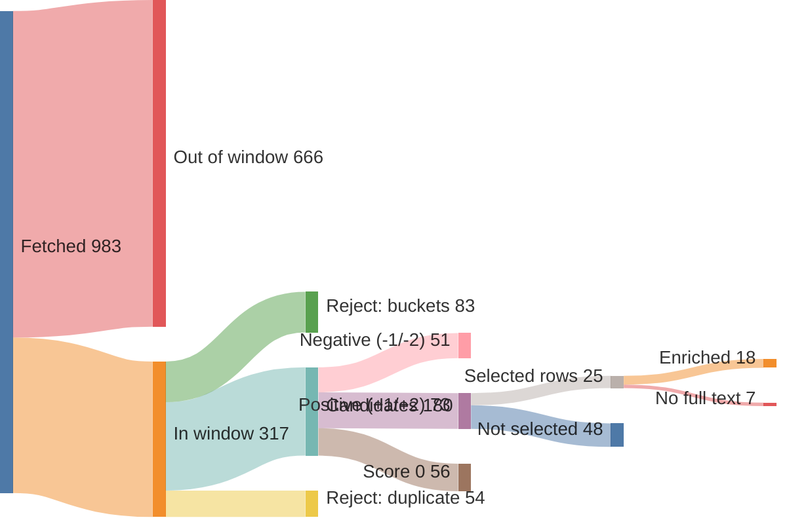
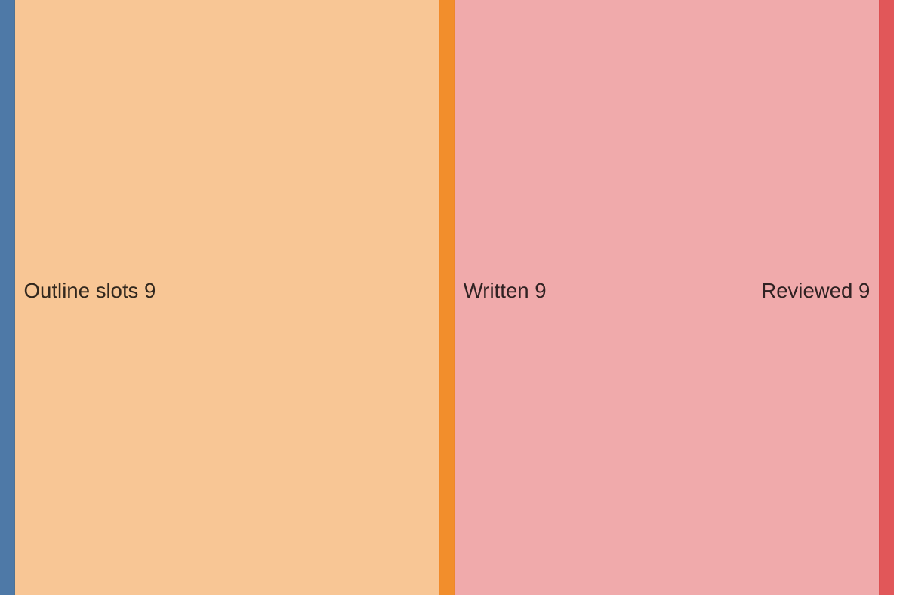

# Run report — edition 2026-07-26

## Funnel overview

Items — fetched → in window → filtered → scored → selected → enriched (drop branches show why and what type):

Edition — outline slots → written → reviewed:

## Funnel

- window: 7 days (from 2026-07-19T00:00:00+02:00, SRC-4)
- S1 fetch: 983 feed items → 317 in window (37/40 feeds ok)
- S2 filter: 317 → 180 candidates (137 rejected)
- S3 score: 180 scored → 73 at +1/+2
- S4 select: 24 topics (25 source rows)
- S5 enrich: 25 source rows → 18 full texts (requests 18, playwright 0); 7 topics dropped (PIPE-5)
- S6 outline: 9 slots, planned 2350–4500 words
- S7 write: 9 articles, 2998 words
- S8 review: 58 correction(s), 3003 words body text (ED-5 target 2800–3400)
- S9 compose: nr 4, 0 recompile(s) — typeset checks clean (LAY-1..5, LAY-7)

## Feeds

| bron | items | in window | undated | error |
|---|---|---|---|---|
| Gem Wijchen | 20 | 0 | 0 | — |
| nieuws.nl | 54 | 4 | 0 | — |
| DG Wijchen | 30 | 30 | 0 | — |
| Gld | 50 | 40 | 0 | — |
| Gld RvN | 50 | 16 | 0 | — |
| DG | 30 | 30 | 0 | — |
| DG Binnen | 30 | 30 | 0 | — |
| Overheid | 1 | 1 | 0 | — |
| NOS J | 20 | 20 | 0 | — |
| NOS Alg | 20 | 20 | 0 | — |
| NOS Binnen | 20 | 19 | 0 | — |
| NOS Buiten | 20 | 20 | 0 | — |
| NOS Econ | 20 | 6 | 0 | — |
| NOS Sport | 20 | 20 | 0 | — |
| NOS Opm | 20 | 1 | 0 | — |
| NOS Cultuur | 20 | 1 | 0 | — |
| FTM | 10 | 2 | 0 | — |
| EW | 10 | 10 | 0 | — |
| HP | 0 | 0 | 0 | HTTPError: 403 Client Error: Forbidden for url: https://www.hpdetijd.nl/rss |
| DW | 21 | 21 | 0 | — |
| DW Env | 20 | 0 | 0 | — |
| DW Science | 2 | 0 | 0 | — |
| Positive | 10 | 1 | 0 | — |
| WijWijchen | 20 | 0 | 0 | — |
| Druten | 20 | 0 | 0 | — |
| KNMI | 5 | 0 | 0 | — |
| CBS n&m | 50 | 0 | 0 | — |
| CBS v&c | 50 | 0 | 0 | — |
| Natuurmon | 30 | 4 | 0 | — |
| IVN | 10 | 0 | 0 | — |
| MaatschapWij | 8 | 1 | 0 | — |
| BBC Future | 10 | 2 | 0 | — |
| RtbC | 10 | 1 | 0 | — |
| FixNews | 20 | 0 | 0 | — |
| Mongabay | 32 | 8 | 0 | — |
| HumanProg | 10 | 0 | 0 | — |
| NatureToday | 200 | 8 | 0 | — |
| ARK | 10 | 1 | 0 | — |
| WijchensNws | 0 | 0 | 0 | HTTPError: 404 Client Error: Not Found for url: https://www.wijchensnieuws.nl/feed/ |
| Wegwijs | 0 | 0 | 0 | HTTPError: 403 Client Error: Forbidden for url: https://www.weekblad-wegwijs.nl/feed |

## LLM usage (OPS-4)

| stage | model | effort | calls | turns | in tok | out tok | tools | think chars | wall | cost |
|---|---|---|---|---|---|---|---|---|---|---|
| S3 score | claude-haiku-4-5-20251001 | — | 3 | 7 | 116,390 | 13,323 | 3 | 30,372 | 143.8s | $0.2684 |
| S4 select | claude-sonnet-5 | medium | 1 | 3 | 128,539 | 8,426 | 2 | 0 | 124.2s | $0.5739 |
| S5 enrich | claude-haiku-4-5-20251001 | — | 12 | 30 | 373,585 | 15,855 | 12 | 33,179 | 192.7s | $0.2657 |
| S6 outline | claude-opus-4-8 | medium | 1 | 2 | 30,546 | 8,183 | 1 | 0 | 118.6s | $0.5155 |
| S7 write | claude-sonnet-5 | medium | 9 | 27 | 595,448 | 18,271 | 9 | 0 | 299.8s | $1.2454 |
| S8 review | claude-sonnet-5 | medium | 9 | 18 | 280,066 | 33,396 | 9 | 0 | 348.3s | $1.2249 |
| S9 compose | — | — | 1 | 6 | 78,074 | 4,191 | 5 | 0 | 60.5s | $0.3534 |
| **total** |  |  | 36 | 93 | 1,602,648 | 101,645 | 41 | 63,551 | 1288.0s | $4.4472 |

## Rejected (PIPE-2)

| reason | count |
|---|---|
| B1 | 35 |
| B2 | 49 |
| B3 | 4 |
| B4 | 4 |
| B5 | 12 |
| duplicate | 54 |

## Scores (PIPE-3)

model claude-haiku-4-5-20251001, prompt score.md v1

| score | count |
|---|---|
| -2 | 5 |
| -1 | 46 |
| 0 | 56 |
| +1 | 36 |
| +2 | 37 |

## Selected topics (PIPE-4)

| scope | topic | bronnen |
|---|---|---|
| L | Toezichthouders werken over gemeentegrenzen tegen overlast | nieuws.nl |
| L | Gratis zomerspeurtocht 'De verdwenen ijscoupes' in Wijchen | nieuws.nl |
| L | Kapper Theo mag na 40 jaar tóch goede doelen knippen | DG Wijchen |
| L | Tweeling miste vlag van Guinee bij Vierdaagse, doet nu zelf mee | DG Wijchen |
| L | Vereniging Gouden-Kruisdragers verrast met koninklijke status | DG Wijchen |
| L | Duizenden uren werk om Vierdaagseplek Kelfkensbos klaar te krijgen | DG Wijchen |
| L | Slechtziende Boaz (11) wandelt Vierdaagse voor klasgenoten | DG Wijchen |
| R | Wilde dieren krijgen meer ruimte op ecoducten bij Hoge Veluwe | Gld |
| R | Burgemeester Rheden debuteert in de Vierdaagse na jaren zwaaien | Gld |
| R | Wolf met prooi en ijsvogel: mooie momenten in de Gelderse natuur | Gld |
| R | Nijmegen krijgt wegwijsborden voor vleermuizen | Gld |
| R | Steeds meer mensen kamperen in Gelderland, en dat is goed | Gld |
| R | Gelderse wijngaarden floreren dankzij droog weer | Gld |
| R | Steeds meer jongeren ontdekken wandelen als sport | Gld |
| N | Stikstofdoelen 2035 in zicht met nieuwe kabinetsplannen | NatureToday |
| N | Gestrande walvis krijgt hulp van dolfijnen terug naar zee | NOS J |
| N | Oranje wint Fair Play-prijs op het WK voetbal | NOS J, NOS Sport |
| N | Historische vereniging redt vervallen molen van sloop | DG |
| N | Veertien kraamhotels vangen tekorten in kraamzorg op | DG Binnen |
| I | EU-verbod op vernietigen onverkochte kleding gaat in | DW |
| I | Hoe Cuba omschakelde van zeeschildpaddenvangst naar bescherming | Mongabay |
| I | Zwitserse architect bewijst: het groenste gebouw staat er al | RtbC |
| I | Zeldzame gier keert na tien jaar terug in Cambodjaans reservaat | Mongabay |
| I | Wetenschappers laten menselijke tanden opnieuw groeien | BBC Future |

## Enrichment (PIPE-5)

| scope | topic | bron | summary | text | refs | ref words | ref links | status |
|---|---|---|---|---|---|---|---|---|
| L | Toezichthouders werken over gemeentegrenzen tegen overlast | nieuws.nl | 43 | 154 | 0 | 0 | — | ok |
| L | Gratis zomerspeurtocht 'De verdwenen ijscoupes' in Wijchen | nieuws.nl | 42 | 144 | 3 | 345 | joepiedoe.com/?srsltid=AfmBOoq4e9HvxsZZ4LdzwMtl1HzSS3tAAWah… kids-town.nl/ bijdaankindermode.nl/ | ok |
| L | Kapper Theo mag na 40 jaar tóch goede doelen knippen | DG Wijchen | 43 | 0 | 0 | 0 | — | **dropped** — no sufficient row |
| L | Tweeling miste vlag van Guinee bij Vierdaagse, doet nu zelf mee | DG Wijchen | 42 | 0 | 0 | 0 | — | **dropped** — no sufficient row |
| L | Vereniging Gouden-Kruisdragers verrast met koninklijke status | DG Wijchen | 42 | 0 | 0 | 0 | — | **dropped** — no sufficient row |
| L | Duizenden uren werk om Vierdaagseplek Kelfkensbos klaar te krijgen | DG Wijchen | 39 | 0 | 0 | 0 | — | **dropped** — no sufficient row |
| L | Slechtziende Boaz (11) wandelt Vierdaagse voor klasgenoten | DG Wijchen | 51 | 0 | 0 | 0 | — | **dropped** — no sufficient row |
| R | Wilde dieren krijgen meer ruimte op ecoducten bij Hoge Veluwe | Gld | 47 | 381 | 0 | 0 | — | ok |
| R | Burgemeester Rheden debuteert in de Vierdaagse na jaren zwaaien | Gld | 31 | 478 | 1 | 308 | gld.nl/4daagse | ok |
| R | Wolf met prooi en ijsvogel: mooie momenten in de Gelderse natuur | Gld | 33 | 356 | 0 | 0 | — | ok |
| R | Nijmegen krijgt wegwijsborden voor vleermuizen | Gld | 44 | 309 | 1 | 0 | rn7.nl/nieuws/artikel/wat-zijn-toch-die-vleermuispalen-lang… | ok |
| R | Steeds meer mensen kamperen in Gelderland, en dat is goed | Gld | 44 | 876 | 2 | 1419 | gld.nl/nieuws/8493152/geen-provincie-is-zo-populair-als-gel… journals.plos.org/plosone/article?id=10.1371%2Fjournal.pone… | ok |
| R | Gelderse wijngaarden floreren dankzij droog weer | Gld | 46 | 663 | 0 | 0 | — | ok |
| R | Steeds meer jongeren ontdekken wandelen als sport | Gld | 30 | 680 | 1 | 670 | nos.nl/artikel/2623579-meer-jonge-wandelaars-bij-nijmeegse-… | ok |
| N | Stikstofdoelen 2035 in zicht met nieuwe kabinetsplannen | NatureToday | 55 | 322 | 3 | 896 | bnnvara.nl/vroegevogels saxifraga.nl/ hogeveluwe.nl/ | ok |
| N | Gestrande walvis krijgt hulp van dolfijnen terug naar zee | NOS J | 86 | 98 | 0 | 0 | — | ok |
| N | Oranje wint Fair Play-prijs op het WK voetbal | NOS J | 125 | 133 | 0 | 0 | — | ok |
| N | Oranje wint Fair Play-prijs op het WK voetbal | NOS Sport | 172 | 183 | 1 | 860 | nos.nl/artikel/2623685-spanje-krijgt-machteloos-argentinie-… | ok |
| N | Historische vereniging redt vervallen molen van sloop | DG | 37 | 0 | 0 | 0 | — | **dropped** — no sufficient row |
| N | Veertien kraamhotels vangen tekorten in kraamzorg op | DG Binnen | 59 | 0 | 0 | 0 | — | **dropped** — no sufficient row |
| I | EU-verbod op vernietigen onverkochte kleding gaat in | DW | 22 | 573 | 1 | 384 | dw.com/en/eu-approves-ban-on-destruction-of-unsold-clothing… | ok |
| I | Hoe Cuba omschakelde van zeeschildpaddenvangst naar bescherming | Mongabay | 56 | 506 | 0 | 0 | — | ok |
| I | Zwitserse architect bewijst: het groenste gebouw staat er al | RtbC | 68 | 1910 | 3 | 603 | circle-economy.com/knowledge-hub/article/29941?title=K118-A… carbonleadershipforum.org/embodied-carbon-101-v2/ researchgate.net/publication/376148869_Case_Study_K118_-_Th… | ok |
| I | Zeldzame gier keert na tien jaar terug in Cambodjaans reservaat | Mongabay | 56 | 370 | 0 | 0 | — | ok |
| I | Wetenschappers laten menselijke tanden opnieuw groeien | BBC Future | 10 | 1465 | 3 | 826 | jada.ada.org/article/S0002-8177(25 frontiersin.org/journals/dental-medicine/articles/10.3389/f… cdc.gov/oral-health/data-research/facts-stats/fast-facts-to… | ok |

## Edition plan (PIPE-6)

| pos | scope | length | topic | location | source date |
|---|---|---|---|---|---|
| 1 | L | standard | Gratis zomerspeurtocht 'De verdwenen ijscoupes' in het centrum van Wijchen | Centrum Wijchen | 2026-07-20 |
| 2 | L | short | Toezichthouders werken voortaan over de gemeentegrens samen in het buitengebied | Gemeente Wijchen / buitengebied | 2026-07-20 |
| 3 | R | long | Gelderse wijngaarden floreren juist dankzij de droogte | Gelderland (wijngaarden) | 2026-07-19 |
| 4 | R | standard | Burgemeester van Rheden debuteert in de Vierdaagse na jaren zwaaien | Rheden / Nijmegen (Vierdaagse) | 2026-07-20 |
| 5 | R | short | Nijmegen krijgt wegwijsborden voor vleermuizen | Nijmegen, Nelson Mandelaplein | 2026-07-19 |
| 6 | N | standard | Stikstofdoelen 2035 binnen bereik met nieuwe kabinetsplannen | Nederland | 2026-07-19 |
| 7 | N | short | Oranje wint de Fair Play-prijs op het WK ondanks vroege uitschakeling | Nederland / WK (Verenigde Staten) | 2026-07-20 |
| 8 | I | long | Wetenschappers laten menselijke tanden opnieuw groeien | Internationaal (onderzoek/lab) | 2026-07-19 |
| 9 | I | standard | Cuba schakelde om van zeeschildpaddenvangst naar bescherming | Cuba | 2026-07-20 |

## Articles (PIPE-7/8)

| pos | title | words draft → reviewed |
|---|---|---|
| 1 | Speurtocht door het centrum: wie vindt de verdwenen ijscoupes? | 186 → 189 |
| 2 | Grens? Welke grens | 203 → 194 |
| 3 | Gelderse wijnboeren varen wel bij de aanhoudende droogte | 552 → 550 |
| 4 | Van zwaaien naar zwoegen: burgemeester van Rheden loopt zijn eerste Vierdaagse | 419 → 428 |
| 5 | Vleermuizen krijgen eigen wegwijzers | 182 → 185 |
| 6 | Nieuw rekenmodel: stikstofdoel 2035 dichterbij dan gedacht | 258 → 263 |
| 7 | Fair Play-prijs voor Oranje, ondanks vroege uitschakeling op WK | 166 → 160 |
| 8 | Eigen tanden, opnieuw gegroeid | 561 → 563 |
| 9 | De bioloog die Cuba's zeeschildpadden van vangst naar bescherming leidde | 471 → 471 |

## Correction log (PIPE-8)

- slot 1: Titel vervangen: 'Kom een ijscoupe redden in het centrum' (imperatief, iets ongemakkelijk als krantenkop) → 'Speurtocht door het centrum: wie vindt de verdwenen ijscoupes?' (helderder en dekt de lading beter).
- slot 1: Grammaticale fout hersteld: 'zijn ijscoupes zijn hun onderdelen verloren' → 'de onderdelen van zijn ijscoupes zijn kwijtgeraakt' (foutieve zinsconstructie).
- slot 1: 'dorpskern' vervangen door 'centrum' voor consistentie met de rest van het stuk.
- slot 1: Ontbrekend werkwoord toegevoegd: 'kunnen kinderen op zoek naar de vermiste stukjes' → 'kunnen kinderen op zoek gaan naar de vermiste stukjes'.
- slot 1: 'Er zijn twee routes, per leeftijd' verduidelijkt naar 'Er zijn twee routes, verdeeld naar leeftijd'.
- slot 1: 'Kinderen vanaf 6 jaar krijgen het lastiger' vereenvoudigd naar 'Voor kinderen vanaf 6 jaar is het lastiger' voor vlottere zinsbouw.
- slot 1: Overbodig informeel woord 'gewoon' geschrapt uit 'Ze zijn gewoon op te halen tijdens openingstijden'.
- slot 2: Titel gehandhaafd: 'Grens? Welke grens' was al sterk en passend bij het onderwerp.
- slot 2: Aanhalingstekens rond de convenantnaam vervangen door Nederlandse typografische aanhalingstekens („...”) in plaats van rechte Engelse aanhalingstekens.
- slot 2: 'Oost Nederland' gecorrigeerd naar 'Oost-Nederland' (samenstelling krijgt een koppelteken).
- slot 2: 'stille, praktische vooruitgang' vervangen door 'stille, praktische stap vooruit' — natuurlijker Nederlands.
- slot 2: Openingszin van de derde alinea herschreven: 'Het effect is vooral een kwestie van samenwerking die wint van verkokering' klopte logisch niet ('effect' is geen 'kwestie van'); nu 'Het belangrijkste effect: samenwerking wint het van verkokering', gevolgd door een nieuwe zin voor betere leesbaarheid.
- slot 3: Werktitel 'Wijnboeren dromen bij deze droogte' vervangen door 'Gelderse wijnboeren varen wel bij de aanhoudende droogte' — de oude titel was clichématig en de zinsconstructie ('dromen bij deze droogte') liep grammaticaal niet lekker; de nieuwe titel is directer en dekt de lading beter.
- slot 3: 'Een eigenaar van Wijnproeverij De Hennep bij Aalten' vervangen door 'Bij Wijnproeverij De Hennep bij Aalten wijst men op...' — een naamloze, vage bronaanduiding ('een eigenaar van') is journalistiek zwak; herschreven zonder de bron te specificeren die niet is aangeleverd.
- slot 3: 'eenzelfde veerkracht' gecorrigeerd naar 'diezelfde veerkracht' voor correct verwijzend gebruik.
- slot 3: 'passen de wijnboeren zelf de grootste voorzichtigheid toe' herschreven naar 'betrachten de wijnboeren zelf de grootste voorzichtigheid' — 'voorzichtigheid toepassen' is geen gangbare collocatie in het Nederlands.
- slot 3: 'Zeker ben ik nu heel positief' herschreven naar 'Ik ben nu zeker heel positief' — de oorspronkelijke woordvolgorde klonk onnatuurlijk/stroef in gesproken citaat.
- slot 4: Titel gehandhaafd: de werktitel was al sterk (bondig, alliteratie, dekt de inhoud) en is niet vervangen.
- slot 4: Komma-splice hersteld in het eerste citaat: 'In totaal heb ik 35 jaar in en om Nijmegen gewoond, ik voel me verwant...' opgeknipt in twee zinnen.
- slot 4: 'Naast hem: Bart, ...' herschreven tot volledige zin ('Naast hem loopt Bart, ...') voor vlottere leesbaarheid.
- slot 4: Onduidelijke zin verduidelijkt: 'Wie een startbewijs zou bemachtigen' werd 'Wie van de twee een startbewijs zou bemachtigen', zodat helder is dat het om de twee vrienden gaat.
- slot 4: Zinsfragment zonder werkwoord ('Ruim driehonderd trainingskilometers, keurig volgens...') omgezet in een volledige zin ('Hij liep ruim driehonderd trainingskilometers...').
- slot 4: Kromme zinsconstructie bij 'die toevallig ook meeloopt en woont op wat Van Eert noemt spuugafstand...' rechtgezet tot een leesbare zin met correcte woordvolgorde.
- slot 4: 'trainingsmaanden die hij grotendeels alleen aflegde' aangepast naar 'doorbracht'; 'afleggen' hoort bij afstand, niet bij een periode.
- slot 5: Werktitel 'Vleermuizen krijgen eigen wegwijzers' behouden: die dekt de lading al goed en is journalistiek sterk.
- slot 5: 'een navigatiehulp voor 's nachts' herschreven naar 'een navigatiehulp voor het duister' — de oorspronkelijke formulering was grammaticaal onhandig.
- slot 5: 'ze zenden geluid uit en varen op de weerkaatsing' aangepast naar '...en oriënteren zich op de weerkaatsing' — 'varen op' is hier geen gangbaar/duidelijk idioom voor deze context.
- slot 5: 'een gat waarin geluid nergens meer op terugkaatst' vereenvoudigd naar 'een gat waar geluid niet meer op terugkaatst' — de dubbele ontkenning/omslachtige zinsbouw verduidelijkt.
- slot 5: 'Een ecoloog volgt of het werkt' verduidelijkt naar 'Een ecoloog volgt of de aanpak werkt' voor een concreter antecedent.
- slot 5: 'Een tijdelijke oplossing, in afwachting van...' lichtjes gladgestreken met toevoeging van 'dus' voor een vloeiendere overgang naar de slotzin.
- slot 5: Gecontroleerd op verwijzingen naar de krant zelf of naar niet-getoonde beelden/illustraties: geen violaties aangetroffen.
- slot 6: Werktitel vervangen door een scherpere kop die het nieuwe rekenmodel als nieuwswaarde benoemt: 'Nieuw rekenmodel: stikstofdoel 2035 dichterbij dan gedacht'.
- slot 6: Verwarrende zin 'De 74 procent blijft een precieze grens' herschreven naar 'De wettelijke norm van 74 procent blijft daarbij een harde grens', zodat het contrast met de bandbreedte van 70-80 procent duidelijker wordt.
- slot 6: Overbodige komma verwijderd in 'financieel haalbaar zijn, en wie de kosten daarvan draagt' → 'financieel haalbaar zijn en wie de kosten daarvan draagt'.
- slot 6: Gecontroleerd op verwijzingen naar de krant zelf of naar niet-getoonde illustraties: geen gevonden, geen aanpassing nodig.
- slot 7: Titel vervangen: 'Oranje wint ondanks vroege uittocht toch een WK-titel' was misleidend, omdat de Fair Play-prijs geen WK-titel is; nieuwe kop benoemt de prijs correct.
- slot 7: 'uittocht' (in de kop) vervangen door 'uitschakeling': verkeerd woordgebruik, uittocht betekent exodus/vertrek, niet sportieve eliminatie.
- slot 7: Tweede alinea herschreven voor duidelijkheid: de zin liep syntactisch vast door de ingebedde bijzin ('die met elk één kaart nog spaarzamer waren, maar al in de groepsfase naar huis moesten') en is opgesplitst in twee heldere zinnen.
- slot 7: 'pakte' vervangen door 'kreeg': 'pakken' is spreektaal/informeel voor het ontvangen van een kaart in journalistieke context.
- slot 7: 'voetbal gerelateerd' aan elkaar geschreven als 'voetbalgerelateerd': samenstelling moet één woord zijn.
- slot 7: 'De ploeg krijgt' vervangen door 'Het winnende team krijgt' ter verduidelijking, aangezien 'de ploeg' na de tussenzin over vorige winnaars (Engeland) verwarrend kon verwijzen.
- slot 8: Titel aangescherpt van 'Uw eigen tanden, opnieuw gegroeid' naar 'Eigen tanden, opnieuw gegroeid' — krantenkoppen spreken de lezer doorgaans niet direct met 'u' aan.
- slot 8: 'een boring' verbeterd naar 'een boor' (tikfout/verkeerd woord).
- slot 8: 'De aanleiding is groter dan cosmetiek' herschreven naar 'De inzet is groter dan cosmetiek alleen' voor duidelijkere zinsconstructie.
- slot 8: 'moeten dan opnieuw' aangevuld tot 'moeten dan vervangen worden' (onvolledige zin).
- slot 8: 'Het draait steeds om herstellen van schade' gecorrigeerd naar 'Het draait steeds om het herstellen van schade' (ontbrekend lidwoord).
- slot 8: 'hele nieuwe tand' gecorrigeerd naar 'heel nieuwe tand' (heel is hier bijwoord bij 'nieuwe', geen verbogen bijvoeglijk naamwoord).
- slot 8: 'Aan het King's College London' gecorrigeerd naar 'Aan King's College London' (foutief lidwoord bij eigennaam).
- slot 8: 'blijkt bovendien ook waardevol' ingekort tot 'blijkt bovendien waardevol' (dubbelop 'bovendien ook').
- slot 9: Werktitel 'Zoenen aan zee: Cuba draaide zeeschildpadden om van vangst naar behoud' vervangen: de woordspeling 'Zoenen aan zee' sloot inhoudelijk niet aan bij het onderwerp; nieuwe kop verwijst direct naar de kern (bioloog, vangst naar bescherming).
- slot 9: 'waar Cubaanse vissers ooit hun brood mee verdienden' > 'waarmee Cubaanse vissers ooit hun brood verdienden' (voorzetsel correct bij het werkwoord geplaatst).
- slot 9: 'klinkt het bijna omgekeerd' > 'klinkt het bijna paradoxaal' (preciezer taalgebruik).
- slot 9: 'het getekende schild voor sieraden' > 'het gevlekte schild als grondstof voor sieraden' (verduidelijkt de onduidelijke formulering).
- slot 9: 'de Cubaanse marien bioloog' > 'de Cubaanse mariene bioloog' (bijvoeglijk naamwoord correct verbogen).
- slot 9: 'Hij hielp de opeenvolgende beperkingen adviseren' > 'Hij adviseerde over de opeenvolgende beperkingen' (grammaticaal onjuiste constructie hersteld).
- slot 9: Gedachtestreepje na 'nationale regels maar een deel van het verhaal zijn' vervangen door dubbele punt voor correctere zinsbouw.
- slot 9: 'en kon de volgorde moeiteloos schetsen' zin ingekort/samengevoegd voor leesbaarheid.
- slot 9: 'Zijn werk verschoof zo van...' > 'Zo verschoof zijn werk van...' (vlottere zinsopbouw).

## Typeset & compose (PIPE-9)

- illustration (EL-3): 'Vleermuizenpaal met batvormige uitsparing langs het fietspad' with the article at pos 5 — `work/85-illustration.svg`
- 0 recompile(s)
- all typeset checks passed (LAY-1..5, LAY-7)
