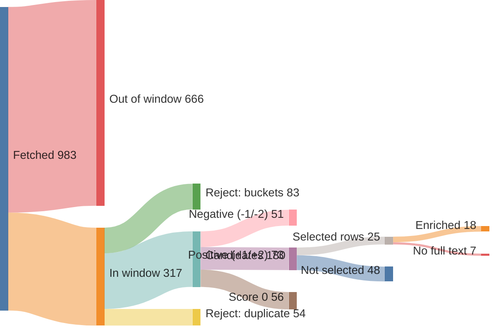

# Run report — edition 2026-07-26

## Funnel overview

Items — fetched → in window → filtered → scored → selected → enriched (drop branches show why and what type):

Edition — outline slots → written → reviewed:

## Funnel

- window: 7 days (from 2026-07-19T00:00:00+02:00, SRC-4)
- S1 fetch: 983 feed items → 317 in window (37/40 feeds ok)
- S2 filter: 317 → 180 candidates (137 rejected)
- S3 score: 180 scored → 73 at +1/+2
- S4 select: 24 topics (25 source rows)
- S5 enrich: 25 source rows → 18 full texts (requests 18, playwright 0); 7 topics dropped (PIPE-5)
- S6 outline: 9 slots, planned 2350–4500 words
- S7 write: 9 articles, 2740 words
- S8 review: 0 correction(s), 0 words body text (ED-5 target 2800–3400); **9 slot(s) failed review at pos [1, 2, 3, 4, 5, 6, 7, 8, 9]**

## Feeds

| bron | items | in window | undated | error |
|---|---|---|---|---|
| Gem Wijchen | 20 | 0 | 0 | — |
| nieuws.nl | 54 | 4 | 0 | — |
| DG Wijchen | 30 | 30 | 0 | — |
| Gld | 50 | 40 | 0 | — |
| Gld RvN | 50 | 16 | 0 | — |
| DG | 30 | 30 | 0 | — |
| DG Binnen | 30 | 30 | 0 | — |
| Overheid | 1 | 1 | 0 | — |
| NOS J | 20 | 20 | 0 | — |
| NOS Alg | 20 | 20 | 0 | — |
| NOS Binnen | 20 | 19 | 0 | — |
| NOS Buiten | 20 | 20 | 0 | — |
| NOS Econ | 20 | 6 | 0 | — |
| NOS Sport | 20 | 20 | 0 | — |
| NOS Opm | 20 | 1 | 0 | — |
| NOS Cultuur | 20 | 1 | 0 | — |
| FTM | 10 | 2 | 0 | — |
| EW | 10 | 10 | 0 | — |
| HP | 0 | 0 | 0 | HTTPError: 403 Client Error: Forbidden for url: https://www.hpdetijd.nl/rss |
| DW | 21 | 21 | 0 | — |
| DW Env | 20 | 0 | 0 | — |
| DW Science | 2 | 0 | 0 | — |
| Positive | 10 | 1 | 0 | — |
| WijWijchen | 20 | 0 | 0 | — |
| Druten | 20 | 0 | 0 | — |
| KNMI | 5 | 0 | 0 | — |
| CBS n&m | 50 | 0 | 0 | — |
| CBS v&c | 50 | 0 | 0 | — |
| Natuurmon | 30 | 4 | 0 | — |
| IVN | 10 | 0 | 0 | — |
| MaatschapWij | 8 | 1 | 0 | — |
| BBC Future | 10 | 2 | 0 | — |
| RtbC | 10 | 1 | 0 | — |
| FixNews | 20 | 0 | 0 | — |
| Mongabay | 32 | 8 | 0 | — |
| HumanProg | 10 | 0 | 0 | — |
| NatureToday | 200 | 8 | 0 | — |
| ARK | 10 | 1 | 0 | — |
| WijchensNws | 0 | 0 | 0 | HTTPError: 404 Client Error: Not Found for url: https://www.wijchensnieuws.nl/feed/ |
| Wegwijs | 0 | 0 | 0 | HTTPError: 403 Client Error: Forbidden for url: https://www.weekblad-wegwijs.nl/feed |

## LLM usage (OPS-4)

| stage | model | effort | calls | turns | in tok | out tok | tools | think chars | wall | cost |
|---|---|---|---|---|---|---|---|---|---|---|
| S3 score | claude-haiku-4-5-20251001 | — | 3 | 7 | 116,390 | 13,323 | 3 | 30,372 | 143.8s | $0.2684 |
| S4 select | claude-sonnet-5 | medium | 1 | 3 | 128,539 | 8,426 | 2 | 0 | 124.2s | $0.5739 |
| S5 enrich | claude-haiku-4-5-20251001 | — | 12 | 30 | 373,585 | 15,855 | 12 | 33,179 | 192.7s | $0.2657 |
| S6 outline | claude-opus-4-8 | medium | 1 | 2 | 30,546 | 8,183 | 1 | 0 | 118.6s | $0.5155 |
| S7 write | claude-sonnet-5 | medium | 9 | 26 | 563,512 | 18,152 | 9 | 0 | 293.2s | $1.2287 |
| **total** |  |  | 26 | 68 | 1,212,572 | 63,939 | 27 | 63,551 | 872.5s | $2.8522 |

## Rejected (PIPE-2)

| reason | count |
|---|---|
| B1 | 35 |
| B2 | 49 |
| B3 | 4 |
| B4 | 4 |
| B5 | 12 |
| duplicate | 54 |

## Scores (PIPE-3)

model claude-haiku-4-5-20251001, prompt score.md v1

| score | count |
|---|---|
| -2 | 5 |
| -1 | 46 |
| 0 | 56 |
| +1 | 36 |
| +2 | 37 |

## Selected topics (PIPE-4)

| scope | topic | bronnen |
|---|---|---|
| L | Toezichthouders werken over gemeentegrenzen tegen overlast | nieuws.nl |
| L | Gratis zomerspeurtocht 'De verdwenen ijscoupes' in Wijchen | nieuws.nl |
| L | Kapper Theo mag na 40 jaar tóch goede doelen knippen | DG Wijchen |
| L | Tweeling miste vlag van Guinee bij Vierdaagse, doet nu zelf mee | DG Wijchen |
| L | Vereniging Gouden-Kruisdragers verrast met koninklijke status | DG Wijchen |
| L | Duizenden uren werk om Vierdaagseplek Kelfkensbos klaar te krijgen | DG Wijchen |
| L | Slechtziende Boaz (11) wandelt Vierdaagse voor klasgenoten | DG Wijchen |
| R | Wilde dieren krijgen meer ruimte op ecoducten bij Hoge Veluwe | Gld |
| R | Burgemeester Rheden debuteert in de Vierdaagse na jaren zwaaien | Gld |
| R | Wolf met prooi en ijsvogel: mooie momenten in de Gelderse natuur | Gld |
| R | Nijmegen krijgt wegwijsborden voor vleermuizen | Gld |
| R | Steeds meer mensen kamperen in Gelderland, en dat is goed | Gld |
| R | Gelderse wijngaarden floreren dankzij droog weer | Gld |
| R | Steeds meer jongeren ontdekken wandelen als sport | Gld |
| N | Stikstofdoelen 2035 in zicht met nieuwe kabinetsplannen | NatureToday |
| N | Gestrande walvis krijgt hulp van dolfijnen terug naar zee | NOS J |
| N | Oranje wint Fair Play-prijs op het WK voetbal | NOS J, NOS Sport |
| N | Historische vereniging redt vervallen molen van sloop | DG |
| N | Veertien kraamhotels vangen tekorten in kraamzorg op | DG Binnen |
| I | EU-verbod op vernietigen onverkochte kleding gaat in | DW |
| I | Hoe Cuba omschakelde van zeeschildpaddenvangst naar bescherming | Mongabay |
| I | Zwitserse architect bewijst: het groenste gebouw staat er al | RtbC |
| I | Zeldzame gier keert na tien jaar terug in Cambodjaans reservaat | Mongabay |
| I | Wetenschappers laten menselijke tanden opnieuw groeien | BBC Future |

## Enrichment (PIPE-5)

| scope | topic | bron | summary | text | refs | ref words | ref links | status |
|---|---|---|---|---|---|---|---|---|
| L | Toezichthouders werken over gemeentegrenzen tegen overlast | nieuws.nl | 43 | 154 | 0 | 0 | — | ok |
| L | Gratis zomerspeurtocht 'De verdwenen ijscoupes' in Wijchen | nieuws.nl | 42 | 144 | 3 | 345 | joepiedoe.com/?srsltid=AfmBOoq4e9HvxsZZ4LdzwMtl1HzSS3tAAWah… kids-town.nl/ bijdaankindermode.nl/ | ok |
| L | Kapper Theo mag na 40 jaar tóch goede doelen knippen | DG Wijchen | 43 | 0 | 0 | 0 | — | **dropped** — no sufficient row |
| L | Tweeling miste vlag van Guinee bij Vierdaagse, doet nu zelf mee | DG Wijchen | 42 | 0 | 0 | 0 | — | **dropped** — no sufficient row |
| L | Vereniging Gouden-Kruisdragers verrast met koninklijke status | DG Wijchen | 42 | 0 | 0 | 0 | — | **dropped** — no sufficient row |
| L | Duizenden uren werk om Vierdaagseplek Kelfkensbos klaar te krijgen | DG Wijchen | 39 | 0 | 0 | 0 | — | **dropped** — no sufficient row |
| L | Slechtziende Boaz (11) wandelt Vierdaagse voor klasgenoten | DG Wijchen | 51 | 0 | 0 | 0 | — | **dropped** — no sufficient row |
| R | Wilde dieren krijgen meer ruimte op ecoducten bij Hoge Veluwe | Gld | 47 | 381 | 0 | 0 | — | ok |
| R | Burgemeester Rheden debuteert in de Vierdaagse na jaren zwaaien | Gld | 31 | 478 | 1 | 308 | gld.nl/4daagse | ok |
| R | Wolf met prooi en ijsvogel: mooie momenten in de Gelderse natuur | Gld | 33 | 356 | 0 | 0 | — | ok |
| R | Nijmegen krijgt wegwijsborden voor vleermuizen | Gld | 44 | 309 | 1 | 0 | rn7.nl/nieuws/artikel/wat-zijn-toch-die-vleermuispalen-lang… | ok |
| R | Steeds meer mensen kamperen in Gelderland, en dat is goed | Gld | 44 | 876 | 2 | 1419 | gld.nl/nieuws/8493152/geen-provincie-is-zo-populair-als-gel… journals.plos.org/plosone/article?id=10.1371%2Fjournal.pone… | ok |
| R | Gelderse wijngaarden floreren dankzij droog weer | Gld | 46 | 663 | 0 | 0 | — | ok |
| R | Steeds meer jongeren ontdekken wandelen als sport | Gld | 30 | 680 | 1 | 670 | nos.nl/artikel/2623579-meer-jonge-wandelaars-bij-nijmeegse-… | ok |
| N | Stikstofdoelen 2035 in zicht met nieuwe kabinetsplannen | NatureToday | 55 | 322 | 3 | 896 | bnnvara.nl/vroegevogels saxifraga.nl/ hogeveluwe.nl/ | ok |
| N | Gestrande walvis krijgt hulp van dolfijnen terug naar zee | NOS J | 86 | 98 | 0 | 0 | — | ok |
| N | Oranje wint Fair Play-prijs op het WK voetbal | NOS J | 125 | 133 | 0 | 0 | — | ok |
| N | Oranje wint Fair Play-prijs op het WK voetbal | NOS Sport | 172 | 183 | 1 | 860 | nos.nl/artikel/2623685-spanje-krijgt-machteloos-argentinie-… | ok |
| N | Historische vereniging redt vervallen molen van sloop | DG | 37 | 0 | 0 | 0 | — | **dropped** — no sufficient row |
| N | Veertien kraamhotels vangen tekorten in kraamzorg op | DG Binnen | 59 | 0 | 0 | 0 | — | **dropped** — no sufficient row |
| I | EU-verbod op vernietigen onverkochte kleding gaat in | DW | 22 | 573 | 1 | 384 | dw.com/en/eu-approves-ban-on-destruction-of-unsold-clothing… | ok |
| I | Hoe Cuba omschakelde van zeeschildpaddenvangst naar bescherming | Mongabay | 56 | 506 | 0 | 0 | — | ok |
| I | Zwitserse architect bewijst: het groenste gebouw staat er al | RtbC | 68 | 1910 | 3 | 603 | circle-economy.com/knowledge-hub/article/29941?title=K118-A… carbonleadershipforum.org/embodied-carbon-101-v2/ researchgate.net/publication/376148869_Case_Study_K118_-_Th… | ok |
| I | Zeldzame gier keert na tien jaar terug in Cambodjaans reservaat | Mongabay | 56 | 370 | 0 | 0 | — | ok |
| I | Wetenschappers laten menselijke tanden opnieuw groeien | BBC Future | 10 | 1465 | 3 | 826 | jada.ada.org/article/S0002-8177(25 frontiersin.org/journals/dental-medicine/articles/10.3389/f… cdc.gov/oral-health/data-research/facts-stats/fast-facts-to… | ok |

## Edition plan (PIPE-6)

| pos | scope | length | topic | location | source date |
|---|---|---|---|---|---|
| 1 | L | standard | Gratis zomerspeurtocht 'De verdwenen ijscoupes' in het centrum van Wijchen | Centrum Wijchen | 2026-07-20 |
| 2 | L | short | Toezichthouders werken voortaan over de gemeentegrens samen in het buitengebied | Gemeente Wijchen / buitengebied | 2026-07-20 |
| 3 | R | long | Gelderse wijngaarden floreren juist dankzij de droogte | Gelderland (wijngaarden) | 2026-07-19 |
| 4 | R | standard | Burgemeester van Rheden debuteert in de Vierdaagse na jaren zwaaien | Rheden / Nijmegen (Vierdaagse) | 2026-07-20 |
| 5 | R | short | Nijmegen krijgt wegwijsborden voor vleermuizen | Nijmegen, Nelson Mandelaplein | 2026-07-19 |
| 6 | N | standard | Stikstofdoelen 2035 binnen bereik met nieuwe kabinetsplannen | Nederland | 2026-07-19 |
| 7 | N | short | Oranje wint de Fair Play-prijs op het WK ondanks vroege uitschakeling | Nederland / WK (Verenigde Staten) | 2026-07-20 |
| 8 | I | long | Wetenschappers laten menselijke tanden opnieuw groeien | Internationaal (onderzoek/lab) | 2026-07-19 |
| 9 | I | standard | Cuba schakelde om van zeeschildpaddenvangst naar bescherming | Cuba | 2026-07-20 |
